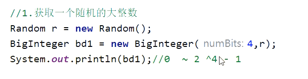
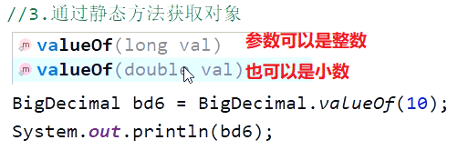

<h1>
Biglnteger 和BigDecimal
</h1>

# Biglnteger (大整数)（取值范围大）

## 为什么要有BigInteger?

---

---

## 一、BigInteger构造方法创建对象

- #### 1. 随机获取一个大整数，构造参数为(num ,random) 结果为[0~ 2^num-1]  

- #### 2.获取一个指定的大整数（常用）

  

- #### 3.获取一个指定进制的大整数（了解）

  

- #### 4.静态方法 获取BigIntegerl的对象,内部有优化（在Long类型范围内常用）

  

- #### 5.对象一旦创建内部的数据不能发生改变

  

---

---

## 二、BigInteger常见的成员方法（用来计算的）

##  

---

----

# BigDecimal（大小数）（取值范围大）

## 为什么要有BigDecimal?

- ## 我们为了精确计算，就要使用这个BigDecimal对象  

- ## 用来表示很大的小数

---

---

## 一、BigDecimal构造方法创建对象

- #### 1.使用 参数为double 的 构造方法创建（不推荐）

  - #### 细节： 这种方式可能是不精确的，所以不建议使用

  

- #### 2.使用参数为string的 构造方法（推荐）非常精确

  - #### 细节：放心用，非常精确

  

- #### 3. 通过静态方法获取对象

  - #### 细节：

  - #### 1.如果要表示的数字不大,没有超出doub1e的取值范围,建议使用静态方法

  - #### 2.如果要表示的数字比较大,超出了double的取值范围,建议使用String参数的构造方法

  - #### 3.如果我们传递的是0~10之间的整数,包含0,包含10,那么方法会返回已经创建好的对象,不会重新new

  

---

---

## 二、BigDecimal常见的成员方法（用来计算的）

## 注意：使用divide 来进行数据的除运算，如果不指定取几位小数，以及舍入模式的话，如果除不整是会报错的。所以我们一般除运算，会给全部参数的。

---

---

## 三、BigDecimal底层存储方式

# 总结

---

----

© 版权声明

<escape>

    <h3 align="center"  style="color: brown;" >版权声明</h3>
    <table>
   		<tr>
    		<ol>
				<li>本网站名称：𝚲𝚳𝚲</li>
				<li>𝚲𝚳𝚲提供的资源仅供您个人用于非商业性目的。</li>
				<li>本站文章部分内容可能来源于网络，仅供大家学习与参考，如有侵权，请联系我进行删除处理。</li>
				<li>本站一切资源不代表本站立场，并不代表本站赞同其观点和对其真实性负责。</li>
        		<li>本站一律禁止以任何方式发布或转载任何违法的相关信息，访客发现请举报</li> 
        		<li>本站资源大多存储在云盘，如发现链接失效，请联系我，我会第一时间更新。</li>
        		<li>本站强烈打击盗版/破解等有损他人权益和违法作为，请支持正版！</li>  
			</ol>
		</tr>
	</table>

</escape>

----

