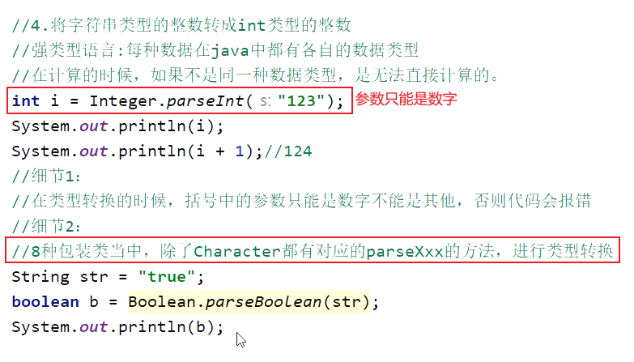

<h1>
包装类
</h1>

# 包装类

## 一、什么是包装类

## 二、为什么使用包装类

- ####  因为：再java中，万事万物皆对象，方法的参数如果是Object，那么 基本数据类型就不能传进来。有局限性，其次是，多态性。

- #### 集合中也只能存储对象，不能存储基本数据类型。

- ### 注意点：

- ### 自动装箱，自动拆箱：

# 总结

---

---

## 三、Integer 包装类的 成员方法

---

----

© 版权声明

<escape>

    <h3 align="center"  style="color: brown;" >版权声明</h3>
    <table>
   		<tr>
    		<ol>
				<li>本网站名称：𝚲𝚳𝚲</li>
				<li>𝚲𝚳𝚲提供的资源仅供您个人用于非商业性目的。</li>
				<li>本站文章部分内容可能来源于网络，仅供大家学习与参考，如有侵权，请联系我进行删除处理。</li>
				<li>本站一切资源不代表本站立场，并不代表本站赞同其观点和对其真实性负责。</li>
        		<li>本站一律禁止以任何方式发布或转载任何违法的相关信息，访客发现请举报</li> 
        		<li>本站资源大多存储在云盘，如发现链接失效，请联系我，我会第一时间更新。</li>
        		<li>本站强烈打击盗版/破解等有损他人权益和违法作为，请支持正版！</li>  
			</ol>
		</tr>
	</table>

</escape>

----

