# 第三章 JavaScript

# 一 JS简介

## 1.1 JS起源


> Javascript是一种由Netscape(网景)的LiveScript发展而来的原型化继承的面向对象的动态类型的区分大小写的`客户端脚本语言`，主要目的是为了解决服务器端语言，遗留的速度问题，为客户提供更流畅的浏览效果。当时服务端需要对数据进行验证，由于网络速度相当缓慢,只有28.8kbps，验证步骤浪费的时间太多。于是Netscape的浏览器Navigator加入了Javascript，提供了数据验证的基本功能。ECMA-262 是正式的 JavaScript 标准。这个标准基于 JavaScript (Netscape) 和 JScript (Microsoft)。ECMA-262 的开发始于 1996 年，在 1997 年 7 月，ECMA 会员大会采纳了它的首个版本。这个标准由 ECMA 组织发展和维护。JavaScript 的正式名称是 "ECMAScript"。JavaScript的组成包含ECMAScript、DOM、BOM。<font color='red'>JS是一种运行于浏览器端上的小脚本语句,可以实现网页如文本内容动,数据动态变化和动画特效等</font>,JS有 如下特点

+ 脚本语言
    + JavaScript是一种解释型的脚本语言。不同于C、C++、Java等语言先编译后执行,	JavaScript不会产生编译出来的字节码文件，而是在程序的运行过程中对源文件逐行进行解释。

+ 基于对象
    + JavaScript是一种基于对象的脚本语言，它不仅可以创建对象，也能使用现有的对象。但是面向对象的三大特性：『封装』、『继承』、『多态』中，JavaScript能够实现封装，可以模拟继承，不支持多态，所以它不是一门面向对象的编程语言。
+ 弱类型
    + JavaScript中也有明确的数据类型，但是声明一个变量后它可以接收任何类型的数据，并且会在程序执行过程中根据上下文自动转换类型。
+ 事件驱动
    + JavaScript是一种采用事件驱动的脚本语言，它不需要经过Web服务器就可以对用户的输入做出响应。
+ 跨平台性
    + JavaScript脚本语言不依赖于操作系统，仅需要浏览器的支持。因此一个JavaScript脚本在编写后可以带到任意机器上使用，前提是机器上的浏览器支持JavaScript脚本语言。目前JavaScript已被大多数的浏览器所支持。

## 1.2 JS 组成部分

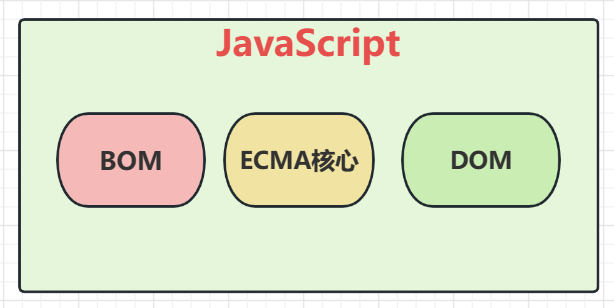

> ECMA 及版本变化

+ 是一种由欧洲计算机制造商协会（ECMA）通过ECMA-262标准化的脚本程序语言,ECMAScript描述了语法、类型、语句、关键字、保留字、运算符和对象。它就是定义了脚本语言的所有属性、方法和对象。

+  ECMA-262第1版本质上跟网景的JavaScript 1.1相同，删除了浏览器特定代码和少量细微的修改.ECMA-262要求支持Unicode标准（以支持多语言）且对象要与平台无关 
+  ECMA-262第2版只是做了一些编校工作，主要是为了严格符合ISO/IEC-16262的要求，并没有增减或改变任何特性。 

+  ECMA-262第3版第一次真正对ECMAScript进行更新，更新了字符串处理、错误定义和数值输出，增加了对正则表达式、新的控制语句、try/catch异常处理的支持。 
+  ECMA-262第4版是对这门语言的一次彻底修订。开发者开始修订ECMAScript以满足全球Web开发日益增长的需求。 第4版包括强类型变量、新语句和数据结构、真正的类和经典的继承，以及操作数据的新手段。  
+  ECMA-262第5版是ECMA-262第3版的小幅改进，于2009年12月3日正式发布。第5版致力于厘清第3版存在的歧义，也增加了新功能。新功能包括原生的解析和序列化JSON数据的JSON对象、方便继承和高级属性定义的方法、新的增强ECMAScript引擎解释和执行代码能力的严格模式。 
+  ECMA-262第6版俗称ES6、ES2015或ES Harmony（和谐版），于2015年6月发布。**`这一版包含了大概这个规范有史以来最重要的一批增强特性。`**ES6正式支持了类、模块、迭代器、生成器、箭头函数、期约、反射、代理和众多新的数据类型。但是并不是所有的浏览器都全面支持了ES6,很多情况下我们需要将ES6的语法通过工具转换成5以后运行
+   ECMA-262第7版也称为ES7或ES2016，于2016年6月发布。这次修订只包含少量语法层面的增强，如Array.prototype.includes和指数操作符。
+  ECMA-262第8版也称为ES8、ES2017，完成于2017年6月。这一版主要增加了异步函数（async/await）、SharedArrayBuffer及Atomics API、Object.values()/Object.entries()/Object.getOwnProperty- Descriptors()和字符串填充方法，另外明确支持对象字面量最后的逗号。  
+  ECMA-262第9版也称为ES9、ES2018，发布于2018年6月。这次修订包括异步迭代、剩余和扩展属性、一组新的正则表达式特性、Promise finally()以及模板字面量修订。
+  ECMA-262第10版也称为ES10、ES2019，发布于2019年6月。这次修订增加了Array.prototype.flat()/flatMap()、String.prototype.trimStart()/trimEnd()、Object.fromEntries()方法以及Symbol.prototype.description属性，明确定义了Function.prototype.toString()的返回值并固定了Array.prototype.sort()的顺序。另外，这次修订解决了与JSON字符串兼容的问题，并定义了catch子句的可选绑定。 
+  ECMA-262第11版，也成为ES11、ES2020，发布于2020年6月。这次修订增加了String 的 matchAll 方法、动态导入语句 import()、import.meta、export * as ns from 'module'、Promise.allSettled、GlobalThis、Nullish coalescing Operator、Optional Chaining以及一种新的数据类型BigInt，在此之后JavaScript正式迎来第8位数据类型。 

> BOM编程

+ BOM是Browser Object Model的简写，即浏览器对象模型。

+ BOM有一系列对象组成，是访问、控制、修改浏览器的属性和方法

+ BOM没有统一的标准(每种客户端都可以自定标准)。

+ BOM编程是将浏览器窗口的各个组成部分抽象成各个对象,通过各个对象的API操作组件行为的一种编程

+ BOM编程的对象结构如下

    + window 顶级对象,代表整个浏览器窗口
        + location对象        window对象的属性之一,代表浏览器的地址栏
        + history对象          window对象的属性之一,代表浏览器的访问历史
        + screen对象           window对象的属性之一,代表屏幕
        + navigator对象      window对象的属性之一,代表浏览器软件本身
        + document对象     window对象的属性之一,代表浏览器窗口目前解析的html文档

    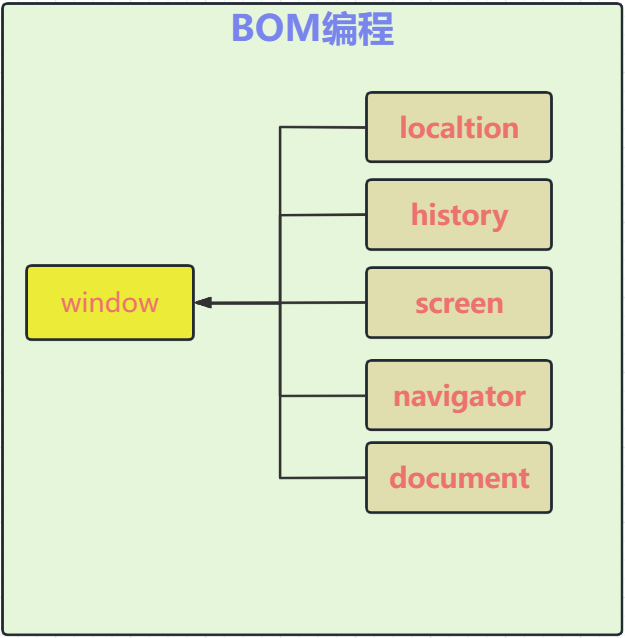

> DOM编程

+ 简单来说:DOM编程就是使用document对象的API完成对网页HTML文档进行动态修改,以实现网页数据和样式动态变化效果的编程.
+ document对象代表整个html文档，可用来访问页面中的所有元素，是最复杂的一个dom对象，可以说是学习好dom编程的关键所在。
+ 根据HTML代码结构特点,document对象本身是一种树形结构的文档对象。

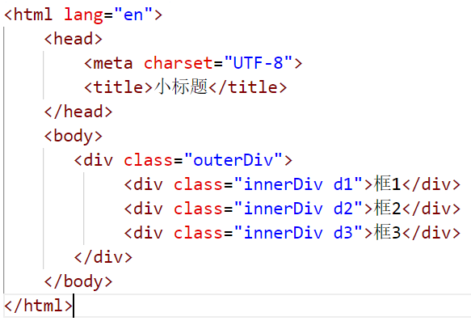


+ 上面的代码生成的树如下

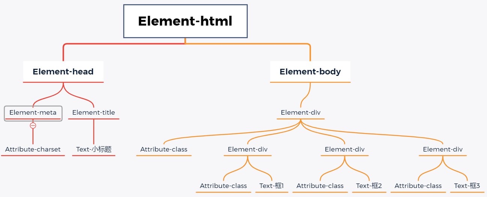

+ DOM编程其实就是用window对象的document属性的相关API完成对页面元素的控制的编程

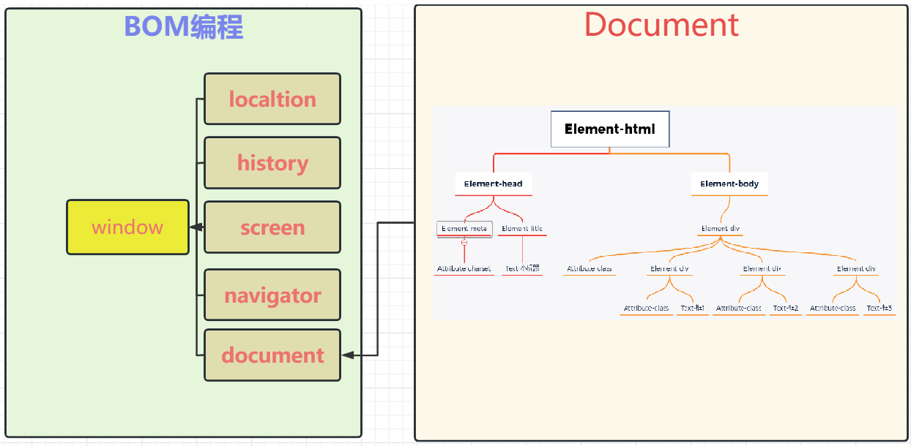

## 1.3 JS的引入方式

> 内部脚本方式引入

+ 说明
    + 在页面中,通过一对script标签引入JS代码
    + script代码放置位置具备一定的随意性,一般放在head标签中居多

+ 代码

``` html
<!DOCTYPE html>
<html lang="en">
    <head>
        <meta charset="UTF-8">
        <title>小标题</title>
        <style>
            /* 通过选择器确定样式的作用范围 */
            .btn1 {
                display: block;
                width: 150px; 
                height: 40px; 
                background-color: rgb(245, 241, 129); 
                color: rgb(238, 31, 31);
                border: 3px solid rgb(238, 23, 66);
                font-size: 22px;
                font-family: '隶书';
                line-height: 30px;
                border-radius: 5px;
            }
        </style>
        <script>
            function suprise(){
                alert("Hello,我是惊喜")
            }
        </script>
    </head>
    <body>
        <button class="btn1" onclick="suprise()">点我有惊喜</button>
    </body>
</html>
```

+ 效果

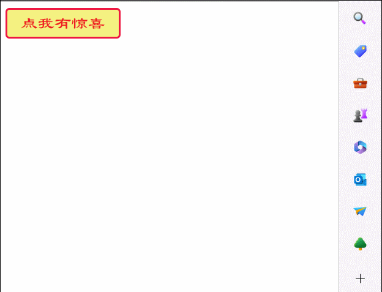


> 外部脚本方式引入

+ 说明
    + 内部脚本仅能在当前页面上使用,代码复用度不高
    + 可以将脚本放在独立的js文件中,通过script标签引入外部脚本文件
    + 一对script标签要么用于定义内部脚本,要么用于引入外部js文件,不能混用
    + 一个html文档中,可以有多个script标签 
+ 抽取脚本代码到独立的js文件中

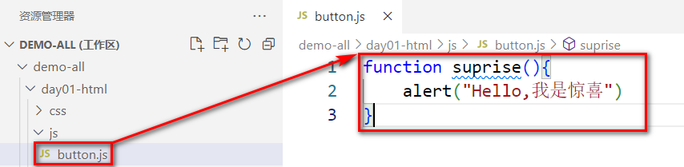

+ 在html文件中,通过script标签引入外部脚本文件

``` html
<!DOCTYPE html>
<html lang="en">
    <head>
        <meta charset="UTF-8">
        <title>小标题</title>
        <style>
            /* 通过选择器确定样式的作用范围 */
            .btn1 {
                display: block;
                width: 150px; 
                height: 40px; 
                background-color: rgb(245, 241, 129); 
                color: rgb(238, 31, 31);
                border: 3px solid rgb(238, 23, 66);
                font-size: 22px;
                font-family: '隶书';
                line-height: 30px;
                border-radius: 5px;
            }
        </style>
        <script src="js/button.js" type="text/javascript"></script>
    </head>

    <body>
        <button class="btn1" onclick="suprise()">点我有惊喜</button>
    </body>
</html>
```

# 二 JS的数据类型和运算符

## 2.1 JS的数据类型

> 数值类型

+ 数值类型统一为 number,不区分整数和浮点数

> 字符串类型

+ 字符串类型为 string 和JAVA中的String相似,JS中不严格区分单双引号,都可以用于表示字符串

> 布尔类型

+ 布尔类型为boolean 和Java中的boolean相似,但是在JS的if语句中,非空字符串会被转换为'真',非零数字也会被认为是'真'

> 引用数据类型

+ 引用数据类型对象是Object类型, 各种对象和数组在JS中都是Object类型

> function类型

+ JS中的各种函数属于function数据类型

> 命名未赋值

+ js为弱类型语言,统一使用 var 声明对象和变量,在赋值时才确定真正的数据类型,变量如果只声明没有赋值的话,数据类型为undefined

> 赋予NULL值

+ 在JS中,如果给一个变量赋值为null,其数据类型是Object, 可以通过typeof关键字判断数据类型

## 2.2 JS的变量

> JS中的变量具有如下特征

+ 1 弱类型变量,可以统一声明成var
+ 2 var声明的变量可以再次声明
+ 3 变量可以使用不同的数据类型多次赋值
+ 4 JS的语句可以以; 结尾,也可以不用;结尾
+ 5 变量标识符严格区分大小写
+ 6 标识符的命名规则参照JAVA
+ 7 如果使用了 一个没有声明的变量,那么运行时会报uncaught ReferenceError: *** is not defined   at index.html:行号:列号
+ 8 如果一个变量只声明,没赋值,那么值是undefined

## 2.3 JS的运算符

>  算数运算符  + - * /  %

+ 其中需要注意的是 / 和 % 
    + / 在除0时,结果是Infinity ,而不是报错
    + %在模0时,结果是NaN,意思为 not a number ,而不是报错

> 复合算数运算符 ++ --  += -= *= /= %=

+ 符合算数运算符基本和JAVA一致,同样需要注意 /=和%=
    + 在/=0时,结果是Infinity ,而不是报错
    + 在%=0时,结果是NaN,意思为 not a number ,而不是报错

> 关系运算符  >   <  >= <= == === !=

+ 需要注意的是 == 和 === 差别
    + == 符号,如果两端的数据类型不一致,会尝试将两端的数据转换成number,再对比number大小
        + '123'  这种字符串可以转换成数字
        + true会被转换成1 false会被转换成0
    + ===  符号,如果两端数据类型不一致,直接返回false,数据类型一致在比较是否相同

> 逻辑运算符  || &&    

+ 几乎和JAVA中的一样,需要注意的是,这里直接就是短路的逻辑运算符,单个的 |   和 &  以及 ^ 是位运算符

> 条件运算符  条件? 值1  : 值2

+ 几乎和JAVA中的一样

> 位运算符  |  &  ^  <<  >>  >>>

+ 和 java中的类似(了解)

# 三 JS的流程控制和函数

## 3.1 JS分支结构

> if结构

+ 这里的if结构几乎和JAVA中的一样,需要注意的是
    + if()中的非空字符串会被认为是true
    + if()中的非零数字会被认为是true

+ 代码

``` javascript
if('false'){// 非空字符串 if判断为true
    console.log(true)
}else{
    console.log(false)
}
if(''){// 长度为0字符串 if判断为false
    console.log(true)
}else{
    console.log(false)
}
if(1){// 非零数字 if判断为true
    console.log(true)
}else{
    console.log(false)
}
if(0){
    console.log(true)
}else{
    console.log(false)
}
```

+ 结果

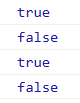

> switch结构

+ 几乎和JAVA的语法一致

+ 代码

``` javascript
var monthStr=prompt("请输入月份","例如:10 ");
var month= Number.parseInt(monthStr)
switch(month){
    case 3:
    case 4:
    case 5:
        console.log("春季");
        break;
    case 6:
    case 7:
    case 8:
        console.log("夏季");
        break;
    case 9:
    case 10:
    case 11:
        console.log("秋季");
        break;
    case 1:
    case 2:
    case 12:
        console.log("冬季");
        break;
    default :
        console.log("月份有误")
}
```

+ 效果

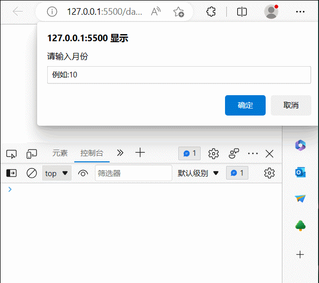


## 3.2 JS循环结构

> while结构

+ 几乎和JAVA一致

+ 代码

```  javascript
/* 打印99 乘法表 */
var i = 1;
while(i <= 9){
    var j = 1;
    while(j <= i){
        document.write(j+"*"+i+"="+i*j+"&nbsp;&nbsp;&nbsp;&nbsp;&nbsp;");
        j++;
    }
    document.write("<hr/>");
    i++;
}
```

+ 效果

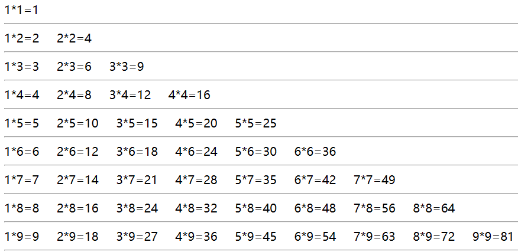

> for循环

+ 几乎和JAVA一致

+ 代码

``` javascript
/* 打印99 乘法表 */
for(  var i = 1;i <= 9; i++){
    for(var j = 1;j <= i;j++){
        document.write(j+"*"+i+"="+i*j+"&nbsp;&nbsp;&nbsp;&nbsp;&nbsp;");
    }
    document.write("<hr/>");
}
```

+ 效果


> foreach循环

+ 迭代数组时,和java不一样
    + 括号中的临时变量表示的是元素的索引,不是元素的值,
    + ()中也不在使用: 分隔,而是使用 in 关键字

+ 代码

``` javascript
var cities =["北京","上海","深圳","武汉","西安","成都"]
document.write("<ul>")
for(var index in  cities){
    document.write("<li>"+cities[index]+"</li>")
}
document.write("</ul>")
```

+ 效果

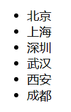

## 3.3 JS函数声明

> JS中的方法,多称为函数,函数的声明语法和JAVA中有较大区别

+ 函数说明
    + 函数没有权限控制符
    + 不用声明函数的返回值类型,需要返回在函数体中直接return即可,也无需void关键字
    + 参数列表中,无需数据类型
    + 调用函数时,实参和形参的个数可以不一致
    + 声明函数时需要用function关键字
    + J函数没有异常列表
+ 代码

``` javascript
/* 
语法1 
    function 函数名 (参数列表){函数体}
            */
function sum(a, b){
    return a+b;
}
var result =sum(10,20);
console.log(result)

/* 
语法2
    var 函数名 = function (参数列表){函数体}
            */
var add = function(a, b){
    return a+b;
}
var result = add(1,2);
console.log(result);
```

+ 调用测试

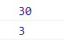


# 四 JS的对象和JSON

## 4.1 JS声明对象的语法

> 语法1 通过new Object()直接创建对象

+ 代码

```javascript
var person =new Object();
// 给对象添加属性并赋值
person.name="张小明";
person.age=10;
person.foods=["苹果","橘子","香蕉","葡萄"];
// 给对象添加功能函数
person.eat= function (){
    console.log(this.age+"岁的"+this.name+"喜欢吃:")
    for(var i = 0;i<this.foods.length;i++){
        console.log(this.foods[i])
    } 
}
//获得对象属性值
console.log(person.name)
console.log(person.age)
//调用对象方法
person.eat();
```

+ 效果

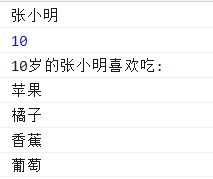


> 语法2 通过 {}形式创建对象

+ 语法为  var person ={"属性名":"属性值","属性名","属性值","函数名":函数}
+ 代码

``` javascript
var person ={
    "name":"张小明",
    "age":10,
    "foods":["苹果","香蕉","橘子","葡萄"],
    "eat":function (){
        console.log(this.age+"岁的"+this.name+"喜欢吃:")
        for(var i = 0;i<this.foods.length;i++){
            console.log(this.foods[i])
        } 
    }
}
//获得对象属性值
console.log(person.name)
console.log(person.age)
//调用对象方法
person.eat();
```

+ 效果


## 4.2 JSON格式

>  JSON（JavaScript Object Notation, JS对象简谱）是一种轻量级的数据交换格式。它基于ECMAScript（European Computer Manufacturers Association, 欧洲计算机协会的一个子集，采用完全独立于编程语言的文本格式来存储和表示数据。简洁和清晰的层次结构使得 JSON 成为理想的数据交换语言。 易于人阅读和编写，同时也易于机器解析和生成，并有效地提升网络传输效率 <font color="red">简单来说,JSON 就是一种字符串格式,这种格式无论是在前端还是在后端,都可以很容易的转换成对象,所以常用于前后端数据传递</font>

+ 说明

    + JSON的语法

        ​		var obj="{'属性名':'属性值','属性名':{'属性名':'属性值'},'属性名':['值1','值1','值3']}"

    + JSON字符串一般用于传递数据,所以字符串中的函数就显得没有意义,在此不做研究

    + 通过JSON.parse()方法可以将一个JSON串转换成对象

    + 通过JSON.stringify()方法可以将一个对象转换成一个JSON格式的字符串

+ 代码

``` javascript
/* 定义一个JSON串 */
var personStr ='{"name":"张小明","age":20,"girlFriend":{"name":"铁铃","age":23},"foods":["苹果","香蕉","橘子","葡萄"],"pets":[{"petName":"大黄","petType":"dog"},{"petName":"小花","petType":"cat"}]}'
console.log(personStr)
console.log(typeof personStr)
/* 将一个JSON串转换为对象 */
var person =JSON.parse(personStr);
console.log(person)
console.log(typeof person)
/* 获取对象属性值 */
console.log(person.name)
console.log(person.age)
console.log(person.girlFriend.name)
console.log(person.foods[1])
console.log(person.pets[1].petName)
console.log(person.pets[1].petType)
```


``` javascript
/* 定义一个对象 */
var person={
    'name':'张小明',
    'age':20,
    'girlFriend':{
        'name':'铁铃',
        'age':23
    },
    'foods':['苹果','香蕉','橘子','葡萄'],
    'pets':[
        {
            'petName':'大黄',
            'petType':'dog'
        },
        {
            'petName':'小花',
            'petType':'cat'
        }
    ]
}

/* 获取对象属性值 */
console.log(person.name)
console.log(person.age)
console.log(person.girlFriend.name)
console.log(person.foods[1])
console.log(person.pets[1].petName)
console.log(person.pets[1].petType)
/* 将对象转换成JSON字符串 */
var personStr =JSON.stringify(person)
console.log(personStr)
console.log(typeof personStr)
```

+ 前后端传递数据


## 4.3 JS常见对象

### 4.3.1 数组

> 创建数组的四种方式

+ new Array()                                                   创建空数组
+ new Array(5)                                                 创建数组时给定长度
+ new Array(ele1,ele2,ele3,... ... ,elen);          创建数组时指定元素值
+ [ele1,ele2,ele3,... ... ,elen];                           相当于第三种语法的简写

> 数组的常见API

+ 在JS中,数组属于Object类型,其长度是可以变化的,更像JAVA中的集合

| 方法                                                         | 描述                                                         |
| :----------------------------------------------------------- | :----------------------------------------------------------- |
| [concat()](https://www.runoob.com/jsref/jsref-concat-array.html) | 连接两个或更多的数组，并返回结果。                           |
| [copyWithin()](https://www.runoob.com/jsref/jsref-copywithin.html) | 从数组的指定位置拷贝元素到数组的另一个指定位置中。           |
| [entries()](https://www.runoob.com/jsref/jsref-entries.html) | 返回数组的可迭代对象。                                       |
| [every()](https://www.runoob.com/jsref/jsref-every.html)     | 检测数值元素的每个元素是否都符合条件。                       |
| [fill()](https://www.runoob.com/jsref/jsref-fill.html)       | 使用一个固定值来填充数组。                                   |
| [filter()](https://www.runoob.com/jsref/jsref-filter.html)   | 检测数值元素，并返回符合条件所有元素的数组。                 |
| [find()](https://www.runoob.com/jsref/jsref-find.html)       | 返回符合传入测试（函数）条件的数组元素。                     |
| [findIndex()](https://www.runoob.com/jsref/jsref-findindex.html) | 返回符合传入测试（函数）条件的数组元素索引。                 |
| [forEach()](https://www.runoob.com/jsref/jsref-foreach.html) | 数组每个元素都执行一次回调函数。                             |
| [from()](https://www.runoob.com/jsref/jsref-from.html)       | 通过给定的对象中创建一个数组。                               |
| [includes()](https://www.runoob.com/jsref/jsref-includes.html) | 判断一个数组是否包含一个指定的值。                           |
| [indexOf()](https://www.runoob.com/jsref/jsref-indexof-array.html) | 搜索数组中的元素，并返回它所在的位置。                       |
| [isArray()](https://www.runoob.com/jsref/jsref-isarray.html) | 判断对象是否为数组。                                         |
| [join()](https://www.runoob.com/jsref/jsref-join.html)       | 把数组的所有元素放入一个字符串。                             |
| [keys()](https://www.runoob.com/jsref/jsref-keys.html)       | 返回数组的可迭代对象，包含原始数组的键(key)。                |
| [lastIndexOf()](https://www.runoob.com/jsref/jsref-lastindexof-array.html) | 搜索数组中的元素，并返回它最后出现的位置。                   |
| [map()](https://www.runoob.com/jsref/jsref-map.html)         | 通过指定函数处理数组的每个元素，并返回处理后的数组。         |
| [pop()](https://www.runoob.com/jsref/jsref-pop.html)         | 删除数组的最后一个元素并返回删除的元素。                     |
| [push()](https://www.runoob.com/jsref/jsref-push.html)       | 向数组的末尾添加一个或更多元素，并返回新的长度。             |
| [reduce()](https://www.runoob.com/jsref/jsref-reduce.html)   | 将数组元素计算为一个值（从左到右）。                         |
| [reduceRight()](https://www.runoob.com/jsref/jsref-reduceright.html) | 将数组元素计算为一个值（从右到左）。                         |
| [reverse()](https://www.runoob.com/jsref/jsref-reverse.html) | 反转数组的元素顺序。                                         |
| [shift()](https://www.runoob.com/jsref/jsref-shift.html)     | 删除并返回数组的第一个元素。                                 |
| [slice()](https://www.runoob.com/jsref/jsref-slice-array.html) | 选取数组的一部分，并返回一个新数组。                         |
| [some()](https://www.runoob.com/jsref/jsref-some.html)       | 检测数组元素中是否有元素符合指定条件。                       |
| [sort()](https://www.runoob.com/jsref/jsref-sort.html)       | 对数组的元素进行排序。                                       |
| [splice()](https://www.runoob.com/jsref/jsref-splice.html)   | 从数组中添加或删除元素。                                     |
| [toString()](https://www.runoob.com/jsref/jsref-tostring-array.html) | 把数组转换为字符串，并返回结果。                             |
| [unshift()](https://www.runoob.com/jsref/jsref-unshift.html) | 向数组的开头添加一个或更多元素，并返回新的长度。             |
| [valueOf()](https://www.runoob.com/jsref/jsref-valueof-array.html) | 返回数组对象的原始值。                                       |
| [Array.of()](https://www.runoob.com/jsref/jsref-of-array.html) | 将一组值转换为数组。                                         |
| [Array.at()](https://www.runoob.com/jsref/jsref-at-array.html) | 用于接收一个整数值并返回该索引对应的元素，允许正数和负数。负整数从数组中的最后一个元素开始倒数。 |
| [Array.flat()](https://www.runoob.com/jsref/jsref-flat-array.html) | 创建一个新数组，这个新数组由原数组中的每个元素都调用一次提供的函数后的返回值组成。 |
| [Array.flatMap()](https://www.runoob.com/jsref/jsref-flatmap-array.html) | 使用映射函数映射每个元素，然后将结果压缩成一个新数组。       |

### 4.3.2 Boolean对象

> boolean对象的方法比较简单

| 方法                                                         | 描述                               |
| :----------------------------------------------------------- | :--------------------------------- |
| [toString()](https://www.runoob.com/jsref/jsref-tostring-boolean.html) | 把布尔值转换为字符串，并返回结果。 |
| [valueOf()](https://www.runoob.com/jsref/jsref-valueof-boolean.html) | 返回 Boolean 对象的原始值。        |

### 4.3.3 Date对象

> 和JAVA中的Date类比较类似

| 方法                                                         | 描述                                                         |
| :----------------------------------------------------------- | :----------------------------------------------------------- |
| [getDate()](https://www.runoob.com/jsref/jsref-getdate.html) | 从 Date 对象返回一个月中的某一天 (1 ~ 31)。                  |
| [getDay()](https://www.runoob.com/jsref/jsref-getday.html)   | 从 Date 对象返回一周中的某一天 (0 ~ 6)。                     |
| [getFullYear()](https://www.runoob.com/jsref/jsref-getfullyear.html) | 从 Date 对象以四位数字返回年份。                             |
| [getHours()](https://www.runoob.com/jsref/jsref-gethours.html) | 返回 Date 对象的小时 (0 ~ 23)。                              |
| [getMilliseconds()](https://www.runoob.com/jsref/jsref-getmilliseconds.html) | 返回 Date 对象的毫秒(0 ~ 999)。                              |
| [getMinutes()](https://www.runoob.com/jsref/jsref-getminutes.html) | 返回 Date 对象的分钟 (0 ~ 59)。                              |
| [getMonth()](https://www.runoob.com/jsref/jsref-getmonth.html) | 从 Date 对象返回月份 (0 ~ 11)。                              |
| [getSeconds()](https://www.runoob.com/jsref/jsref-getseconds.html) | 返回 Date 对象的秒数 (0 ~ 59)。                              |
| [getTime()](https://www.runoob.com/jsref/jsref-gettime.html) | 返回 1970 年 1 月 1 日至今的毫秒数。                         |
| [getTimezoneOffset()](https://www.runoob.com/jsref/jsref-gettimezoneoffset.html) | 返回本地时间与格林威治标准时间 (GMT) 的分钟差。              |
| [getUTCDate()](https://www.runoob.com/jsref/jsref-getutcdate.html) | 根据世界时从 Date 对象返回月中的一天 (1 ~ 31)。              |
| [getUTCDay()](https://www.runoob.com/jsref/jsref-getutcday.html) | 根据世界时从 Date 对象返回周中的一天 (0 ~ 6)。               |
| [getUTCFullYear()](https://www.runoob.com/jsref/jsref-getutcfullyear.html) | 根据世界时从 Date 对象返回四位数的年份。                     |
| [getUTCHours()](https://www.runoob.com/jsref/jsref-getutchours.html) | 根据世界时返回 Date 对象的小时 (0 ~ 23)。                    |
| [getUTCMilliseconds()](https://www.runoob.com/jsref/jsref-getutcmilliseconds.html) | 根据世界时返回 Date 对象的毫秒(0 ~ 999)。                    |
| [getUTCMinutes()](https://www.runoob.com/jsref/jsref-getutcminutes.html) | 根据世界时返回 Date 对象的分钟 (0 ~ 59)。                    |
| [getUTCMonth()](https://www.runoob.com/jsref/jsref-getutcmonth.html) | 根据世界时从 Date 对象返回月份 (0 ~ 11)。                    |
| [getUTCSeconds()](https://www.runoob.com/jsref/jsref-getutcseconds.html) | 根据世界时返回 Date 对象的秒钟 (0 ~ 59)。                    |
| getYear()                                                    | 已废弃。 请使用 getFullYear() 方法代替。                     |
| [parse()](https://www.runoob.com/jsref/jsref-parse.html)     | 返回1970年1月1日午夜到指定日期（字符串）的毫秒数。           |
| [setDate()](https://www.runoob.com/jsref/jsref-setdate.html) | 设置 Date 对象中月的某一天 (1 ~ 31)。                        |
| [setFullYear()](https://www.runoob.com/jsref/jsref-setfullyear.html) | 设置 Date 对象中的年份（四位数字）。                         |
| [setHours()](https://www.runoob.com/jsref/jsref-sethours.html) | 设置 Date 对象中的小时 (0 ~ 23)。                            |
| [setMilliseconds()](https://www.runoob.com/jsref/jsref-setmilliseconds.html) | 设置 Date 对象中的毫秒 (0 ~ 999)。                           |
| [setMinutes()](https://www.runoob.com/jsref/jsref-setminutes.html) | 设置 Date 对象中的分钟 (0 ~ 59)。                            |
| [setMonth()](https://www.runoob.com/jsref/jsref-setmonth.html) | 设置 Date 对象中月份 (0 ~ 11)。                              |
| [setSeconds()](https://www.runoob.com/jsref/jsref-setseconds.html) | 设置 Date 对象中的秒钟 (0 ~ 59)。                            |
| [setTime()](https://www.runoob.com/jsref/jsref-settime.html) | setTime() 方法以毫秒设置 Date 对象。                         |
| [setUTCDate()](https://www.runoob.com/jsref/jsref-setutcdate.html) | 根据世界时设置 Date 对象中月份的一天 (1 ~ 31)。              |
| [setUTCFullYear()](https://www.runoob.com/jsref/jsref-setutcfullyear.html) | 根据世界时设置 Date 对象中的年份（四位数字）。               |
| [setUTCHours()](https://www.runoob.com/jsref/jsref-setutchours.html) | 根据世界时设置 Date 对象中的小时 (0 ~ 23)。                  |
| [setUTCMilliseconds()](https://www.runoob.com/jsref/jsref-setutcmilliseconds.html) | 根据世界时设置 Date 对象中的毫秒 (0 ~ 999)。                 |
| [setUTCMinutes()](https://www.runoob.com/jsref/jsref-setutcminutes.html) | 根据世界时设置 Date 对象中的分钟 (0 ~ 59)。                  |
| [setUTCMonth()](https://www.runoob.com/jsref/jsref-setutcmonth.html) | 根据世界时设置 Date 对象中的月份 (0 ~ 11)。                  |
| [setUTCSeconds()](https://www.runoob.com/jsref/jsref-setutcseconds.html) | setUTCSeconds() 方法用于根据世界时 (UTC) 设置指定时间的秒字段。 |
| setYear()                                                    | 已废弃。请使用 setFullYear() 方法代替。                      |
| [toDateString()](https://www.runoob.com/jsref/jsref-todatestring.html) | 把 Date 对象的日期部分转换为字符串。                         |
| toGMTString()                                                | 已废弃。请使用 toUTCString() 方法代替。                      |
| [toISOString()](https://www.runoob.com/jsref/jsref-toisostring.html) | 使用 ISO 标准返回字符串的日期格式。                          |
| [toJSON()](https://www.runoob.com/jsref/jsref-tojson.html)   | 以 JSON 数据格式返回日期字符串。                             |
| [toLocaleDateString()](https://www.runoob.com/jsref/jsref-tolocaledatestring.html) | 根据本地时间格式，把 Date 对象的日期部分转换为字符串。       |
| [toLocaleTimeString()](https://www.runoob.com/jsref/jsref-tolocaletimestring.html) | 根据本地时间格式，把 Date 对象的时间部分转换为字符串。       |
| [toLocaleString()](https://www.runoob.com/jsref/jsref-tolocalestring.html) | 根据本地时间格式，把 Date 对象转换为字符串。                 |
| [toString()](https://www.runoob.com/jsref/jsref-tostring-date.html) | 把 Date 对象转换为字符串。                                   |
| [toTimeString()](https://www.runoob.com/jsref/jsref-totimestring.html) | 把 Date 对象的时间部分转换为字符串。                         |
| [toUTCString()](https://www.runoob.com/jsref/jsref-toutcstring.html) | 根据世界时，把 Date 对象转换为字符串。实例：`var today = new Date(); var UTCstring = today.toUTCString();` |
| [UTC()](https://www.runoob.com/jsref/jsref-utc.html)         | 根据世界时返回 1970 年 1 月 1 日 到指定日期的毫秒数。        |
| [valueOf()](https://www.runoob.com/jsref/jsref-valueof-date.html) | 返回 Date 对象的原始值。                                     |

### 4.3.4 Math

>  和JAVA中的Math类比较类似

| 方法                                                         | 描述                                                         |
| :----------------------------------------------------------- | :----------------------------------------------------------- |
| [abs(x)](https://www.runoob.com/jsref/jsref-abs.html)        | 返回 x 的绝对值。                                            |
| [acos(x)](https://www.runoob.com/jsref/jsref-acos.html)      | 返回 x 的反余弦值。                                          |
| [asin(x)](https://www.runoob.com/jsref/jsref-asin.html)      | 返回 x 的反正弦值。                                          |
| [atan(x)](https://www.runoob.com/jsref/jsref-atan.html)      | 以介于 -PI/2 与 PI/2 弧度之间的数值来返回 x 的反正切值。     |
| [atan2(y,x)](https://www.runoob.com/jsref/jsref-atan2.html)  | 返回从 x 轴到点 (x,y) 的角度（介于 -PI/2 与 PI/2 弧度之间）。 |
| [ceil(x)](https://www.runoob.com/jsref/jsref-ceil.html)      | 对数进行上舍入。                                             |
| [cos(x)](https://www.runoob.com/jsref/jsref-cos.html)        | 返回数的余弦。                                               |
| [exp(x)](https://www.runoob.com/jsref/jsref-exp.html)        | 返回 Ex 的指数。                                             |
| [floor(x)](https://www.runoob.com/jsref/jsref-floor.html)    | 对 x 进行下舍入。                                            |
| [log(x)](https://www.runoob.com/jsref/jsref-log.html)        | 返回数的自然对数（底为e）。                                  |
| [max(x,y,z,...,n)](https://www.runoob.com/jsref/jsref-max.html) | 返回 x,y,z,...,n 中的最高值。                                |
| [min(x,y,z,...,n)](https://www.runoob.com/jsref/jsref-min.html) | 返回 x,y,z,...,n中的最低值。                                 |
| [pow(x,y)](https://www.runoob.com/jsref/jsref-pow.html)      | 返回 x 的 y 次幂。                                           |
| [random()](https://www.runoob.com/jsref/jsref-random.html)   | 返回 0 ~ 1 之间的随机数。                                    |
| [round(x)](https://www.runoob.com/jsref/jsref-round.html)    | 四舍五入。                                                   |
| [sin(x)](https://www.runoob.com/jsref/jsref-sin.html)        | 返回数的正弦。                                               |
| [sqrt(x)](https://www.runoob.com/jsref/jsref-sqrt.html)      | 返回数的平方根。                                             |
| [tan(x)](https://www.runoob.com/jsref/jsref-tan.html)        | 返回角的正切。                                               |
| [tanh(x)](https://www.runoob.com/jsref/jsref-tanh.html)      | 返回一个数的双曲正切函数值。                                 |
| [trunc(x)](https://www.runoob.com/jsref/jsref-trunc.html)    | 将数字的小数部分去掉，只保留整数部分。                       |

### 4.3.5 Number

> Number中准备了一些基础的数据处理函数

| 方法                                                         | 描述                                                 |
| :----------------------------------------------------------- | :--------------------------------------------------- |
| [isFinite](https://www.runoob.com/jsref/jsref-isfinite-number.html) | 检测指定参数是否为无穷大。                           |
| [isInteger](https://www.runoob.com/jsref/jsref-isinteger-number.html) | 检测指定参数是否为整数。                             |
| [isNaN](https://www.runoob.com/jsref/jsref-isnan-number.html) | 检测指定参数是否为 NaN。                             |
| [isSafeInteger](https://www.runoob.com/jsref/jsref-issafeInteger-number.html) | 检测指定参数是否为安全整数。                         |
| [toExponential(x)](https://www.runoob.com/jsref/jsref-toexponential.html) | 把对象的值转换为指数计数法。                         |
| [toFixed(x)](https://www.runoob.com/jsref/jsref-tofixed.html) | 把数字转换为字符串，结果的小数点后有指定位数的数字。 |
| [toLocaleString(locales, options)](https://www.runoob.com/jsref/jsref-tolocalestring-number.html) | 返回数字在特定语言环境下的表示字符串。               |
| [toPrecision(x)](https://www.runoob.com/jsref/jsref-toprecision.html) | 把数字格式化为指定的长度。                           |
| [toString()](https://www.runoob.com/jsref/jsref-tostring-number.html) | 把数字转换为字符串，使用指定的基数。                 |
| [valueOf()](https://www.runoob.com/jsref/jsref-valueof-number.html) | 返回一个 Number 对象的基本数字值。                   |

### 4.3.6 String

> 和JAVA中的String类似

| 方法                                                         | 描述                                                         |
| :----------------------------------------------------------- | :----------------------------------------------------------- |
| [charAt()](https://www.runoob.com/jsref/jsref-charat.html)   | 返回在指定位置的字符。                                       |
| [charCodeAt()](https://www.runoob.com/jsref/jsref-charcodeat.html) | 返回在指定的位置的字符的 Unicode 编码。                      |
| [concat()](https://www.runoob.com/jsref/jsref-concat-string.html) | 连接两个或更多字符串，并返回新的字符串。                     |
| [endsWith()](https://www.runoob.com/jsref/jsref-endswith.html) | 判断当前字符串是否是以指定的子字符串结尾的（区分大小写）。   |
| [fromCharCode()](https://www.runoob.com/jsref/jsref-fromcharcode.html) | 将 Unicode 编码转为字符。                                    |
| [indexOf()](https://www.runoob.com/jsref/jsref-indexof.html) | 返回某个指定的字符串值在字符串中首次出现的位置。             |
| [includes()](https://www.runoob.com/jsref/jsref-string-includes.html) | 查找字符串中是否包含指定的子字符串。                         |
| [lastIndexOf()](https://www.runoob.com/jsref/jsref-lastindexof.html) | 从后向前搜索字符串，并从起始位置（0）开始计算返回字符串最后出现的位置。 |
| [match()](https://www.runoob.com/jsref/jsref-match.html)     | 查找找到一个或多个正则表达式的匹配。                         |
| [repeat()](https://www.runoob.com/jsref/jsref-repeat.html)   | 复制字符串指定次数，并将它们连接在一起返回。                 |
| [replace()](https://www.runoob.com/jsref/jsref-replace.html) | 在字符串中查找匹配的子串，并替换与正则表达式匹配的子串。     |
| [replaceAll()](https://www.runoob.com/jsref/jsref-replaceall.html) | 在字符串中查找匹配的子串，并替换与正则表达式匹配的所有子串。 |
| [search()](https://www.runoob.com/jsref/jsref-search.html)   | 查找与正则表达式相匹配的值。                                 |
| [slice()](https://www.runoob.com/jsref/jsref-slice-string.html) | 提取字符串的片断，并在新的字符串中返回被提取的部分。         |
| [split()](https://www.runoob.com/jsref/jsref-split.html)     | 把字符串分割为字符串数组。                                   |
| [startsWith()](https://www.runoob.com/jsref/jsref-startswith.html) | 查看字符串是否以指定的子字符串开头。                         |
| [substr()](https://www.runoob.com/jsref/jsref-substr.html)   | 从起始索引号提取字符串中指定数目的字符。                     |
| [substring()](https://www.runoob.com/jsref/jsref-substring.html) | 提取字符串中两个指定的索引号之间的字符。                     |
| [toLowerCase()](https://www.runoob.com/jsref/jsref-tolowercase.html) | 把字符串转换为小写。                                         |
| [toUpperCase()](https://www.runoob.com/jsref/jsref-touppercase.html) | 把字符串转换为大写。                                         |
| [trim()](https://www.runoob.com/jsref/jsref-trim.html)       | 去除字符串两边的空白。                                       |
| [toLocaleLowerCase()](https://www.runoob.com/jsref/jsref-tolocalelowercase.html) | 根据本地主机的语言环境把字符串转换为小写。                   |
| [toLocaleUpperCase()](https://www.runoob.com/jsref/jsref-tolocaleuppercase.html) | 根据本地主机的语言环境把字符串转换为大写。                   |
| [valueOf()](https://www.runoob.com/jsref/jsref-valueof-string.html) | 返回某个字符串对象的原始值。                                 |
| [toString()](https://www.runoob.com/jsref/jsref-tostring.html) | 返回一个字符串。                                             |

# 五 事件的绑定

## 5.1 什么是事件

>  HTML 事件可以是浏览器行为，也可以是用户行为。 当这些一些行为发生时,可以自动触发对应的JS函数的运行,我们称之为事件发生.JS的事件驱动指的就是行为触发代码运行的这种特点

## 5.2 常见事件

> 鼠标事件

| 属性                                                         | 描述                                   |
| :----------------------------------------------------------- | :------------------------------------- |
| [onclick](https://www.runoob.com/jsref/event-onclick.html)   | 当用户点击某个对象时调用的事件句柄。   |
| [oncontextmenu](https://www.runoob.com/jsref/event-oncontextmenu.html) | 在用户点击鼠标右键打开上下文菜单时触发 |
| [ondblclick](https://www.runoob.com/jsref/event-ondblclick.html) | 当用户双击某个对象时调用的事件句柄。   |
| [onmousedown](https://www.runoob.com/jsref/event-onmousedown.html) | 鼠标按钮被按下。                       |
| [onmouseenter](https://www.runoob.com/jsref/event-onmouseenter.html) | 当鼠标指针移动到元素上时触发。         |
| [onmouseleave](https://www.runoob.com/jsref/event-onmouseleave.html) | 当鼠标指针移出元素时触发               |
| [onmousemove](https://www.runoob.com/jsref/event-onmousemove.html) | 鼠标被移动。                           |
| [onmouseover](https://www.runoob.com/jsref/event-onmouseover.html) | 鼠标移到某元素之上。                   |
| [onmouseout](https://www.runoob.com/jsref/event-onmouseout.html) | 鼠标从某元素移开。                     |
| [onmouseup](https://www.runoob.com/jsref/event-onmouseup.html) | 鼠标按键被松开。                       |

> 键盘事件

| 属性                                                         | 描述                       |
| :----------------------------------------------------------- | :------------------------- |
| [onkeydown](https://www.runoob.com/jsref/event-onkeydown.html) | 某个键盘按键被按下。       |
| [onkeypress](https://www.runoob.com/jsref/event-onkeypress.html) | 某个键盘按键被按下并松开。 |
| [onkeyup](https://www.runoob.com/jsref/event-onkeyup.html)   | 某个键盘按键被松开。       |

> 表单事件

| 属性                                                         | 描述                                                         |
| :----------------------------------------------------------- | :----------------------------------------------------------- |
| [onblur](https://www.runoob.com/jsref/event-onblur.html)     | 元素失去焦点时触发                                           |
| [onchange](https://www.runoob.com/jsref/event-onchange.html) | 该事件在表单元素的内容改变时触发( <input>, <keygen>, <select>, 和 <textarea>) |
| [onfocus](https://www.runoob.com/jsref/event-onfocus.html)   | 元素获取焦点时触发                                           |
| [onfocusin](https://www.runoob.com/jsref/event-onfocusin.html) | 元素即将获取焦点时触发                                       |
| [onfocusout](https://www.runoob.com/jsref/event-onfocusout.html) | 元素即将失去焦点时触发                                       |
| [oninput](https://www.runoob.com/jsref/event-oninput.html)   | 元素获取用户输入时触发                                       |
| [onreset](https://www.runoob.com/jsref/event-onreset.html)   | 表单重置时触发                                               |
| [onsearch](https://www.runoob.com/jsref/event-onsearch.html) | 用户向搜索域输入文本时触发 ( <input="search">)               |
| [onselect](https://www.runoob.com/jsref/event-onselect.html) | 用户选取文本时触发 ( <input> 和 <textarea>)                  |
| [onsubmit](https://www.runoob.com/jsref/event-onsubmit.html) | 表单提交时触发                                               |

## 5.3 事件的绑定

> 通过属性绑定

+ 代码

``` html
    <head>
        <meta charset="UTF-8">
        <title>小标题</title>
      
        <script>
            function testDown1(){
                console.log("down1")
            }
            function testDown2(){
                console.log("down2")
            }
            function testFocus(){
                console.log("获得焦点")
            }

            function testBlur(){
                console.log("失去焦点")
            }
            function testChange(input){
                console.log("内容改变")
                console.log(input.value);
            }
            function testMouseOver(){
                console.log("鼠标悬停")
            }
            function testMouseLeave(){
                console.log("鼠标离开")
            }
            function testMouseMove(){
                console.log("鼠标移动")
            }
        </script>
    </head>

    <body>
        <input type="text" 
        onkeydown="testDown1(),testDown2()"
        onfocus="testFocus()" 
        onblur="testBlur()" 
        onchange="testChange(this)"
        onmouseover="testMouseOver()" 
        onmouseleave="testMouseLeave()" 
        onmousemove="testMouseMove()" 
         />
    </body>
```

+ 说明

    + 通过事件属性绑定函数,在行为发生时会自动执行函数
    + 一个事件可以同时绑定多个函数

    + 一个元素可以同时绑定多个事件
    + 方法中可以传入 this对象,代表当前元素

> 通过DOM编程绑定

``` html
    <head>
        <meta charset="UTF-8">
        <title>小标题</title>
      
        <script>
            // 页面加载完毕事件,浏览器加载完整个文档行为
            window.onload=function(){
                var in1 =document.getElementById("in1");
                // 通过DOM编程绑定事件
                in1.onchange=testChange
            }
            function testChange(){
                console.log("内容改变")
                console.log(event.target.value);
            }
        </script>
    </head>

    <body>
        <input id="in1" type="text" />
    </body>
```

## 5.4 事件的触发

> 行为触发

+ 发生行为时触发,演示:略

> DOM编程触发

+ 通过DOM编程,用代码触发,执行某些代码相当于发生了某些行为

+ 代码

``` html
    <head>
        <meta charset="UTF-8">
        <title>小标题</title>
      
        <script>
            // 页面加载完毕事件,浏览器加载完整个文档行为
            window.onload=function(){
                var in1 =document.getElementById("in1");
                // 通过DOM编程绑定事件
                in1.onchange=testChange

                var btn1 =document.getElementById("btn1");
                btn1.onclick=function (){
                    console.log("按钮点击了")
                    // 调用事件方法触发事件
                    in1.onchange()
                }
            }
            function testChange(){
                console.log("内容改变")
                console.log(event.target.value);
            }
        </script>
    </head>

    <body>
        <input id="in1" type="text" />
        <br>
        <button id="btn1">按钮</button>
    </body>
```

# 六 BOM编程

## 6.1 什么是BOM

+ BOM是Browser Object Model的简写，即浏览器对象模型。

+ BOM由一系列对象组成，是访问、控制、修改浏览器的属性和方法(通过window对象及属性的一系列方法 控制浏览器行为的一种编程)

+ BOM没有统一的标准(每种客户端都可以自定标准)。

+ BOM编程是将浏览器窗口的各个组成部分抽象成各个对象,通过各个对象的API操作组件行为的一种编程

+ BOM编程的对象结构如下

    + window 顶级对象,代表整个浏览器窗口
        + location对象                 window对象的属性之一,代表浏览器的地址栏
        + history对象                   window对象的属性之一,代表浏览器的访问历史
        + screen对象                    window对象的属性之一,代表屏幕
        + navigator对象               window对象的属性之一,代表浏览器软件本身
        + document对象              window对象的属性之一,代表浏览器窗口目前解析的html文档
        + console对象                  window对象的属性之一,代表浏览器开发者工具的控制台
        + localStorage对象          window对象的属性之一,代表浏览器的本地数据持久化存储
        + sessionStorage对象      window对象的属性之一,代表浏览器的本地数据会话级存储
    
    

##  6.2 window对象的常见属性(了解)

| 属性                                                         | 描述                                                         |
| :----------------------------------------------------------- | :----------------------------------------------------------- |
| [closed](https://www.runoob.com/jsref/prop-win-closed.html)  | 返回窗口是否已被关闭。                                       |
| [defaultStatus](https://www.runoob.com/jsref/prop-win-defaultstatus.html) | 设置或返回窗口状态栏中的默认文本。                           |
| [document](https://www.runoob.com/jsref/dom-obj-document.html) | 对 Document 对象的只读引用。(请参阅[对象](https://www.runoob.com/jsref/dom-obj-document.html)) |
| [frames](https://www.runoob.com/jsref/prop-win-frames.html)  | 返回窗口中所有命名的框架。该集合是 Window 对象的数组，每个 Window 对象在窗口中含有一个框架。 |
| [history](https://www.runoob.com/jsref/obj-history.html)     | 对 History 对象的只读引用。请参数 [History 对象](https://www.runoob.com/jsref/obj-history.html)。 |
| [innerHeight](https://www.runoob.com/jsref/prop-win-innerheight.html) | 返回窗口的文档显示区的高度。                                 |
| [innerWidth](https://www.runoob.com/jsref/prop-win-innerheight.html) | 返回窗口的文档显示区的宽度。                                 |
| [localStorage](https://www.runoob.com/jsref/prop-win-localstorage.html) | 在浏览器中存储 key/value 对。没有过期时间。                  |
| [length](https://www.runoob.com/jsref/prop-win-length.html)  | 设置或返回窗口中的框架数量。                                 |
| [location](https://www.runoob.com/jsref/obj-location.html)   | 用于窗口或框架的 Location 对象。请参阅 [Location 对象](https://www.runoob.com/jsref/obj-location.html)。 |
| [name](https://www.runoob.com/jsref/prop-win-name.html)      | 设置或返回窗口的名称。                                       |
| [navigator](https://www.runoob.com/jsref/obj-navigator.html) | 对 Navigator 对象的只读引用。请参数 [Navigator 对象](https://www.runoob.com/jsref/obj-navigator.html)。 |
| [opener](https://www.runoob.com/jsref/prop-win-opener.html)  | 返回对创建此窗口的窗口的引用。                               |
| [outerHeight](https://www.runoob.com/jsref/prop-win-outerheight.html) | 返回窗口的外部高度，包含工具条与滚动条。                     |
| [outerWidth](https://www.runoob.com/jsref/prop-win-outerheight.html) | 返回窗口的外部宽度，包含工具条与滚动条。                     |
| [pageXOffset](https://www.runoob.com/jsref/prop-win-pagexoffset.html) | 设置或返回当前页面相对于窗口显示区左上角的 X 位置。          |
| [pageYOffset](https://www.runoob.com/jsref/prop-win-pagexoffset.html) | 设置或返回当前页面相对于窗口显示区左上角的 Y 位置。          |
| [parent](https://www.runoob.com/jsref/prop-win-parent.html)  | 返回父窗口。                                                 |
| [screen](https://www.runoob.com/jsref/obj-screen.html)       | 对 Screen 对象的只读引用。请参数 [Screen 对象](https://www.runoob.com/jsref/obj-screen.html)。 |
| [screenLeft](https://www.runoob.com/jsref/prop-win-screenleft.html) | 返回相对于屏幕窗口的x坐标                                    |
| [screenTop](https://www.runoob.com/jsref/prop-win-screenleft.html) | 返回相对于屏幕窗口的y坐标                                    |
| [screenX](https://www.runoob.com/jsref/prop-win-screenx.html) | 返回相对于屏幕窗口的x坐标                                    |
| [sessionStorage](https://www.runoob.com/jsref/prop-win-sessionstorage.html) | 在浏览器中存储 key/value 对。 在关闭窗口或标签页之后将会删除这些数据。 |
| [screenY](https://www.runoob.com/jsref/prop-win-screenx.html) | 返回相对于屏幕窗口的y坐标                                    |
| [self](https://www.runoob.com/jsref/prop-win-self.html)      | 返回对当前窗口的引用。等价于 Window 属性。                   |
| [status](https://www.runoob.com/jsref/prop-win-status.html)  | 设置窗口状态栏的文本。                                       |
| [top](https://www.runoob.com/jsref/prop-win-top.html)        | 返回最顶层的父窗口。                                         |

## 6.3 window对象的常见方法(了解)

| 方法                                                         | 描述                                                         |
| :----------------------------------------------------------- | :----------------------------------------------------------- |
| [alert()](https://www.runoob.com/jsref/met-win-alert.html)   | 显示带有一段消息和一个确认按钮的警告框。                     |
| [atob()](https://www.runoob.com/jsref/met-win-atob.html)     | 解码一个 base-64 编码的字符串。                              |
| [btoa()](https://www.runoob.com/jsref/met-win-btoa.html)     | 创建一个 base-64 编码的字符串。                              |
| [blur()](https://www.runoob.com/jsref/met-win-blur.html)     | 把键盘焦点从顶层窗口移开。                                   |
| [clearInterval()](https://www.runoob.com/jsref/met-win-clearinterval.html) | 取消由 setInterval() 设置的 timeout。                        |
| [clearTimeout()](https://www.runoob.com/jsref/met-win-cleartimeout.html) | 取消由 setTimeout() 方法设置的 timeout。                     |
| [close()](https://www.runoob.com/jsref/met-win-close.html)   | 关闭浏览器窗口。                                             |
| [confirm()](https://www.runoob.com/jsref/met-win-confirm.html) | 显示带有一段消息以及确认按钮和取消按钮的对话框。             |
| [createPopup()](https://www.runoob.com/jsref/met-win-createpopup.html) | 创建一个 pop-up 窗口。                                       |
| [focus()](https://www.runoob.com/jsref/met-win-focus.html)   | 把键盘焦点给予一个窗口。                                     |
| [getSelection](https://www.runoob.com/jsref/met-win-getselection.html)() | 返回一个 Selection 对象，表示用户选择的文本范围或光标的当前位置。 |
| [getComputedStyle()](https://www.runoob.com/jsref/jsref-getcomputedstyle.html) | 获取指定元素的 CSS 样式。                                    |
| [matchMedia()](https://www.runoob.com/jsref/met-win-matchmedia.html) | 该方法用来检查 media query 语句，它返回一个 MediaQueryList对象。 |
| [moveBy()](https://www.runoob.com/jsref/met-win-moveby.html) | 可相对窗口的当前坐标把它移动指定的像素。                     |
| [moveTo()](https://www.runoob.com/jsref/met-win-moveto.html) | 把窗口的左上角移动到一个指定的坐标。                         |
| [open()](https://www.runoob.com/jsref/met-win-open.html)     | 打开一个新的浏览器窗口或查找一个已命名的窗口。               |
| [print()](https://www.runoob.com/jsref/met-win-print.html)   | 打印当前窗口的内容。                                         |
| [prompt()](https://www.runoob.com/jsref/met-win-prompt.html) | 显示可提示用户输入的对话框。                                 |
| [resizeBy()](https://www.runoob.com/jsref/met-win-resizeby.html) | 按照指定的像素调整窗口的大小。                               |
| [resizeTo()](https://www.runoob.com/jsref/met-win-resizeto.html) | 把窗口的大小调整到指定的宽度和高度。                         |
| scroll()                                                     | 已废弃。 该方法已经使用了 [scrollTo()](https://www.runoob.com/jsref/met-win-scrollto.html) 方法来替代。 |
| [scrollBy()](https://www.runoob.com/jsref/met-win-scrollby.html) | 按照指定的像素值来滚动内容。                                 |
| [scrollTo()](https://www.runoob.com/jsref/met-win-scrollto.html) | 把内容滚动到指定的坐标。                                     |
| [setInterval()](https://www.runoob.com/jsref/met-win-setinterval.html) | 按照指定的周期（以毫秒计）来调用函数或计算表达式。           |
| [setTimeout()](https://www.runoob.com/jsref/met-win-settimeout.html) | 在指定的毫秒数后调用函数或计算表达式。                       |
| [stop()](https://www.runoob.com/jsref/met-win-stop.html)     | 停止页面载入。                                               |
| [postMessage()](https://www.runoob.com/jsref/met-win-postmessage.html) | 安全地实现跨源通信。                                         |

## 6.4 通过BOM编程控制浏览器行为演示

>  三种弹窗方式

``` html
    <head>
        <meta charset="UTF-8">
        <title>小标题</title>
      
        <script>
           function testAlert(){
                //普通信息提示框
                window.alert("提示信息");
           }
           function testConfirm(){
                //确认框
                var con =confirm("确定要删除吗?");
                if(con){
                    alert("点击了确定")
                }else{
                    alert("点击了取消")
                }
           }
           function testPrompt(){
                //信息输入对话框
                var res =prompt("请输入昵称","例如:张三");
                alert("您输入的是:"+res)
           }
        </script>
    </head>

    <body>
        <input type="button" value="提示框" onclick="testAlert()"/> <br>
        <input type="button" value="确认框" onclick="testConfirm()"/> <br>
        <input type="button" value="对话框" onclick="testPrompt()"/> <br>
    </body>
```

>  页面跳转

``` html
    <head>
        <meta charset="UTF-8">
        <title>小标题</title>
      
        <script>
           function goAtguigu(){
                var flag =confirm("即将跳转到尚硅谷官网,本页信息即将丢失,确定吗?")
                if(flag){
                    // 通过BOM编程地址栏url切换
                    window.location.href="http://www.atguigu.com"
                }
           }
          
        </script>
    </head>

    <body>
        <input type="button" value="跳转到尚硅谷" onclick="goAtguigu()"/> <br>
    </body>
```

## 6.5 通过BOM编程实现会话级和持久级数据存储

+ 会话级数据 : 内存型数据,是浏览器在内存上临时存储的数据,浏览器关闭后,数据失去,通过window的sessionStorge属性实现
+ 持久级数据 : 磁盘型数据,是浏览器在磁盘上持久存储的数据,浏览器关闭后,数据仍在,通过window的localStorge实现
+ 可以用于将来存储一些服务端响应回来的数据,比如:token令牌,或者一些其他功能数据,根据数据的业务范围我们可以选择数据存储的会话/持久 级别

``` html
<!DOCTYPE html>
<html lang="en">
<head>
    <meta charset="UTF-8">
    <meta name="viewport" content="width=device-width, initial-scale=1.0">
    <title>Document</title>
    <script>
        function saveItem(){
            // 让浏览器存储一些会话级数据
            window.sessionStorage.setItem("sessionMsg","sessionValue")
            // 让浏览器存储一些持久级数据
            window.localStorage.setItem("localMsg","localValue")

            console.log("haha")
        }

        function removeItem(){
            // 删除数据
            sessionStorage.removeItem("sessionMsg")
            localStorage.removeItem("localMsg")
        }

        function readItem(){
            console.log("read")
            // 读取数据
            console.log("session:"+sessionStorage.getItem("sessionMsg"))
            console.log("local:"+localStorage.getItem("localMsg"))
        }
    </script>
</head>
<body>

    <button onclick="saveItem()">存储数据</button>
    <button onclick="removeItem()">删除数据</button>
    <button onclick="readItem()">读取数据</button>

</body>
</html>
```

+ 测试,存储数据后,再读取数据,然后关闭浏览器,获取数据,发现sessionStorge的数据没有了,localStorge的数据还在
+ 通过removeItem可以将这些数据直接删除
+ 在F12开发者工具的应用程序栏,可以查看数据的状态

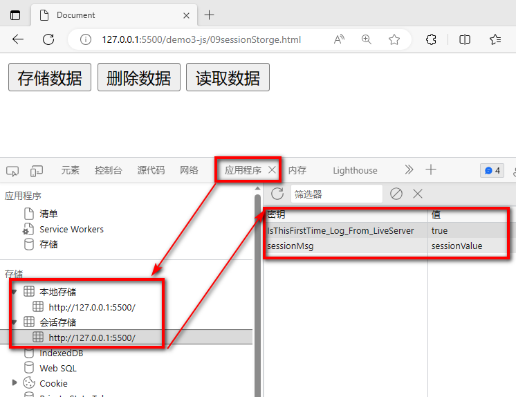

# 七 DOM编程

## 7.1 什么是DOM编程

> 简单来说:DOM(Document Object Model)编程就是使用document对象的API完成对网页HTML文档进行动态修改,以实现网页数据和样式动态变化效果的编程.

+ document对象代表整个html文档，可用来访问页面中的所有元素，是最复杂的一个dom对象，可以说是学习好dom编程的关键所在。
+ 根据HTML代码结构特点,document对象本身是一种树形结构的文档对象。


+ 上面的代码生成的树如下


+ DOM编程其实就是用window对象的document属性的相关API完成对页面元素的控制的编程


+ dom树中节点的类型
    + node  节点,所有结点的父类型
        + element   元素节点,node的子类型之一,代表一个完整标签
        + attribute  属性节点,node的子类型之一,代表元素的属性
        + text          文本节点,node的子类型之一,代表双标签中间的文本

## 7.2 获取页面元素的几种方式

### 7.2.1 在整个文档范围内查找元素结点

| 功能               | API                                     | 返回值           |
| ------------------ | --------------------------------------- | ---------------- |
| 根据id值查询       | document.getElementById(“id值”)         | 一个具体的元素节 |
| 根据标签名查询     | document.getElementsByTagName(“标签名”) | 元素节点数组     |
| 根据name属性值查询 | document.getElementsByName(“name值”)    | 元素节点数组     |
| 根据类名查询       | document.getElementsByClassName("类名") | 元素节点数组     |

### 7.2.2 在具体元素节点范围内查找子节点

| 功能               | API                       | 返回值         |
| ------------------ | ------------------------- | -------------- |
| 查找子标签         | element.children          | 返回子标签数组 |
| 查找第一个子标签   | element.firstElementChild | 标签对象       |
| 查找最后一个子标签 | element.lastElementChild  | 节点对象       |

### 7.2.3 查找指定子元素节点的父节点

| 功能                     | API                   | 返回值   |
| ------------------------ | --------------------- | -------- |
| 查找指定元素节点的父标签 | element.parentElement | 标签对象 |

### 7.2.4  查找指定元素节点的兄弟节点

| 功能               | API                         | 返回值   |
| ------------------ | --------------------------- | -------- |
| 查找前一个兄弟标签 | node.previousElementSibling | 标签对象 |
| 查找后一个兄弟标签 | node.nextElementSibling     | 标签对象 |

``` html

<!DOCTYPE html>
<html lang="en">
<head>
    <meta charset="UTF-8">
    <meta name="viewport" content="width=device-width, initial-scale=1.0">
    <title>Document</title>
   <script>
    /* 
    1 获得document  dom树
        window.document
    2 从document中获取要操作的元素
        1. 直接获取
            var el1 =document.getElementById("username") // 根据元素的id值获取页面上唯一的一个元素
            var els =document.getElementsByTagName("input") // 根据元素的标签名获取多个同名元素
            var els =document.getElementsByName("aaa") // 根据元素的name属性值获得多个元素
            var els =document.getElementsByClassName("a") // 根据元素的class属性值获得多个元素
        2. 间接获取
            var cs=div01.children // 通过父元素获取全部的子元素
            var firstChild =div01.firstElementChild  // 通过父元素获取第一个子元素
            var lastChild = div01.lastElementChild   // 通过父元素获取最后一个子元素
            var parent = pinput.parentElement  // 通过子元素获取父元素
            var pElement = pinput.previousElementSibling // 获取前面的第一个元素
            var nElement = pinput.nextElementSibling // 获取后面的第一个元素
    3 对元素进行操作
        1. 操作元素的属性
        2. 操作元素的样式
        3. 操作元素的文本
        4. 增删元素   
    */
   function fun1(){
        //1 获得document
        //2 通过document获得元素
        var el1 =document.getElementById("username") // 根据元素的id值获取页面上唯一的一个元素
        console.log(el1)
   }
   function fun2(){
        var els =document.getElementsByTagName("input") // 根据元素的标签名获取多个同名元素
        for(var i = 0 ;i<els.length;i++){
            console.log(els[i])
        }
   }
   function fun3(){
        var els =document.getElementsByName("aaa") // 根据元素的name属性值获得多个元素
        console.log(els)
        for(var i =0;i< els.length;i++){
            console.log(els[i])
        }
   }

   function fun4(){
    var els =document.getElementsByClassName("a") // 根据元素的class属性值获得多个元素
    for(var i =0;i< els.length;i++){
            console.log(els[i])
        }
   }

   function fun5(){
    // 先获取父元素
     var div01 = document.getElementById("div01")
     // 获取所有子元素
     var cs=div01.children // 通过父元素获取全部的子元素
     for(var i =0;i< cs.length;i++){
            console.log(cs[i])
     }

     console.log(div01.firstElementChild)  // 通过父元素获取第一个子元素
     console.log(div01.lastElementChild)   // 通过父元素获取最后一个子元素
   }

   function fun6(){
        // 获取子元素
        var pinput =document.getElementById("password")
        console.log(pinput.parentElement) // 通过子元素获取父元素
   }

   function fun7(){
        // 获取子元素
        var pinput =document.getElementById("password")
        console.log(pinput.previousElementSibling) // 获取前面的第一个元素
        console.log(pinput.nextElementSibling) // 获取后面的第一个元素
   }
   </script>
</head>
<body>
    <div id="div01">
        <input type="text" class="a" id="username" name="aaa"/>
        <input type="text" class="b" id="password" name="aaa"/>
        <input type="text" class="a" id="email"/>
        <input type="text" class="b" id="address"/>
    </div>
    <input type="text" class="a"/><br>

    <hr>
    <input type="button" value="通过父元素获取子元素" onclick="fun5()" id="btn05"/>
    <input type="button" value="通过子元素获取父元素" onclick="fun6()" id="btn06"/>
    <input type="button" value="通过当前元素获取兄弟元素" onclick="fun7()" id="btn07"/>
    <hr>

    <input type="button" value="根据id获取指定元素" onclick="fun1()" id="btn01"/>
    <input type="button" value="根据标签名获取多个元素" onclick="fun2()" id="btn02"/>
    <input type="button" value="根据name属性值获取多个元素" onclick="fun3()" id="btn03"/>
    <input type="button" value="根据class属性值获得多个元素" onclick="fun4()" id="btn04"/>
    
</body>
</html>
```


## 7.3 操作元素属性值

### 7.3.1 属性操作

| 需求       | 操作方式                   |
| ---------- | -------------------------- |
| 读取属性值 | 元素对象.属性名            |
| 修改属性值 | 元素对象.属性名=新的属性值 |

### 7.3.2 内部文本操作

| 需求                         | 操作方式          |
| ---------------------------- | ----------------- |
| 获取或者设置标签体的文本内容 | element.innerText |
| 获取或者设置标签体的内容     | element.innerHTML |

``` html

<!DOCTYPE html>
<html lang="en">
<head>
    <meta charset="UTF-8">
    <meta name="viewport" content="width=device-width, initial-scale=1.0">
    <title>Document</title>
   <script>
    /* 
    1 获得document  dom树
        window.document
    2 从document中获取要操作的元素
        1. 直接获取
            var el1 =document.getElementById("username") // 根据元素的id值获取页面上唯一的一个元素
            var els =document.getElementsByTagName("input") // 根据元素的标签名获取多个同名元素
            var els =document.getElementsByName("aaa") // 根据元素的name属性值获得多个元素
            var els =document.getElementsByClassName("a") // 根据元素的class属性值获得多个元素
        2. 间接获取
            var cs=div01.children // 通过父元素获取全部的子元素
            var firstChild =div01.firstElementChild  // 通过父元素获取第一个子元素
            var lastChild = div01.lastElementChild   // 通过父元素获取最后一个子元素
            var parent = pinput.parentElement  // 通过子元素获取父元素
            var pElement = pinput.previousElementSibling // 获取前面的第一个元素
            var nElement = pinput.nextElementSibling // 获取后面的第一个元素
    3 对元素进行操作
        1. 操作元素的属性   元素名.属性名=""
        2. 操作元素的样式   元素名.style.样式名=""  样式名"-" 要进行驼峰转换
        3. 操作元素的文本   元素名.innerText   只识别文本
                           元素名.innerHTML   同时可以识别html代码 
        4. 增删元素   
    */
   function changeAttribute(){
        var in1 =document.getElementById("in1")
        // 语法 元素.属性名=""
        // 获得属性值
        console.log(in1.type)
        console.log(in1.value)
        // 修改属性值
        in1.type="button"
        in1.value="嗨"
   }
   function changeStyle(){
        var in1 =document.getElementById("in1")
        // 语法  元素.style.样式名=""   原始样式名中的"-"符号 要转换驼峰式  background-color > backgroundColor
        in1.style.color="green"
        in1.style.borderRadius="5px"
        
   }
   function changeText(){
        var div01 =document.getElementById("div01")
        /* 
        语法  元素名.innerText   只识别文本
              元素名.innerHTML   同时可以识别html代码
        */
        console.log(div01.innerText)
        div01.innerHTML="<h1>嗨</h1>"
   }

   </script>
   <style>
    #in1{
        color: red;
    }
   </style>
</head>
<body>
    <input id="in1" type="text" value="hello">
    <div id="div01">
        hello
    </div>

    <hr>
    <button onclick="changeAttribute()">操作属性</button>
    <button onclick="changeStyle()">操作样式</button>
    <button onclick="changeText()">操作文本</button>
    
</body>
</html>
```


## 7.4 增删元素

### 7.4.1 对页面的元素进行增删操作

| API                                      | 功能                                       |
| ---------------------------------------- | ------------------------------------------ |
| document.createElement(“标签名”)         | 创建元素节点并返回，但不会自动添加到文档中 |
| document.createTextNode(“文本值”)        | 创建文本节点并返回，但不会自动添加到文档中 |
| element.appendChild(ele)                 | 将ele添加到element所有子节点后面           |
| parentEle.insertBefore(newEle,targetEle) | 将newEle插入到targetEle前面                |
| parentEle.replaceChild(newEle, oldEle)   | 用新节点替换原有的旧子节点                 |
| element.remove()                         | 删除某个标签                               |

``` html

<!DOCTYPE html>
<html lang="en">
<head>
    <meta charset="UTF-8">
    <meta name="viewport" content="width=device-width, initial-scale=1.0">
    <title>Document</title>
   <script>
    /* 
    1 获得document  dom树
        window.document
    2 从document中获取要操作的元素
        1. 直接获取
            var el1 =document.getElementById("username") // 根据元素的id值获取页面上唯一的一个元素
            var els =document.getElementsByTagName("input") // 根据元素的标签名获取多个同名元素
            var els =document.getElementsByName("aaa") // 根据元素的name属性值获得多个元素
            var els =document.getElementsByClassName("a") // 根据元素的class属性值获得多个元素
        2. 间接获取
            var cs=div01.children // 通过父元素获取全部的子元素
            var firstChild =div01.firstElementChild  // 通过父元素获取第一个子元素
            var lastChild = div01.lastElementChild   // 通过父元素获取最后一个子元素
            var parent = pinput.parentElement  // 通过子元素获取父元素
            var pElement = pinput.previousElementSibling // 获取前面的第一个元素
            var nElement = pinput.nextElementSibling // 获取后面的第一个元素
    3 对元素进行操作
        1. 操作元素的属性   元素名.属性名=""
        2. 操作元素的样式   元素名.style.样式名=""  样式名"-" 要进行驼峰转换
        3. 操作元素的文本   元素名.innerText   只识别文本
                           元素名.innerHTML   同时可以识别html代码 
        4. 增删元素
            var element =document.createElement("元素名") // 创建元素
            父元素.appendChild(子元素)               // 在父元素中追加子元素
            父元素.insertBefore(新元素,参照元素)     // 在某个元素前增加元素
            父元素.replaceChild(新元素,被替换的元素) // 用新的元素替换某个子子元素
            元素.remove()                            // 删除当前元素
    */
   function addCs(){
        // 创建一个新的元素
        // 创建元素
        var csli =document.createElement("li") // <li></li>
        // 设置子元素的属性和文本 <li id="cs">长沙</li>
        csli.id="cs"
        csli.innerText="长沙"
        // 将子元素放入父元素中
        var cityul =document.getElementById("city")
        // 在父元素中追加子元素
        cityul.appendChild(csli)
   }
   function addCsBeforeSz(){
        // 创建一个新的元素
        // 创建元素
        var csli =document.createElement("li") // <li></li>
        // 设置子元素的属性和文本 <li id="cs">长沙</li>
        csli.id="cs"
        csli.innerText="长沙"
        // 将子元素放入父元素中
        var cityul =document.getElementById("city")
        // 在父元素中追加子元素
        //cityul.insertBefore(新元素,参照元素)
        var szli =document.getElementById("sz")
        cityul.insertBefore(csli,szli)
   }

   function replaceSz(){
        // 创建一个新的元素
        // 创建元素
        var csli =document.createElement("li") // <li></li>
        // 设置子元素的属性和文本 <li id="cs">长沙</li>
        csli.id="cs"
        csli.innerText="长沙"
        // 将子元素放入父元素中
        var cityul =document.getElementById("city")
        // 在父元素中追加子元素
        //cityul.replaceChild(新元素,被替换的元素)
        var szli =document.getElementById("sz")
        cityul.replaceChild(csli,szli)
   }

   function removeSz(){
        var szli =document.getElementById("sz")
        // 哪个元素调用了remove该元素就会从dom树中移除
        szli.remove()
   }

   function clearCity(){
        
        var cityul =document.getElementById("city")

        /* var fc =cityul.firstChild
        while(fc != null ){
            fc.remove()
            fc =cityul.firstChild
        } */
        cityul.innerHTML=""
        //cityul.remove()
        
   }
   
   </script>
   
</head>
<body>
    <ul id="city">
        <li id="bj">北京</li>
        <li id="sh">上海</li>
        <li id="sz">深圳</li>
        <li id="gz">广州</li>
    </ul>

    <hr>
    <!-- 目标1 在城市列表的最后添加一个子标签  <li id="cs">长沙</li>  -->
    <button onclick="addCs()">增加长沙</button>
    <!-- 目标2 在城市列表的深圳前添加一个子标签  <li id="cs">长沙</li>  -->
    <button onclick="addCsBeforeSz()">在深圳前插入长沙</button>
    <!-- 目标3  将城市列表的深圳替换为  <li id="cs">长沙</li>  -->
    <button onclick="replaceSz()">替换深圳</button>
    <!-- 目标4  将城市列表删除深圳  -->
    <button onclick="removeSz()">删除深圳</button>
    <!-- 目标5  清空城市列表  -->
    <button onclick="clearCity()">清空</button>
    
</body>
</html>
```

# 八 正则表达式

## 8.1 正则表达式简介

> 正则表达式是描述字符模式的对象。正则表达式用于对字符串模式匹配及检索替换，是对字符串执行模式匹配的强大工具。

+ 语法 

``` javascript
var patt=new RegExp(pattern,modifiers);
或者更简单的方式:
var patt=/pattern/modifiers; 
```

> 修饰符

| 修饰符                                             | 描述                                                     |
| :------------------------------------------------- | :------------------------------------------------------- |
| [i](https://www.runoob.com/js/jsref-regexp-i.html) | 执行对大小写不敏感的匹配。                               |
| [g](https://www.runoob.com/js/jsref-regexp-g.html) | 执行全局匹配（查找所有匹配而非在找到第一个匹配后停止）。 |
| m                                                  | 执行多行匹配。                                           |

> 方括号

| 表达式                                                       | 描述                               |
| :----------------------------------------------------------- | :--------------------------------- |
| [[abc\]](https://www.runoob.com/jsref/jsref-regexp-charset.html) | 查找方括号之间的任何字符。         |
| [[^abc\]](https://www.runoob.com/jsref/jsref-regexp-charset-not.html) | 查找任何不在方括号之间的字符。     |
| [0-9]                                                        | 查找任何从 0 至 9 的数字。         |
| [a-z]                                                        | 查找任何从小写 a 到小写 z 的字符。 |
| [A-Z]                                                        | 查找任何从大写 A 到大写 Z 的字符。 |
| [A-z]                                                        | 查找任何从大写 A 到小写 z 的字符。 |
| [adgk]                                                       | 查找给定集合内的任何字符。         |
| [^adgk]                                                      | 查找给定集合外的任何字符。         |
| (red\|blue\|green)                                           | 查找任何指定的选项。               |

> 元字符

| 元字符                                                       | 描述                                        |
| :----------------------------------------------------------- | :------------------------------------------ |
| [.](https://www.runoob.com/jsref/jsref-regexp-dot.html)      | 查找单个字符，除了换行和行结束符。          |
| [\w](https://www.runoob.com/jsref/jsref-regexp-wordchar.html) | 查找数字、字母及下划线。                    |
| [\W](https://www.runoob.com/jsref/jsref-regexp-wordchar-non.html) | 查找非单词字符。                            |
| [\d](https://www.runoob.com/jsref/jsref-regexp-digit.html)   | 查找数字。                                  |
| [\D](https://www.runoob.com/jsref/jsref-regexp-digit-non.html) | 查找非数字字符。                            |
| [\s](https://www.runoob.com/jsref/jsref-regexp-whitespace.html) | 查找空白字符。                              |
| [\S](https://www.runoob.com/jsref/jsref-regexp-whitespace-non.html) | 查找非空白字符。                            |
| [\b](https://www.runoob.com/jsref/jsref-regexp-begin.html)   | 匹配单词边界。                              |
| [\B](https://www.runoob.com/jsref/jsref-regexp-begin-not.html) | 匹配非单词边界。                            |
| \0                                                           | 查找 NULL 字符。                            |
| [\n](https://www.runoob.com/jsref/jsref-regexp-newline.html) | 查找换行符。                                |
| \f                                                           | 查找换页符。                                |
| \r                                                           | 查找回车符。                                |
| \t                                                           | 查找制表符。                                |
| \v                                                           | 查找垂直制表符。                            |
| [\xxx](https://www.runoob.com/jsref/jsref-regexp-octal.html) | 查找以八进制数 xxx 规定的字符。             |
| [\xdd](https://www.runoob.com/jsref/jsref-regexp-hex.html)   | 查找以十六进制数 dd 规定的字符。            |
| [\uxxxx](https://www.runoob.com/jsref/jsref-regexp-unicode-hex.html) | 查找以十六进制数 xxxx 规定的 Unicode 字符。 |

> 量词

| 量词                                                         | 描述                                                         |
| :----------------------------------------------------------- | :----------------------------------------------------------- |
| [n+](https://www.runoob.com/jsref/jsref-regexp-onemore.html) | 匹配任何包含至少一个 n 的字符串。例如，/a+/ 匹配 "candy" 中的 "a"，"caaaaaaandy" 中所有的 "a"。 |
| [n*](https://www.runoob.com/jsref/jsref-regexp-zeromore.html) | 匹配任何包含零个或多个 n 的字符串。例如，/bo*/ 匹配 "A ghost booooed" 中的 "boooo"，"A bird warbled" 中的 "b"，但是不匹配 "A goat grunted"。 |
| [n?](https://www.runoob.com/jsref/jsref-regexp-zeroone.html) | 匹配任何包含零个或一个 n 的字符串。例如，/e?le?/ 匹配 "angel" 中的 "el"，"angle" 中的 "le"。 |
| [n{X}](https://www.runoob.com/jsref/jsref-regexp-nx.html)    | 匹配包含 X 个 n 的序列的字符串。例如，/a{2}/ 不匹配 "candy," 中的 "a"，但是匹配 "caandy," 中的两个 "a"，且匹配 "caaandy." 中的前两个 "a"。 |
| [n{X,}](https://www.runoob.com/jsref/jsref-regexp-nxcomma.html) | X 是一个正整数。前面的模式 n 连续出现至少 X 次时匹配。例如，/a{2,}/ 不匹配 "candy" 中的 "a"，但是匹配 "caandy" 和 "caaaaaaandy." 中所有的 "a"。 |
| [n{X,Y}](https://www.runoob.com/jsref/jsref-regexp-nxy.html) | X 和 Y 为正整数。前面的模式 n 连续出现至少 X 次，至多 Y 次时匹配。例如，/a{1,3}/ 不匹配 "cndy"，匹配 "candy," 中的 "a"，"caandy," 中的两个 "a"，匹配 "caaaaaaandy" 中的前面三个 "a"。注意，当匹配 "caaaaaaandy" 时，即使原始字符串拥有更多的 "a"，匹配项也是 "aaa"。 |
| [n$](https://www.runoob.com/jsref/jsref-regexp-ndollar.html) | 匹配任何结尾为 n 的字符串。                                  |
| [^n](https://www.runoob.com/jsref/jsref-regexp-ncaret.html)  | 匹配任何开头为 n 的字符串。                                  |
| [?=n](https://www.runoob.com/jsref/jsref-regexp-nfollow.html) | 匹配任何其后紧接指定字符串 n 的字符串。                      |
| [?!n](https://www.runoob.com/jsref/jsref-regexp-nfollow-not.html) | 匹配任何其后没有紧接指定字符串 n 的字符串。                  |

> RegExp对象方法

| 方法                                                         | 描述                                               |
| :----------------------------------------------------------- | :------------------------------------------------- |
| [compile](https://www.runoob.com/jsref/jsref-regexp-compile.html) | 在 1.5 版本中已废弃。 编译正则表达式。             |
| [exec](https://www.runoob.com/jsref/jsref-exec-regexp.html)  | 检索字符串中指定的值。返回找到的值，并确定其位置。 |
| [test](https://www.runoob.com/jsref/jsref-test-regexp.html)  | 检索字符串中指定的值。返回 true 或 false。         |
| [toString](https://www.runoob.com/jsref/jsref-regexp-tostring.html) | 返回正则表达式的字符串。                           |

> 支持正则的String的方法

| 方法                                                    | 描述                             |
| :------------------------------------------------------ | :------------------------------- |
| [search](https://www.runoob.com/js/jsref-search.html)   | 检索与正则表达式相匹配的值。     |
| [match](https://www.runoob.com/js/jsref-match.html)     | 找到一个或多个正则表达式的匹配。 |
| [replace](https://www.runoob.com/js/jsref-replace.html) | 替换与正则表达式匹配的子串。     |
| [split](https://www.runoob.com/js/jsref-split.html)     | 把字符串分割为字符串数组。       |

## 8.2 正则表达式体验

### 8.2.1 验证

**注意**：这里是使用**正则表达式对象**来**调用**方法。

```javascript
// 创建一个最简单的正则表达式对象
var reg = /o/;
// 创建一个字符串对象作为目标字符串
var str = 'Hello World!';
// 调用正则表达式对象的test()方法验证目标字符串是否满足我们指定的这个模式，返回结果true
console.log("/o/.test('Hello World!')="+reg.test(str));
```

### 8.2.2 匹配

```javascript
// 创建一个最简单的正则表达式对象
var reg = /o/;
// 创建一个字符串对象作为目标字符串
var str = 'Hello World!';
// 在目标字符串中查找匹配的字符，返回匹配结果组成的数组
var resultArr = str.match(reg);
// 数组长度为1
console.log("resultArr.length="+resultArr.length);

// 数组内容是o
console.log("resultArr[0]="+resultArr[0]);
```

### 8.2.3 替换

**注意**：这里是使用**字符串对象**来**调用**方法。

```javascript
// 创建一个最简单的正则表达式对象
var reg = /o/;
// 创建一个字符串对象作为目标字符串
var str = 'Hello World!';
var newStr = str.replace(reg,'@');
// 只有第一个o被替换了，说明我们这个正则表达式只能匹配第一个满足的字符串
console.log("str.replace(reg)="+newStr);//Hell@ World!

// 原字符串并没有变化，只是返回了一个新字符串
console.log("str="+str);//str=Hello World!
```

### 8.2.4  全文查找

如果不使用g对正则表达式对象进行修饰，则使用正则表达式进行查找时，仅返回第一个匹配；使用g后，返回所有匹配。

```javascript
// 目标字符串
var targetStr = 'Hello World!';

// 没有使用全局匹配的正则表达式
var reg = /[A-Z]/;
// 获取全部匹配
var resultArr = targetStr.match(reg);
// 数组长度为1
console.log("resultArr.length="+resultArr.length);
// 遍历数组，发现只能得到'H'
for(var i = 0; i < resultArr.length; i++){
  console.log("resultArr["+i+"]="+resultArr[i]);
}
```

对比

```javascript
// 目标字符串
var targetStr = 'Hello World!';
// 使用了全局匹配的正则表达式
var reg = /[A-Z]/g;
// 获取全部匹配
var resultArr = targetStr.match(reg);
// 数组长度为2
console.log("resultArr.length="+resultArr.length);
// 遍历数组，发现可以获取到“H”和“W”
for(var i = 0; i < resultArr.length; i++){
  console.log("resultArr["+i+"]="+resultArr[i]);
}
```

###  8.2.5 忽略大小写

```javascript
//目标字符串
var targetStr = 'Hello WORLD!';

//没有使用忽略大小写的正则表达式
var reg = /o/g;
//获取全部匹配
var resultArr = targetStr.match(reg);
//数组长度为1
console.log("resultArr.length="+resultArr.length);
//遍历数组，仅得到'o'
for(var i = 0; i < resultArr.length; i++){
  console.log("resultArr["+i+"]="+resultArr[i]);
}
```

对比

```javascript
//目标字符串
var targetStr = 'Hello WORLD!';
//使用了忽略大小写的正则表达式
var reg = /o/gi;
//获取全部匹配
var resultArr = targetStr.match(reg);
//数组长度为2
console.log("resultArr.length="+resultArr.length);
//遍历数组，得到'o'和'O'
for(var i = 0; i < resultArr.length; i++){
  console.log("resultArr["+i+"]="+resultArr[i]);
}
```

### 8.2.6 元字符使用

```javascript
var str01 = 'I love Java';
var str02 = 'Java love me';
// 匹配以Java开头
var reg = /^Java/g;
console.log('reg.test(str01)='+reg.test(str01)); // false
console.log("<br />");
console.log('reg.test(str02)='+reg.test(str02)); // true
```

```javascript
var str01 = 'I love Java';
var str02 = 'Java love me';
// 匹配以Java结尾
var reg = /Java$/g;
console.log('reg.test(str01)='+reg.test(str01)); // true
console.log("<br />");
console.log('reg.test(str02)='+reg.test(str02)); // false
```

### 8.2.7 字符集合的使用

```javascript
//n位数字的正则
var targetStr="123456789";
var reg=/^[0-9]{0,}$/;
//或者 ： var reg=/^\d*$/;
var b = reg.test(targetStr);//true
```

```javascript
//数字+字母+下划线，6-16位
var targetStr="HelloWorld";
var reg=/^[a-z0-9A-Z_]{6,16}$/;
var b = reg.test(targetStr);//true
```

### 8.2.8  常用正则表达式

| 需求     | 正则表达式                                                 |
| -------- | ---------------------------------------------------------- |
| 用户名   | /^\[a-zA-Z ]\[a-zA-Z-0-9]{5,9}\$/                          |
| 密码     | /^\[a-zA-Z0-9 \_-@#& \*]{6,12}\$/                          |
| 前后空格 | /^\s+\|\s+\$/g                                             |
| 电子邮箱 | /^\[a-zA-Z0-9 \_.-]+@(\[a-zA-Z0-9-]+\[.]{1})+\[a-zA-Z]+\$/ |


# 九 案例开发-日程管理-第一期

## 9.1 登录页及校验

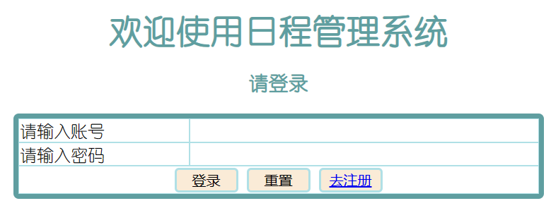

``` html
<!DOCTYPE html>
<html lang="en">
<head>
    <meta charset="UTF-8">
    <title>Title</title>
    <style>

        .ht{
            text-align: center;
            color: cadetblue;
            font-family: 幼圆;
        }
        .tab{
            width: 500px;
            border: 5px solid cadetblue;
            margin: 0px auto;
            border-radius: 5px;
            font-family: 幼圆;
        }
        .ltr td{
            border: 1px solid  powderblue;

        }
        .ipt{
            border: 0px;
            width: 50%;

        }
        .btn1{
            border: 2px solid powderblue;
            border-radius: 4px;
            width:60px;
            background-color: antiquewhite;

        }
        #usernameMsg , #userPwdMsg {
            color: rgb(230, 87, 51);
        }

        .buttonContainer{
            text-align: center;
        }
    </style>
    <script>
        // 检验用户名格式是否合法的函数
        function checkUsername(){
            // 定义正则表示字符串的规则
            var  usernameReg= /^[a-zA-Z0-9]{5,10}$/
            // 获得用户在页面上输入的信息
            var usernameInput =document.getElementById("usernameInput")
            var username = usernameInput.value
            // 获得格式提示的框
            var usernameMsg =document.getElementById("usernameMsg")
            // 格式有误时,返回false,在页面上提示
            if(!usernameReg.test(username)){ 
                usernameMsg.innerText="用户名格式有误"
                return false
            }
            // 格式OK,返回true 在页面上提示OK
            usernameMsg.innerText="OK"
            return true

        }

        // 检验密码格式是否合法的函数
        function checkUserPwd(){
            // 定义正则表示字符串的规则
            var  userPwdReg= /^[0-9]{6}$/
            // 获得用户在页面上输入的信息
            var userPwdInput =document.getElementById("userPwdInput")
            var userPwd = userPwdInput.value
            // 获得格式提示的框
            var userPwdMsg =document.getElementById("userPwdMsg")
            // 格式有误时,返回false,在页面上提示
            if(!userPwdReg.test(userPwd)){ 
                userPwdMsg.innerText="密码必须是6位数字"
                return false
            }
            // 格式OK,返回true 在页面上提示OK
            userPwdMsg.innerText="OK"
            return true

        }

        // 表单在提交时,校验用户名和密码格式,格式OK才会提交
        function checkForm(){
            var flag1 =checkUsername()
            var flag2 =checkUserPwd()

            return flag1&&flag2
        }


    </script>

    
</head>
<body>
    <h1 class="ht">欢迎使用日程管理系统</h1>
    <h3 class="ht">请登录</h3>
    <form method="post" action="/user/login" onsubmit="return checkForm()">
        <table class="tab" cellspacing="0px">
            <tr class="ltr">
                <td>请输入账号</td>
                <td>
                    <input class="ipt" type="text" id="usernameInput" name="username" onblur="checkUsername()">
                    <span id="usernameMsg"></span>
                </td>
            </tr>
            <tr class="ltr">
                <td>请输入密码</td>
                <td>
                    <input class="ipt" type="password" id="userPwdInput"  name="userPwd" onblur="checkUserPwd()">
                    <span id="userPwdMsg"></span>
                </td>
            </tr>
            <tr class="ltr">
                <td colspan="2" class="buttonContainer">
                    <input class="btn1" type="submit" value="登录">
                    <input class="btn1" type="reset" value="重置">
                    <button class="btn1"><a href="regist.html">去注册</a></button>
                </td>
            </tr>
        </table>
    </form>
</body>
</html>
```


## 9.2 注册页及校验


``` html
<!DOCTYPE html>
<html lang="en">
<head>
    <meta charset="UTF-8">
    <title>Title</title>
    <style>

        .ht{
            text-align: center;
            color: cadetblue;
            font-family: 幼圆;
        }
        .tab{
            width: 500px;
            border: 5px solid cadetblue;
            margin: 0px auto;
            border-radius: 5px;
            font-family: 幼圆;
        }
        .ltr td{
            border: 1px solid  powderblue;

        }
        .ipt{
            border: 0px;
            width: 50%;

        }
        .btn1{
            border: 2px solid powderblue;
            border-radius: 4px;
            width:60px;
            background-color: antiquewhite;

        }

        .msg {
            color: gold;
        }

        .buttonContainer{
            text-align: center;
        }
    </style>

    <script>
        function checkUsername(){
            var usernameReg = /^[a-zA-Z0-9]{5,10}$/
            var usernameInput = document.getElementById("usernameInput")  
            var username = usernameInput.value  
            var usernameMsg = document.getElementById("usernameMsg")
            if(!usernameReg.test(username)){
                usernameMsg.innerText="格式有误"
                return false
            } 
            usernameMsg.innerText="OK"
            return true 
        }


        function checkUserPwd(){
            var userPwdReg = /^\d{6}$/
            var userPwdInput = document.getElementById("userPwdInput")  
            var userPwd = userPwdInput.value  
            var userPwdMsg = document.getElementById("userPwdMsg")
            if(!userPwdReg.test(userPwd)){
                userPwdMsg.innerText="格式有误"
                return false
            } 
            userPwdMsg.innerText="OK"
            return true 
        }


        function checkReUserPwd(){
            var userPwdReg = /^\d{6}$/
            // 再次输入的密码的格式
            var reUserPwdInput = document.getElementById("reUserPwdInput")  
            var reUserPwd = reUserPwdInput.value 
            var reUserPwdMsg = document.getElementById("reUserPwdMsg")
            if(!userPwdReg.test(reUserPwd)){
                reUserPwdMsg.innerText="格式有误"
                return false
            } 
            // 获得上次密码,对比两次密码是否一致
            var userPwdInput = document.getElementById("userPwdInput")  
            var userPwd = userPwdInput.value  
            if(reUserPwd != userPwd){
                reUserPwdMsg.innerText="两次密码不一致"
                return false
            } 
            reUserPwdMsg.innerText="OK"
            return true 
        }


        function checkForm(){
            var flag1 = checkUsername()
            var flag2 = checkUserPwd()
            var flag3 = checkReUserPwd()

            return flag1 && flag2 && flag3
        }


    </script>


   
</head>
<body>
<h1 class="ht">欢迎使用日程管理系统</h1>
<h3 class="ht">请注册</h3>
<form method="post" action="/user/regist" onsubmit="return checkForm()">
    <table class="tab" cellspacing="0px">
        <tr class="ltr">
            <td>请输入账号</td>
            <td>
                <input class="ipt" id="usernameInput" type="text" name="username" onblur="checkUsername()">
                <span id="usernameMsg" class="msg"></span>
            </td>
        </tr>
        <tr class="ltr">
            <td>请输入密码</td>
            <td>
                <input class="ipt" id="userPwdInput" type="password" name="userPwd" onblur="checkUserPwd()">
                <span id="userPwdMsg" class="msg"></span>
            </td>
        </tr>
        <tr class="ltr">
            <td>确认密码</td>
            <td>
                <input class="ipt" id="reUserPwdInput" type="password" onblur="checkReUserPwd()">
                <span id="reUserPwdMsg" class="msg"></span>
            </td>
        </tr>
        <tr class="ltr">
            <td colspan="2" class="buttonContainer">
                <input class="btn1" type="submit" value="注册">
                <input class="btn1" type="reset" value="重置">
                <button class="btn1"><a  href="login.html">去登录</a></button>
            </td>
        </tr>
    </table>

</form>
</body>
</html>
```


---


----

© 版权声明

<escape>

<div>
    <h3 align="center"  style="color: brown;" >版权声明</h3>
    <table>
   		<tr>
    		<ol>
				<li>本网站名称：𝚲𝚳𝚲</li>
				<li>𝚲𝚳𝚲提供的资源仅供您个人用于非商业性目的。</li>
				<li>本站文章部分内容可能来源于网络，仅供大家学习与参考，如有侵权，请联系我进行删除处理。</li>
				<li>本站一切资源不代表本站立场，并不代表本站赞同其观点和对其真实性负责。</li>
        		<li>本站一律禁止以任何方式发布或转载任何违法的相关信息，访客发现请举报</li> 
        		<li>本站资源大多存储在云盘，如发现链接失效，请联系我，我会第一时间更新。</li>
        		<li>本站强烈打击盗版/破解等有损他人权益和违法作为，请支持正版！</li>  
			</ol>
		</tr>
	</table>
</div>


</escape>

----


