# 第五章 Servlet

# 一 Servlet简介

## 1.1 动态资源和静态资源

> 静态资源

+ 无需在程序运行时通过代码运行生成的资源,在程序运行之前就写好的资源. 例如:html css js img ,音频文件和视频文件

> 动态资源 

+ 需要在程序运行时通过代码运行生成的资源,在程序运行之前无法确定的数据,运行时动态生成,例如Servlet,Thymeleaf ... ...
+ 动态资源指的不是视图上的动画效果或者是简单的人机交互效果

> 生活举例

+ 去蛋糕店买蛋糕
    + 直接买柜台上已经做好的  : 静态资源
    + 和柜员说要求后现场制作  : 动态资源

## 1.2 Servlet简介

> Servlet  (server applet) 是运行在服务端(tomcat)的Java小程序，是sun公司提供一套定义动态资源规范; 从代码层面上来讲Servlet就是一个接口

+ 用来接收、处理客户端请求、响应给浏览器的动态资源。在整个Web应用中，Servlet主要负责接收处理请求、协同调度功能以及响应数据。我们可以把Servlet称为Web应用中的**控制器**


+ 不是所有的JAVA类都能用于处理客户端请求,能处理客户端请求并做出响应的一套技术标准就是Servlet
+ Servlet是运行在服务端的,所以 Servlet必须在WEB项目中开发且在Tomcat这样的服务容器中运行
> 请求响应与HttpServletRequest和HttpServletResponse之间的对应关系

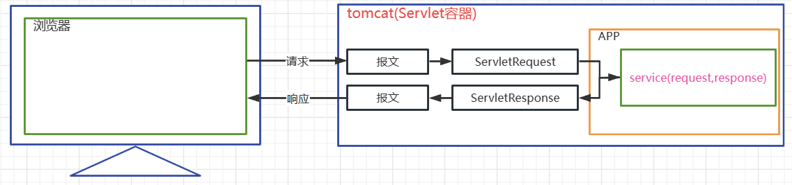

# 二 Servlet开发流程

## 2.1 目标

> 校验注册时,用户名是否被占用. 通过客户端向一个Servlet发送请求,携带username,如果用户名是'atguigu',则向客户端响应 NO,如果是其他,响应YES

## 2.2 开发过程

> 步骤1 开发一个web类型的module 

+ 过程参照之前

> 步骤2 开发一个UserServlet

``` java
public class UserServlet  extends HttpServlet {
    @Override
    protected void service(HttpServletRequest req, HttpServletResponse resp) throws ServletException, IOException {
        // 获取请求中的参数
        String username = req.getParameter("username");
        if("atguigu".equals(username)){
            //通过响应对象响应信息
            resp.getWriter().write("NO");
        }else{
            resp.getWriter().write("YES");
        }

    }
}
```

+ 自定义一个类,要继承HttpServlet类
+ 重写service方法,该方法主要就是用于处理用户请求的服务方法
+ HttpServletRequest 代表请求对象,是有请求报文经过tomcat转换而来的,通过该对象可以获取请求中的信息
+ HttpServletResponse 代表响应对象,该对象会被tomcat转换为响应的报文,通过该对象可以设置响应中的信息
+ Servlet对象的生命周期(创建,初始化,处理服务,销毁)是由tomcat管理的,无需我们自己new
+ HttpServletRequest HttpServletResponse 两个对象也是有tomcat负责转换,在调用service方法时传入给我们用的

> 步骤3 在web.xml为UseServlet配置请求的映射路径

``` xml
<?xml version="1.0" encoding="UTF-8"?>
<web-app xmlns="https://jakarta.ee/xml/ns/jakartaee"
         xmlns:xsi="http://www.w3.org/2001/XMLSchema-instance"
         xsi:schemaLocation="https://jakarta.ee/xml/ns/jakartaee https://jakarta.ee/xml/ns/jakartaee/web-app_5_0.xsd"
         version="5.0">

    <servlet>
        <!--给UserServlet起一个别名-->
        <servlet-name>userServlet</servlet-name>
        <servlet-class>com.atguigu.servlet.UserServlet</servlet-class>
    </servlet>


    <servlet-mapping>
        <!--关联别名和映射路径-->
        <servlet-name>userServlet</servlet-name>
        <!--可以为一个Servlet匹配多个不同的映射路径,但是不同的Servlet不能使用相同的url-pattern-->
        <url-pattern>/userServlet</url-pattern>
       <!-- <url-pattern>/userServlet2</url-pattern>-->
        <!--
            /        表示通配所有资源,不包括jsp文件
            /*       表示通配所有资源,包括jsp文件
            /a/*     匹配所有以a前缀的映射路径
            *.action 匹配所有以action为后缀的映射路径
        -->
       <!-- <url-pattern>/*</url-pattern>-->
    </servlet-mapping>

</web-app>
```

+ Servlet并不是文件系统中实际存在的文件或者目录,所以为了能够请求到该资源,我们需要为其配置映射路径
+ servlet的请求映射路径配置在web.xml中
+ servlet-name作为servlet的别名,可以自己随意定义,见名知意就好
+ url-pattern标签用于定义Servlet的请求映射路径
+ 一个servlet可以对应多个不同的url-pattern
+ 多个servlet不能使用相同的url-pattern
+ url-pattern中可以使用一些通配写法
    + /        表示通配所有资源,不包括jsp文件
    + /*      表示通配所有资源,包括jsp文件
    + /a/*     匹配所有以a前缀的映射路径
    + *.action 匹配所有以action为后缀的映射路径

> 步骤4 开发一个form表单,向servlet发送一个get请求并携带username参数

```html
<!DOCTYPE html>
<html lang="en">
<head>
    <meta charset="UTF-8">
    <title>Title</title>
</head>
<body>
    <form action="userServlet">
        请输入用户名:<input type="text" name="username" /> <br>
        <input type="submit" value="校验">
    </form>
</body>
</html>
```

> 启动项目,访问index.html ,提交表单测试

+ 使用debug模式运行测试

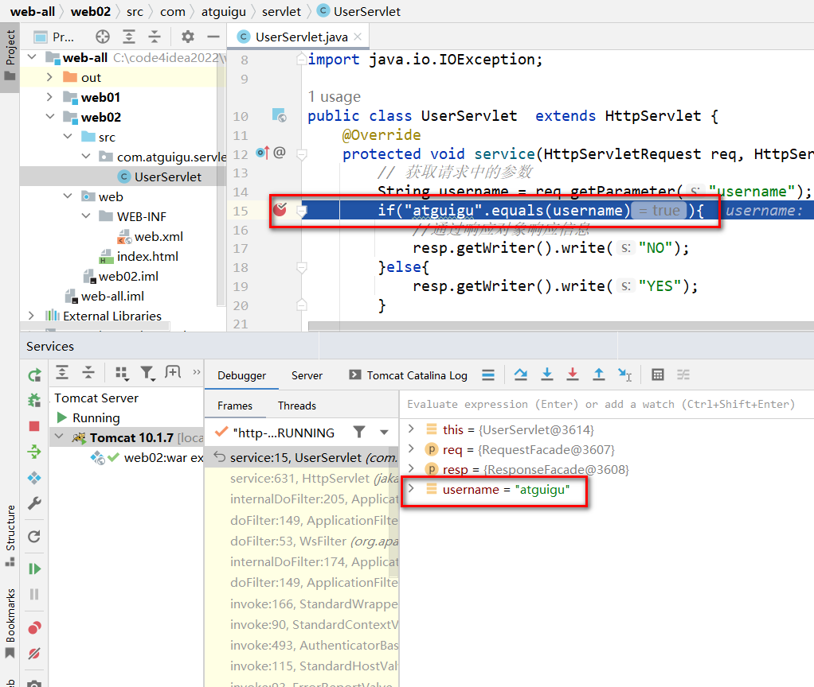

> 映射关系图


# 三 Servlet注解方式配置

## 3.1 @WebServlet注解源码

> 官方JAVAEEAPI文档下载地址

+  [Java EE - Technologies (oracle.com)](https://www.oracle.com/java/technologies/javaee/javaeetechnologies.html#javaee8) 

+ @WebServlet注解的源码阅读

``` java


package jakarta.servlet.annotation;

import java.lang.annotation.Documented;
import java.lang.annotation.ElementType;
import java.lang.annotation.Retention;
import java.lang.annotation.RetentionPolicy;
import java.lang.annotation.Target;

/**
 * @since Servlet 3.0
 */
@Target({ ElementType.TYPE })
@Retention(RetentionPolicy.RUNTIME)
@Documented
public @interface WebServlet {

    /**
     * The name of the servlet
     * 相当于 servlet-name
     * @return the name of the servlet
     */
    String name() default "";

    /**
     * The URL patterns of the servlet
     * 如果只配置一个url-pattern ,则通过该属性即可,和urlPatterns属性互斥
     * @return the URL patterns of the servlet
     */
    String[] value() default {};

    /**
     * The URL patterns of the servlet
     * 如果要配置多个url-pattern ,需要通过该属性,和value属性互斥
     * @return the URL patterns of the servlet
     */
    String[] urlPatterns() default {};

    /**
     * The load-on-startup order of the servlet
     * 配置Servlet是否在项目加载时实例化
     * @return the load-on-startup order of the servlet
     */
    int loadOnStartup() default -1;

    /**
     * The init parameters of the servlet
     * 配置初始化参数
     * @return the init parameters of the servlet
     */
    WebInitParam[] initParams() default {};

    /**
     * Declares whether the servlet supports asynchronous operation mode.
     *
     * @return {@code true} if the servlet supports asynchronous operation mode
     * @see jakarta.servlet.ServletRequest#startAsync
     * @see jakarta.servlet.ServletRequest#startAsync( jakarta.servlet.ServletRequest,jakarta.servlet.ServletResponse)
     */
    boolean asyncSupported() default false;

    /**
     * The small-icon of the servlet
     *
     * @return the small-icon of the servlet
     */
    String smallIcon() default "";

    /**
     * The large-icon of the servlet
     *
     * @return the large-icon of the servlet
     */
    String largeIcon() default "";

    /**
     * The description of the servlet
     *
     * @return the description of the servlet
     */
    String description() default "";

    /**
     * The display name of the servlet
     *
     * @return the display name of the servlet
     */
    String displayName() default "";

}

```

## 3.2 @WebServlet注解使用

> 使用@WebServlet注解替换Servlet配置

``` java
@WebServlet(
        name = "userServlet",
        //value = "/user",
        urlPatterns = {"/userServlet1","/userServlet2","/userServlet"},
        initParams = {@WebInitParam(name = "encoding",value = "UTF-8")},
        loadOnStartup = 6
)
public class UserServlet  extends HttpServlet {
    @Override
    protected void service(HttpServletRequest req, HttpServletResponse resp) throws ServletException, IOException {
        String encoding = getServletConfig().getInitParameter("encoding");
        System.out.println(encoding);
        // 获取请求中的参数
        String username = req.getParameter("username");
        if("atguigu".equals(username)){
            //通过响应对象响应信息
            resp.getWriter().write("NO");
        }else{
            resp.getWriter().write("YES");
        }
    }
}
```


# 四 Servlet生命周期

## 4.1 生命周期简介

> 什么是Servlet的生命周期

-   应用程序中的对象不仅在空间上有层次结构的关系，在时间上也会因为处于程序运行过程中的不同阶段而表现出不同状态和不同行为——这就是对象的生命周期。
-   简单的叙述生命周期，就是对象在容器中从开始创建到销毁的过程。

> Servlet容器

+ Servlet对象是Servlet容器创建的，生命周期方法都是由容器(目前我们使用的是Tomcat)调用的。这一点和我们之前所编写的代码有很大不同。在今后的学习中我们会看到，越来越多的对象交给容器或框架来创建，越来越多的方法由容器或框架来调用，开发人员要尽可能多的将精力放在业务逻辑的实现上。

> Servlet主要的生命周期执行特点

| 生命周期 | 对应方法                                                 | 执行时机               | 执行次数 |
| -------- | -------------------------------------------------------- | ---------------------- | -------- |
| 构造对象 | 构造器                                                   | 第一次请求或者容器启动 | 1        |
| 初始化   | init()                                                   | 构造完毕后             | 1        |
| 处理服务 | service(HttpServletRequest req,HttpServletResponse resp) | 每次请求               | 多次     |
| 销毁     | destory()                                                | 容器关闭               | 1        |

## 4.2 生命周期测试

> 开发servlet代码

``` java
package com.atguigu.servlet;
import jakarta.servlet.ServletException;
import jakarta.servlet.http.HttpServlet;
import jakarta.servlet.http.HttpServletRequest;
import jakarta.servlet.http.HttpServletResponse;

import java.io.IOException;

public class ServletLifeCycle  extends HttpServlet {
    public ServletLifeCycle(){
        System.out.println("构造器");
    }

    @Override
    public void init() throws ServletException {
        System.out.println("初始化方法");
    }

    @Override
    protected void service(HttpServletRequest req, HttpServletResponse resp) throws ServletException, IOException {
        System.out.println("service方法");
    }

    @Override
    public void destroy() {
        System.out.println("销毁方法");
    }
}

```

> 配置Servlet

``` xml
  
    <servlet>
        <servlet-name>servletLifeCycle</servlet-name>
        <servlet-class>com.atguigu.servlet.ServletLifeCycle</servlet-class>
        <!--load-on-startup
            如果配置的是正整数则表示容器在启动时就要实例化Servlet,
            数字表示的是实例化的顺序
        -->
        <load-on-startup>1</load-on-startup>
    </servlet>
    <servlet-mapping>
        <servlet-name>servletLifeCycle</servlet-name>
        <url-pattern>/servletLiftCycle</url-pattern>
    </servlet-mapping>
```


+ 请求Servlet测试

略

## 4.3 生命周期总结

1. 通过生命周期测试我们发现Servlet对象在容器中是单例的
2. 容器是可以处理并发的用户请求的,每个请求在容器中都会开启一个线程
3. 多个线程可能会使用相同的Servlet对象,所以在Servlet中,我们不要轻易定义一些容易经常发生修改的成员变量
4. load-on-startup中定义的正整数表示实例化顺序,如果数字重复了,容器会自行解决实例化顺序问题,但是应该避免重复
5. Tomcat容器中,已经定义了一些随系统启动实例化的servlet,我们自定义的servlet的load-on-startup尽量不要占用数字1-5


# 五 Servlet继承结构

## 5.1 Servlet 接口

> 源码及功能解释

+ 通过idea查看: 此处略

> 接口及方法说明

+ Servlet 规范接口,所有的Servlet必须实现 
    + public void init(ServletConfig config) throws ServletException;   
        + 初始化方法,容器在构造servlet对象后,自动调用的方法,容器负责实例化一个ServletConfig对象,并在调用该方法时传入
        + ServletConfig对象可以为Servlet 提供初始化参数
    + public ServletConfig getServletConfig();
        + 获取ServletConfig对象的方法,后续可以通过该对象获取Servlet初始化参数
    + public void service(ServletRequest req, ServletResponse res) throws ServletException, IOException;
        + 处理请求并做出响应的服务方法,每次请求产生时由容器调用
        + 容器创建一个ServletRequest对象和ServletResponse对象,容器在调用service方法时,传入这两个对象
    + public String getServletInfo();
        + 获取ServletInfo信息的方法
    + public void destroy();
        + Servlet实例在销毁之前调用的方法

## 5.2 GenericServlet 抽象类

> 源码

+ 通过idea查看: 此处略

> 源码解释

+ GenericServlet 抽象类是对Servlet接口一些固定功能的粗糙实现,以及对service方法的再次抽象声明,并定义了一些其他相关功能方法
    + private transient ServletConfig config; 
        + 初始化配置对象作为属性
    + public GenericServlet() { } 
        + 构造器,为了满足继承而准备
    + public void destroy() { } 
        + 销毁方法的平庸实现
    + public String getInitParameter(String name) 
        + 获取初始参数的快捷方法
    + public Enumeration<String> getInitParameterNames() 
        + 返回所有初始化参数名的方法
    + public ServletConfig getServletConfig()
        +  获取初始Servlet初始配置对象ServletConfig的方法
    + public ServletContext getServletContext()
        +  获取上下文对象ServletContext的方法
    + public String getServletInfo() 
        + 获取Servlet信息的平庸实现
    + public void init(ServletConfig config) throws ServletException() 
        + 初始化方法的实现,并在此调用了init的重载方法
    + public void init() throws ServletException 
        + 重载init方法,为了让我们自己定义初始化功能的方法
    + public void log(String msg) 
    + public void log(String message, Throwable t)
        +  打印日志的方法及重载
    + public abstract void service(ServletRequest req, ServletResponse res) throws ServletException, IOException; 
        + 服务方法再次声明
    + public String getServletName() 
        + 获取ServletName的方法

## 5.3 HttpServlet 抽象类

> 源码

+ 通过idea查看: 此处略

> 解释

+ abstract class HttpServlet extends GenericServlet  HttpServlet抽象类,除了基本的实现以外,增加了更多的基础功能
    + private static final String METHOD_DELETE = "DELETE";
    + private static final String METHOD_HEAD = "HEAD";
    + private static final String METHOD_GET = "GET";
    + private static final String METHOD_OPTIONS = "OPTIONS";
    + private static final String METHOD_POST = "POST";
    + private static final String METHOD_PUT = "PUT";
    + private static final String METHOD_TRACE = "TRACE";
        + 上述属性用于定义常见请求方式名常量值
    + public HttpServlet() {}
        + 构造器,用于处理继承
    + public void service(ServletRequest req, ServletResponse res) throws ServletException, IOException
        + 对服务方法的实现
        + 在该方法中,将请求和响应对象转换成对应HTTP协议的HttpServletRequest HttpServletResponse对象
        + 调用重载的service方法
    + public void service(HttpServletRequest req, HttpServletResponse res) throws ServletException, IOException
        + 重载的service方法,被重写的service方法所调用
        + 在该方法中,通过请求方式判断,调用具体的do***方法完成请求的处理
    + protected void doGet(HttpServletRequest req, HttpServletResponse resp) throws ServletException, IOException
    + protected void doPost(HttpServletRequest req, HttpServletResponse resp) throws ServletException, IOException
    + protected void doHead(HttpServletRequest req, HttpServletResponse resp) throws ServletException, IOException
    + protected void doPut(HttpServletRequest req, HttpServletResponse resp) throws ServletException, IOException
    + protected void doDelete(HttpServletRequest req, HttpServletResponse resp) throws ServletException, IOException
    + protected void doOptions(HttpServletRequest req, HttpServletResponse resp) throws ServletException, IOException
    + protected void doTrace(HttpServletRequest req, HttpServletResponse resp) throws ServletException, IOException
        + 对应不同请求方式的处理方法
        + 除了doOptions和doTrace方法,其他的do*** 方法都在故意响应错误信息

## 5.4 自定义Servlet

> 继承关系图解


+ 自定义Servlet中,必须要对处理请求的方法进行重写
    + 要么重写service方法
    + 要么重写doGet/doPost方法


# 六 ServletConfig和ServletContext

## 6.1  ServletConfig的使用

> ServletConfig是什么

+ 为Servlet提供初始配置参数的一种对象,每个Servlet都有自己独立唯一的ServletConfig对象
+ 容器会为每个Servlet实例化一个ServletConfig对象,并通过Servlet生命周期的init方法传入给Servlet作为属性

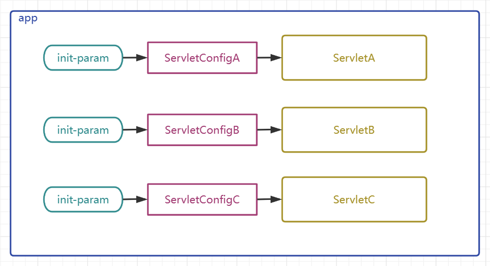

> ServletConfig是一个接口,定义了如下API

``` java
package jakarta.servlet;
import java.util.Enumeration;
public interface ServletConfig {
    String getServletName();
    ServletContext getServletContext();
    String getInitParameter(String var1);
    Enumeration<String> getInitParameterNames();
}
```

| 方法名                  | 作用                                                         |
| ----------------------- | ------------------------------------------------------------ |
| getServletName()        | 获取\<servlet-name>HelloServlet\</servlet-name>定义的Servlet名称 |
| getServletContext()     | 获取ServletContext对象                                       |
| getInitParameter()      | 获取配置Servlet时设置的『初始化参数』，根据名字获取值        |
| getInitParameterNames() | 获取所有初始化参数名组成的Enumeration对象                    |

> ServletConfig怎么用,测试代码如下

+ 定义Servlet

``` java
public class ServletA extends HttpServlet {
    @Override
    protected void service(HttpServletRequest req, HttpServletResponse resp) throws ServletException, IOException {
        ServletConfig servletConfig = this.getServletConfig();
        // 根据参数名获取单个参数
        String value = servletConfig.getInitParameter("param1");
        System.out.println("param1:"+value);
        // 获取所有参数名
        Enumeration<String> parameterNames = servletConfig.getInitParameterNames();
        // 迭代并获取参数名
        while (parameterNames.hasMoreElements()) {
            String paramaterName = parameterNames.nextElement();
            System.out.println(paramaterName+":"+servletConfig.getInitParameter(paramaterName));
        }
    }
}


public class ServletB extends HttpServlet {
    @Override
    protected void service(HttpServletRequest req, HttpServletResponse resp) throws ServletException, IOException {
        ServletConfig servletConfig = this.getServletConfig();
        // 根据参数名获取单个参数
        String value = servletConfig.getInitParameter("param1");
        System.out.println("param1:"+value);
        // 获取所有参数名
        Enumeration<String> parameterNames = servletConfig.getInitParameterNames();
        // 迭代并获取参数名
        while (parameterNames.hasMoreElements()) {
            String paramaterName = parameterNames.nextElement();
            System.out.println(paramaterName+":"+servletConfig.getInitParameter(paramaterName));
        }
    }
}
```

+ 配置Servlet

``` xml
  <servlet>
       <servlet-name>ServletA</servlet-name>
       <servlet-class>com.atguigu.servlet.ServletA</servlet-class>
       <!--配置ServletA的初始参数-->
       <init-param>
           <param-name>param1</param-name>
           <param-value>value1</param-value>
       </init-param>
       <init-param>
           <param-name>param2</param-name>
           <param-value>value2</param-value>
       </init-param>
   </servlet>

    <servlet>
        <servlet-name>ServletB</servlet-name>
        <servlet-class>com.atguigu.servlet.ServletB</servlet-class>
        <!--配置ServletB的初始参数-->
        <init-param>
            <param-name>param3</param-name>
            <param-value>value3</param-value>
        </init-param>
        <init-param>
            <param-name>param4</param-name>
            <param-value>value4</param-value>
        </init-param>
    </servlet>

    <servlet-mapping>
        <servlet-name>ServletA</servlet-name>
        <url-pattern>/servletA</url-pattern>
    </servlet-mapping>

    <servlet-mapping>
        <servlet-name>ServletB</servlet-name>
        <url-pattern>/servletB</url-pattern>
    </servlet-mapping>
```

+ 请求Servlet测试

略

## 6.2 ServletContext的使用

> ServletContext是什么

+ ServletContext对象有称呼为上下文对象,或者叫应用域对象(后面统一讲解域对象)
+ 容器会为每个app创建一个独立的唯一的ServletContext对象
+ ServletContext对象为所有的Servlet所共享
+ ServletContext可以为所有的Servlet提供初始配置参数

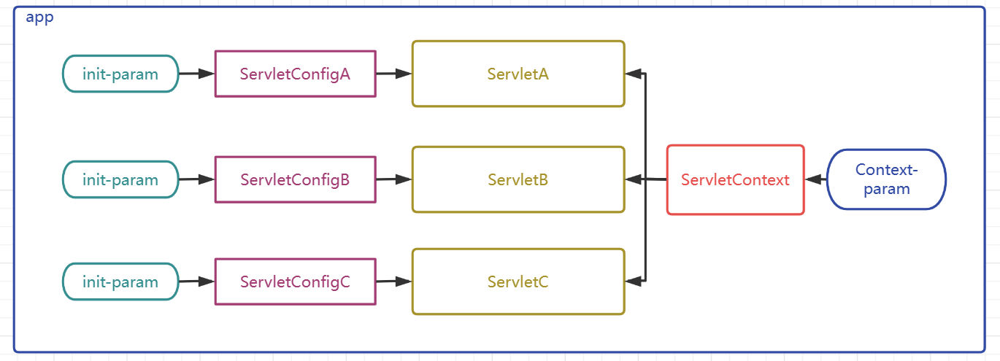

> ServletContext怎么用

+ 配置ServletContext参数

``` xml
<?xml version="1.0" encoding="UTF-8"?>
<web-app xmlns="https://jakarta.ee/xml/ns/jakartaee"
         xmlns:xsi="http://www.w3.org/2001/XMLSchema-instance"
         xsi:schemaLocation="https://jakarta.ee/xml/ns/jakartaee https://jakarta.ee/xml/ns/jakartaee/web-app_5_0.xsd"
         version="5.0">

    <context-param>
        <param-name>paramA</param-name>
        <param-value>valueA</param-value>
    </context-param>
    <context-param>
        <param-name>paramB</param-name>
        <param-value>valueB</param-value>
    </context-param>
</web-app>
```

+ 在Servlet中获取ServletContext并获取参数

``` java
package com.atguigu.servlet;

import jakarta.servlet.ServletConfig;
import jakarta.servlet.ServletContext;
import jakarta.servlet.ServletException;
import jakarta.servlet.http.HttpServlet;
import jakarta.servlet.http.HttpServletRequest;
import jakarta.servlet.http.HttpServletResponse;

import java.io.IOException;
import java.util.Enumeration;

public class ServletA extends HttpServlet {
    @Override
    protected void service(HttpServletRequest req, HttpServletResponse resp) throws ServletException, IOException {
       
        // 从ServletContext中获取为所有的Servlet准备的参数
        ServletContext servletContext = this.getServletContext();
        String valueA = servletContext.getInitParameter("paramA");
        System.out.println("paramA:"+valueA);
        // 获取所有参数名
        Enumeration<String> initParameterNames = servletContext.getInitParameterNames();
        // 迭代并获取参数名
        while (initParameterNames.hasMoreElements()) {
            String paramaterName = initParameterNames.nextElement();
            System.out.println(paramaterName+":"+servletContext.getInitParameter(paramaterName));
        }
    }
}
```

## 6.3 ServletContext其他重要API

> 获取资源的真实路径

``` java
String realPath = servletContext.getRealPath("资源在web目录中的路径");
```

+ 例如我们的目标是需要获取项目中某个静态资源的路径，不是工程目录中的路径，而是**部署目录中的路径**；我们如果直接拷贝其在我们电脑中的完整路径的话其实是有问题的，因为如果该项目以后部署到公司服务器上的话，路径肯定是会发生改变的，所以我们需要使用代码动态获取资源的真实路径.  只要使用了servletContext动态获取资源的真实路径，**那么无论项目的部署路径发生什么变化，都会动态获取项目运行时候的实际路径**，所以就不会发生由于写死真实路径而导致项目部署位置改变引发的路径错误问题

> 获取项目的上下文路径

``` java
String contextPath = servletContext.getContextPath();
```

+ 项目的部署名称,也叫项目的上下文路径,在部署进入tomcat时所使用的路径,该路径是可能发生变化的,通过该API动态获取项目真实的上下文路径,可以**帮助我们解决一些后端页面渲染技术或者请求转发和响应重定向中的路径问题**

>  域对象的相关API

+ 域对象: 一些用于存储数据和传递数据的对象,传递数据不同的范围,我们称之为不同的域,不同的域对象代表不同的域,共享数据的范围也不同
+ ServletContext代表应用,所以ServletContext域也叫作应用域,是webapp中最大的域,可以在本应用内实现数据的共享和传递
+ webapp中的三大域对象,分别是应用域,会话域,请求域
+ `后续我们会将三大域对象统一进行讲解和演示`,三大域对象都具有的API如下

| API                                         | 功能解释            |
| ------------------------------------------- | ------------------- |
| void setAttribute(String key,Object value); | 向域中存储/修改数据 |
| Object getAttribute(String key);            | 获得域中的数据      |
| void removeAttribute(String key);           | 移除域中的数据      |

# 七 HttpServletRequest

## 7.1 HttpServletRequest简介

> HttpServletRequest是什么

+ HttpServletRequest是一个接口,其父接口是ServletRequest
+ HttpServletRequest是Tomcat将请求报文转换封装而来的对象,在Tomcat调用service方法时传入
+ HttpServletRequest代表客户端发来的请求,所有请求中的信息都可以通过该对象获得


## 7.2 HttpServletRequest常见API

> HttpServletRequest怎么用

+ 获取请求行信息相关(方式,请求的url,协议及版本)

| API                           | 功能解释                       |
| ----------------------------- | ------------------------------ |
| StringBuffer getRequestURL(); | 获取客户端请求的url            |
| String getRequestURI();       | 获取客户端请求项目中的具体资源 |
| int getServerPort();          | 获取客户端发送请求时的端口     |
| int getLocalPort();           | 获取本应用在所在容器的端口     |
| int getRemotePort();          | 获取客户端程序的端口           |
| String getScheme();           | 获取请求协议                   |
| String getProtocol();         | 获取请求协议及版本号           |
| String getMethod();           | 获取请求方式                   |

+ 获得请求头信息相关
| API                                   | 功能解释               |
| ------------------------------------- | ---------------------- |
| String getHeader(String headerName);  | 根据头名称获取请求头   |
| Enumeration<String> getHeaderNames(); | 获取所有的请求头名字   |
| String getContentType();              | 获取content-type请求头 |

+ 获得请求参数相关
| API                                                     | 功能解释                             |
| ------------------------------------------------------- | ------------------------------------ |
| String getParameter(String parameterName);              | 根据请求参数名获取请求单个参数值     |
| String[] getParameterValues(String parameterName);      | 根据请求参数名获取请求多个参数值数组 |
| Enumeration<String> getParameterNames();                | 获取所有请求参数名                   |
| Map<String, String[]> getParameterMap();                | 获取所有请求参数的键值对集合         |
| BufferedReader getReader() throws IOException;          | 获取读取请求体的字符输入流           |
| ServletInputStream getInputStream() throws IOException; | 获取读取请求体的字节输入流           |
| int getContentLength();                                 | 获得请求体长度的字节数               |

+ 其他API
| API                                          | 功能解释                    |
| -------------------------------------------- | --------------------------- |
| String getServletPath();                     | 获取请求的Servlet的映射路径 |
| ServletContext getServletContext();          | 获取ServletContext对象      |
| Cookie[] getCookies();                       | 获取请求中的所有cookie      |
| HttpSession getSession();                    | 获取Session对象             |
| void setCharacterEncoding(String encoding) ; | 设置请求体字符集            |

# 八 HttpServletResponse

## 8.1 HttpServletResponse简介

> HttpServletResponse是什么

+ HttpServletResponse是一个接口,其父接口是ServletResponse
+ HttpServletResponse是Tomcat预先创建的,在Tomcat调用service方法时传入
+ HttpServletResponse代表对客户端的响应,该对象会被转换成响应的报文发送给客户端,通过该对象我们可以设置响应信息


## 8.2 HttpServletResponse的常见API

> HttpServletRequest怎么用

+ 设置响应行相关

| API                        | 功能解释                   |
| -------------------------- | -------------------------- |
| void setStatus(int  code); | 设置响应状态码             |


+ 设置响应头相关

| API                                                    | 功能解释                                         |
| ------------------------------------------------------ | ------------------------------------------------ |
| void setHeader(String headerName, String headerValue); | 设置/修改响应头键值对                            |
| void setContentType(String contentType);               | 设置content-type响应头及响应字符集(设置MIME类型) |

+ 设置响应体相关

| API                                                       | 功能解释                                                |
| --------------------------------------------------------- | ------------------------------------------------------- |
| PrintWriter getWriter() throws IOException;               | 获得向响应体放入信息的字符输出流                        |
| ServletOutputStream getOutputStream() throws IOException; | 获得向响应体放入信息的字节输出流                        |
| void setContentLength(int length);                        | 设置响应体的字节长度,其实就是在设置content-length响应头 |

+ 其他API

| API                                                          | 功能解释                                            |
| ------------------------------------------------------------ | --------------------------------------------------- |
| void sendError(int code, String message) throws IOException; | 向客户端响应错误信息的方法,需要指定响应码和响应信息 |
| void addCookie(Cookie cookie);                               | 向响应体中增加cookie                                |
| void setCharacterEncoding(String encoding);                  | 设置响应体字符集                                    |

> MIME类型

+ MIME类型,可以理解为文档类型,用户表示传递的数据是属于什么类型的文档
+ 浏览器可以根据MIME类型决定该用什么样的方式解析接收到的响应体数据
+ 可以这样理解: 前后端交互数据时,告诉对方发给对方的是 html/css/js/图片/声音/视频/... ...
+ tomcat/conf/web.xml中配置了常见文件的拓展名和MIMIE类型的对应关系
+ 常见的MIME类型举例如下

| 文件拓展名                  | MIME类型               |
| --------------------------- | ---------------------- |
| .html                       | text/html              |
| .css                        | text/css               |
| .js                         | application/javascript |
| .png /.jpeg/.jpg/... ...    | image/jpeg             |
| .mp3/.mpe/.mpeg/ ... ...    | audio/mpeg             |
| .mp4                        | video/mp4              |
| .m1v/.m1v/.m2v/.mpe/... ... | video/mpeg             |


# 九 请求转发和响应重定向

## 9.1 概述

> 什么是请求转发和响应重定向

+ 请求转发和响应重定向是web应用中间接访问项目资源的两种手段,也是Servlet控制页面跳转的两种手段

+ 请求转发通过HttpServletRequest实现,响应重定向通过HttpServletResponse实现

+ 请求转发生活举例: 张三找李四借钱,李四没有,李四找王五,让王五借给张三
+ 响应重定向生活举例:张三找李四借钱,李四没有,李四让张三去找王五,张三自己再去找王五借钱

## 9.2 请求转发

> 请求转发运行逻辑图


> 请求转发特点(背诵)

+ 请求转发通过HttpServletRequest对象获取请求转发器实现
+ 请求转发是服务器内部的行为,对客户端是屏蔽的
+ 客户端只发送了一次请求,客户端地址栏不变
+ 服务端只产生了一对请求和响应对象,这一对请求和响应对象会继续传递给下一个资源
+ 因为全程只有一个HttpServletRequset对象,所以请求参数可以传递,请求域中的数据也可以传递
+ 请求转发可以转发给其他Servlet动态资源,也可以转发给一些静态资源以实现页面跳转
+ 请求转发可以转发给WEB-INF下受保护的资源
+ 请求转发不能转发到本项目以外的外部资源

> 请求转发测试代码

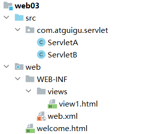


+ ServletA

``` java
@WebServlet("/servletA")
public class ServletA extends HttpServlet {
    @Override
    protected void service(HttpServletRequest req, HttpServletResponse resp) throws ServletException, IOException {
        //  获取请求转发器
        //  转发给servlet  ok
        RequestDispatcher  requestDispatcher = req.getRequestDispatcher("servletB");
        //  转发给一个视图资源 ok
        //RequestDispatcher requestDispatcher = req.getRequestDispatcher("welcome.html");
        //  转发给WEB-INF下的资源  ok
        //RequestDispatcher requestDispatcher = req.getRequestDispatcher("WEB-INF/views/view1.html");
        //  转发给外部资源   no
        //RequestDispatcher requestDispatcher = req.getRequestDispatcher("http://www.atguigu.com");
        //  获取请求参数
        String username = req.getParameter("username");
        System.out.println(username);
        //  向请求域中添加数据
        req.setAttribute("reqKey","requestMessage");
        //  做出转发动作
        requestDispatcher.forward(req,resp);
    }
}
```


+ ServletB

``` java
@WebServlet("/servletB")
public class ServletB extends HttpServlet {
    @Override
    protected void service(HttpServletRequest req, HttpServletResponse resp) throws ServletException, IOException {
        // 获取请求参数
        String username = req.getParameter("username");
        System.out.println(username);
        // 获取请求域中的数据
        String reqMessage = (String)req.getAttribute("reqKey");
        System.out.println(reqMessage);
        // 做出响应
        resp.getWriter().write("servletB response");        
    }
}
```


+ 打开浏览器,输入以下url测试

``` http
http://localhost:8080/web03_war_exploded/servletA?username=atguigu
```

## 9.3 响应重定向

> 响应重定向运行逻辑图

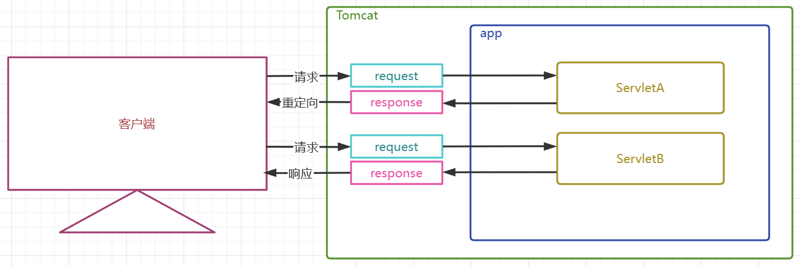

> 响应重定向特点(背诵)

+ 响应重定向通过HttpServletResponse对象的sendRedirect方法实现
+ 响应重定向是服务端通过302响应码和路径,告诉客户端自己去找其他资源,是在服务端提示下的,客户端的行为
+ 客户端至少发送了两次请求,客户端地址栏是要变化的
+ 服务端产生了多对请求和响应对象,且请求和响应对象不会传递给下一个资源
+ 因为全程产生了多个HttpServletRequset对象,所以请求参数不可以传递,请求域中的数据也不可以传递
+ 重定向可以是其他Servlet动态资源,也可以是一些静态资源以实现页面跳转
+ 重定向不可以到给WEB-INF下受保护的资源
+ 重定向可以到本项目以外的外部资源

> 响应重定向测试代码


+ ServletA

``` java

@WebServlet("/servletA")
public class ServletA extends HttpServlet {
    @Override
    protected void service(HttpServletRequest req, HttpServletResponse resp) throws ServletException, IOException {
        //  获取请求参数
        String username = req.getParameter("username");
        System.out.println(username);
        //  向请求域中添加数据
        req.setAttribute("reqKey","requestMessage");
        //  响应重定向
        // 重定向到servlet动态资源 OK
        resp.sendRedirect("servletB");
        // 重定向到视图静态资源 OK
        //resp.sendRedirect("welcome.html");
        // 重定向到WEB-INF下的资源 NO
        //resp.sendRedirect("WEB-INF/views/view1");
        // 重定向到外部资源
        //resp.sendRedirect("http://www.atguigu.com");
    }
}
```

+ ServletB

``` java
@WebServlet("/servletB")
public class ServletB extends HttpServlet {
    @Override
    protected void service(HttpServletRequest req, HttpServletResponse resp) throws ServletException, IOException {
        // 获取请求参数
        String username = req.getParameter("username");
        System.out.println(username);
        // 获取请求域中的数据
        String reqMessage = (String)req.getAttribute("reqKey");
        System.out.println(reqMessage);
        // 做出响应
        resp.getWriter().write("servletB response");

    }
}
```

+ 打开浏览器,输入以下url测试

``` url
http://localhost:8080/web03_war_exploded/servletA?username=atguigu
```


# 十 web乱码和路径问题总结
##  10.1 乱码问题
> 乱码问题产生的根本原因是什么

1. 数据的编码和解码使用的不是同一个字符集
2. 使用了不支持某个语言文字的字符集

> 各个字符集的兼容性


+ 由上图得知,上述字符集都兼容了ASCII
+ ASCII中有什么? 英文字母和一些通常使用的符号,所以这些东西无论使用什么字符集都不会乱码


### 10.1.1 HTML乱码问题

> 设置项目文件的字符集要使用一个支持中文的字符集

+ 查看当前文件的字符集


+ 查看项目字符集 配置,将Global Encoding 全局字符集,Project Encoding 项目字符集, Properties Files 属性配置文件字符集设置为UTF-8


> 当前视图文件的字符集通过<meta charset="UTF-8"> 来告知浏览器通过什么字符集来解析当前文件

``` html
<!DOCTYPE html>
<html lang="en">
<head>
    <meta charset="UTF-8">
    <title>Title</title>
</head>
<body>
    中文
</body>
</html>
```

### 10.1.2 Tomcat控制台乱码

> 在tomcat10.1.7这个版本中,修改 tomcat/conf/logging.properties中,所有的UTF-8为GBK即可

+ 修改前

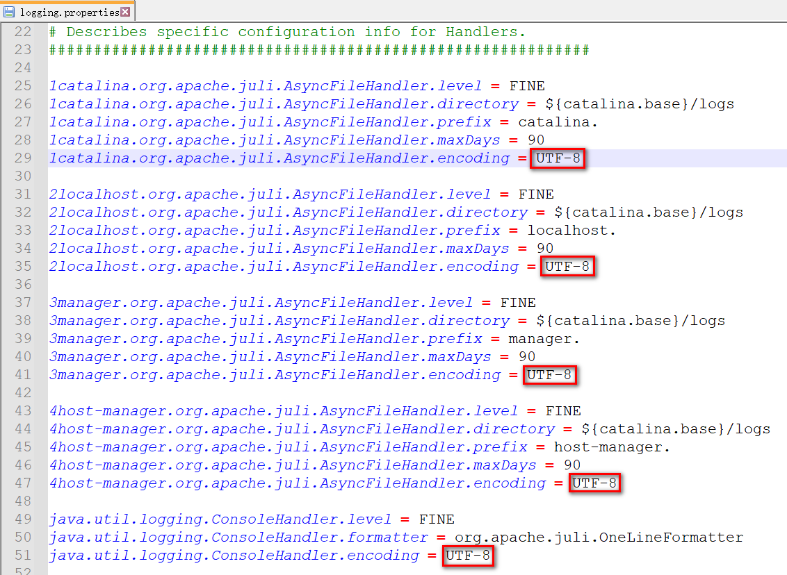

+ 修改后


+ 重启测试

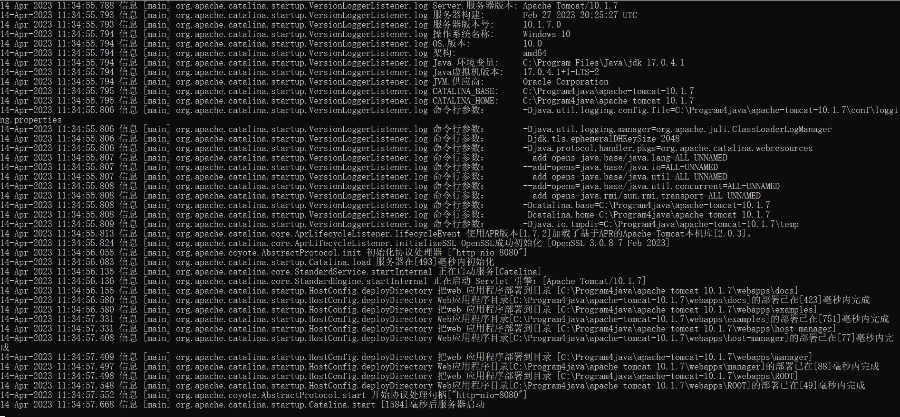

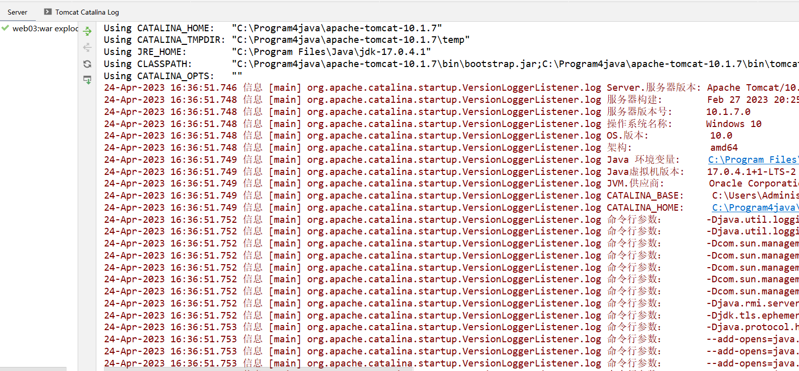

> sout乱码问题,设置JVM加载.class文件时使用UTF-8字符集

+ 设置虚拟机加载.class文件的字符集和编译时使用的字符集一致

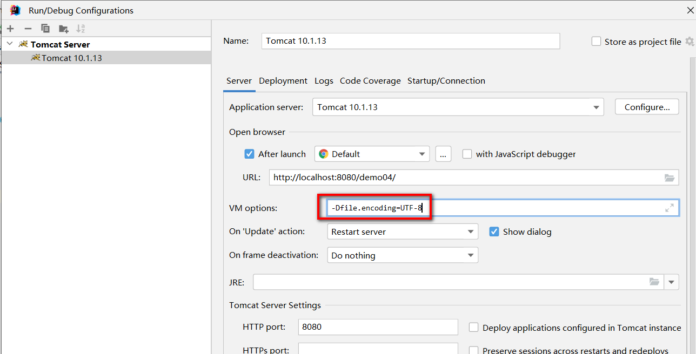


### 10.1.3 请求乱码问题

#### 10.1.3.1 GET请求乱码

> GET请求方式乱码分析

+ GET方式提交参数的方式是将参数放到URL后面,如果使用的不是UTF-8,那么会对参数进行URL编码处理
+ HTML中的 <meta charset='字符集'/> 影响了GET方式提交参数的URL编码
+ tomcat10.1.7的URI编码默认为 UTF-8
+ 当GET方式提交的参数URL编码和tomcat10.1.7默认的URI编码不一致时,就会出现乱码

> GET请求方式乱码演示

+ 浏览器解析的文档的<meta charset="GBK" /> 

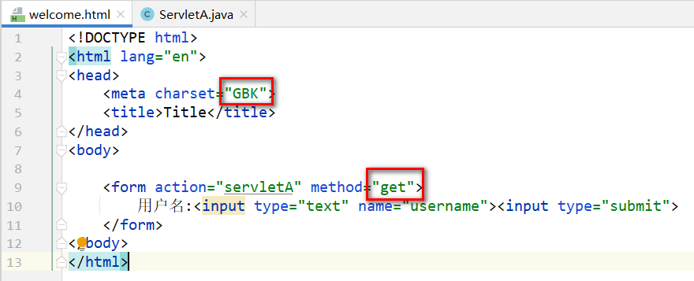

+ GET方式提交时,会对数据进行URL编码处理 ,是将GBK 转码为 "百分号码"


+ tomcat10.1.7 默认使用UTF-8对URI进行解析,造成前后端使用的字符集不一致,出现乱码


> GET请求方式乱码解决

+ 方式1  :设置GET方式提交的编码和Tomcat10.1.7的URI默认解析编码一致即可 (推荐)


+ 方式2 : 设置Tomcat10.1.7的URI解析字符集和GET请求发送时所使用URL转码时的字符集一致即可,修改conf/server.xml中 Connecter 添加 URIEncoding="GBK"  (不推荐)


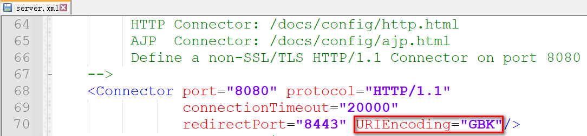

#### 10.1.3.2 POST方式请求乱码

> POST请求方式乱码分析

+ POST请求将参数放在请求体中进行发送
+ 请求体使用的字符集受到了<meta charset="字符集"/> 的影响
+ Tomcat10.1.7 默认使用UTF-8字符集对请求体进行解析
+ 如果请求体的URL转码和Tomcat的请求体解析编码不一致,就容易出现乱码

> POST方式乱码演示

+ POST请求请求体受到了<meta charset="字符集"/> 的影响


+ 请求体中,将GBK数据进行 URL编码


+ 后端默认使用UTF-8解析请求体,出现字符集不一致,导致乱码

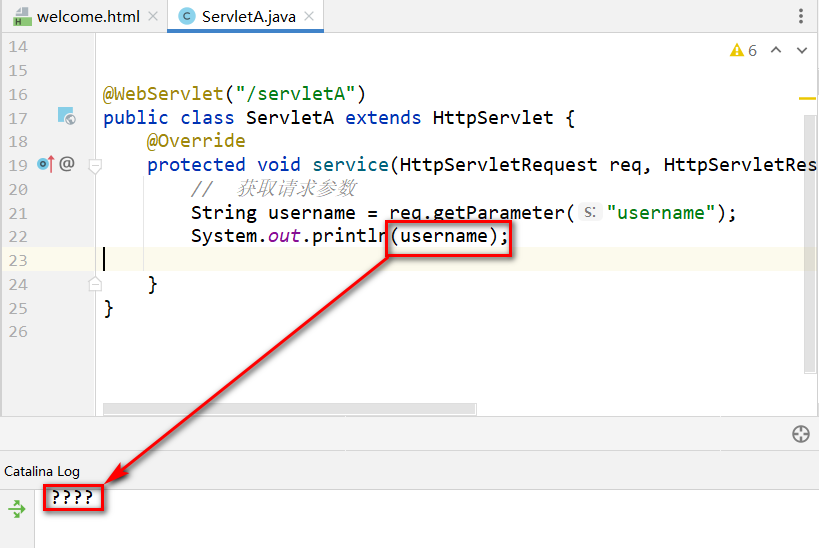

> POST请求方式乱码解决

+ 方式1 : 请求时,使用UTF-8字符集提交请求体 (推荐)


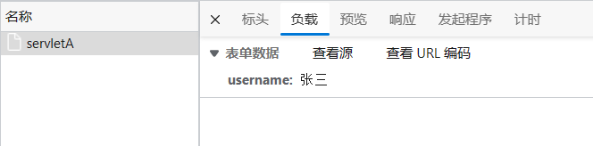

+ 方式2 : 后端在获取参数前,设置解析请求体使用的字符集和请求发送时使用的字符集一致 (不推荐)


### 10.1.3 响应乱码问题

> 响应乱码分析

+ 在Tomcat10.1.7中,向响应体中放入的数据默认使用了工程编码 UTF-8
+ 浏览器在接收响应信息时,使用了不同的字符集或者是不支持中文的字符集就会出现乱码

> 响应乱码演示

+ 服务端通过response对象向响应体添加数据


+ 浏览器接收数据解析乱码

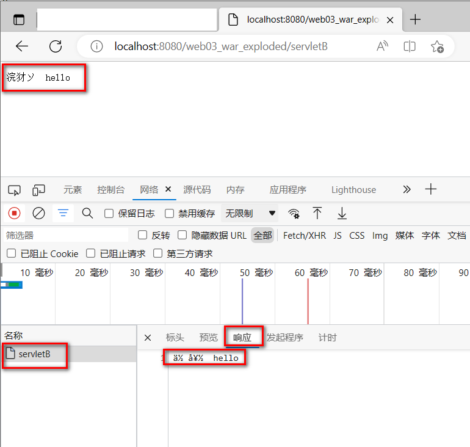


> 响应乱码解决

+ 方式1 : 手动设定浏览器对本次响应体解析时使用的字符集(不推荐)
    + edge和 chrome浏览器没有提供直接的比较方便的入口,不方便

+ 方式2: 后端通过设置响应体的字符集和浏览器解析响应体的默认字符集一致(不推荐)

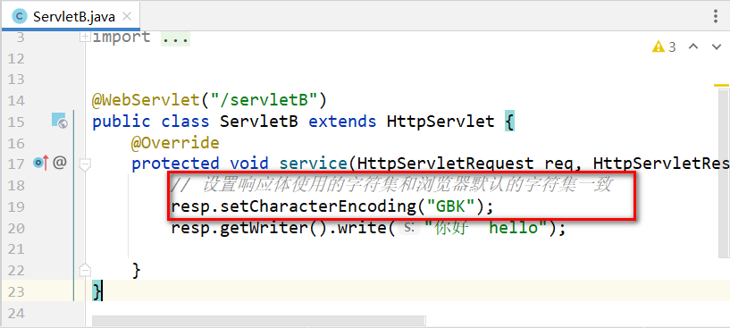


方式3: 通过设置content-type响应头,告诉浏览器以指定的字符集解析响应体(推荐)

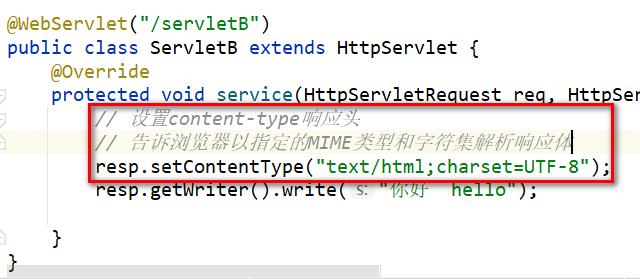


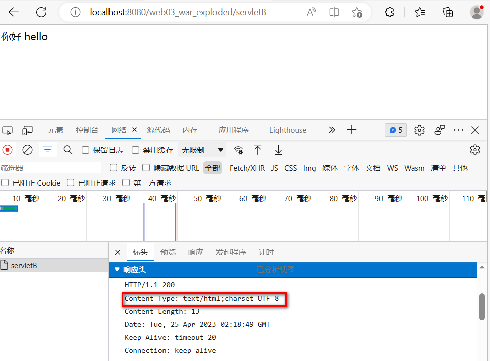


## 10.2  路径问题

> 相对路径和绝对路径

+ 相对路径
    + 相对路径的规则是: 以当前资源所在的路径为出发点去寻找目标资源
    + 相对路径不以 / 开头
    + 在file协议下,使用的是磁盘路径
    + 在http协议下,使用的是url路径
    + 相对路径中可以使用 ./表示当前资源所在路径,可以省略不写
    + 相对路径中可以使用../表示当前资源所在路径的上一层路径,需要时要手动添加

+ 绝对路径
    + 绝对路径的规则是: 使用以一个固定的路径做出出发点去寻找目标资源,和当前资源所在的路径没有关系
    + 绝对路径要以/ 开头
    + 绝对路径的写法中,不以当前资源的所在路径为出发点,所以不会出现  ./ 和../
    + 不同的项目和不同的协议下,绝对路径的基础位置可能不同,要通过测试确定
    + 绝对路径的好处就是:无论当前资源位置在哪,寻找目标资源路径的写法都一致
+ 应用场景
    1. 前端代码中,href src action 等属性
    2. 请求转发和重定向中的路径

### 10.2.1 前端路径问题

> 前端项目结构


#### 10.2.1.1  相对路径情况分析

> 相对路径情况1:web/index.html中引入web/static/img/logo.png

+ 访问index.html的url为   :  http://localhost:8080/web03_war_exploded/index.html
+ 当前资源为                      :  index.html
+ 当前资源的所在路径为  : http://localhost:8080/web03_war_exploded/
+ 要获取的目标资源url为 :  http://localhost:8080/web03_war_exploded/static/img/logo.png
+ index.html中定义的了    : ``
+ 寻找方式就是在当前资源所在路径(http://localhost:8080/web03_war_exploded/)后拼接src属性值(static/img/logo.png),正好是目标资源正常获取的url(http://localhost:8080/web03_war_exploded/static/img/logo.png)

``` html
<!DOCTYPE html>
<html lang="en">
<head>
    <meta charset="UTF-8">
    <title>Title</title>
</head>
<body>
    
    
</body>
</html>


```

> 相对路径情况2:web/a/b/c/test.html中引入web/static/img/logo.png

+ 访问test.html的url为      :  http://localhost:8080/web03_war_exploded/a/b/c/test.html
+ 当前资源为                      :  test.html
+ 当前资源的所在路径为  : http://localhost:8080/web03_war_exploded/a/b/c/
+ 要获取的目标资源url为 :  http://localhost:8080/web03_war_exploded/static/img/logo.png
+ test.html中定义的了       : ``
+ 寻找方式就是在当前资源所在路径(http://localhost:8080/web03_war_exploded/a/b/c/)后拼接src属性值(../../../static/img/logo.png),其中 ../可以抵消一层路径,正好是目标资源正常获取的url(http://localhost:8080/web03_war_exploded/static/img/logo.png)

``` html
<!DOCTYPE html>
<html lang="en">
<head>
    <meta charset="UTF-8">
    <title>Title</title>
</head>
<body>
    <!-- ../代表上一层路径 -->
    
</body>
</html>
```

> 相对路径情况3:web/WEB-INF/views/view1.html中引入web/static/img/logo.png

+ view1.html在WEB-INF下,需要通过Servlet请求转发获得

``` java
@WebServlet("/view1Servlet")
public class View1Servlet extends HttpServlet {
    @Override
    protected void service(HttpServletRequest req, HttpServletResponse resp) throws ServletException, IOException {
        RequestDispatcher requestDispatcher = req.getRequestDispatcher("WEB-INF/views/view1.html");
        requestDispatcher.forward(req,resp);
    }
}
```

+ 访问view1.html的url为   :  http://localhost:8080/web03_war_exploded/view1Servlet
+ 当前资源为                      :  view1Servlet
+ 当前资源的所在路径为  : http://localhost:8080/web03_war_exploded/
+ 要获取的目标资源url为 :  http://localhost:8080/web03_war_exploded/static/img/logo.png
+ view1.html中定义的了    : ``
+ 寻找方式就是在当前资源所在路径(http://localhost:8080/web03_war_exploded/)后拼接src属性值(static/img/logo.png),正好是目标资源正常获取的url(http://localhost:8080/web03_war_exploded/static/img/logo.png)

``` html
<!DOCTYPE html>
<html lang="en">
<head>
    <meta charset="UTF-8">
    <title>Title</title>
</head>
<body>


</body>
</html>
```

#### 10.2.1.2 绝对路径情况分析
> 绝对路径情况1:web/index.html中引入web/static/img/logo.png

+ 访问index.html的url为   :  http://localhost:8080/web03_war_exploded/index.html
+ 绝对路径的基准路径为  :  http://localhost:8080
+ 要获取的目标资源url为 :  http://localhost:8080/web03_war_exploded/static/img/logo.png
+ index.html中定义的了    : ``
+ 寻找方式就是在基准路径(http://localhost:8080)后面拼接src属性值(/web03_war_exploded/static/img/logo.png),得到的正是目标资源访问的正确路径

``` html
<!DOCTYPE html>
<html lang="en">
<head>
    <meta charset="UTF-8">
    <title>Title</title>
</head>
<body>
    <!-- 绝对路径写法 -->
    
</body>
</html>


```

> 绝对路径情况2:web/a/b/c/test.html中引入web/static/img/logo.png

+ 访问test.html的url为   :  http://localhost:8080/web03_war_exploded/a/b/c/test.html
+ 绝对路径的基准路径为  :  http://localhost:8080
+ 要获取的目标资源url为 :  http://localhost:8080/web03_war_exploded/static/img/logo.png
+ test.html中定义的了    : ``
+ 寻找方式就是在基准路径(http://localhost:8080)后面拼接src属性值(/web03_war_exploded/static/img/logo.png),得到的正是目标资源访问的正确路径

``` html
<!DOCTYPE html>
<html lang="en">
<head>
    <meta charset="UTF-8">
    <title>Title</title>
</head>
<body>
    <!-- 绝对路径写法 -->
    
</body>
</html>
```

> 绝对路径情况3:web/WEB-INF/views/view1.html中引入web/static/img/logo.png

+ view1.html在WEB-INF下,需要通过Servlet请求转发获得

``` java
@WebServlet("/view1Servlet")
public class View1Servlet extends HttpServlet {
    @Override
    protected void service(HttpServletRequest req, HttpServletResponse resp) throws ServletException, IOException {
        RequestDispatcher requestDispatcher = req.getRequestDispatcher("WEB-INF/views/view1.html");
        requestDispatcher.forward(req,resp);
    }
}
```

+ 访问view1.html的url为   :  http://localhost:8080/web03_war_exploded/view1Servlet
+ 绝对路径的基准路径为  :  http://localhost:8080
+ 要获取的目标资源url为 :  http://localhost:8080/web03_war_exploded/static/img/logo.png
+ view1.html中定义的了    : ``
+ 寻找方式就是在基准路径(http://localhost:8080)后面拼接src属性值(/static/img/logo.png),得到的正是目标资源访问的正确路径

``` html
<!DOCTYPE html>
<html lang="en">
<head>
    <meta charset="UTF-8">
    <title>Title</title>
</head>
<body>


</body>
</html>
```

#### 10.2.1.3 base标签的使用

> base标签定义页面相对路径公共前缀

+ base 标签定义在head标签中,用于定义相对路径的公共前缀
+ base 标签定义的公共前缀只在相对路径上有效,绝对路径中无效
+ 如果相对路径开头有 ./ 或者../修饰,则base标签对该路径同样无效

> index.html 和a/b/c/test.html 以及view1Servlet 中的路径处理

```html
<!DOCTYPE html>
<html lang="en">
<head>
    <meta charset="UTF-8">
    <title>Title</title>
    <!--定义相对路径的公共前缀,将相对路径转化成了绝对路径-->
    <base href="/web03_war_exploded/">
</head>
<body>
    
</body>
</html>
```

#### 10.2.1.4 缺省项目上下文路径

> 项目上下文路径变化问题

+ 通过 base标签虽然解决了相对路径转绝对路径问题,但是base中定义的是项目的上下文路径
+ 项目的上下文路径是可以随意变化的
+ 一旦项目的上下文路径发生变化,所有base标签中的路径都需要改

> 解决方案

+ 将项目的上下文路径进行缺省设置,设置为 /,所有的绝对路径中就不必填写项目的上下文了,直接就是/开头即可

### 10.2.2 重定向中的路径问题

> 目标 :由/x/y/z/servletA重定向到a/b/c/test.html

``` java
@WebServlet("/x/y/z/servletA")
public class ServletA extends HttpServlet {
    @Override
    protected void service(HttpServletRequest req, HttpServletResponse resp) throws ServletException, IOException {
        
    }
}

```

#### 10.2.2.1相对路径写法

+ 访问ServletA的url为   :  http://localhost:8080/web03_war_exploded/x/y/z/servletA
+ 当前资源为                      :  servletA
+ 当前资源的所在路径为  : http://localhost:8080/web03_war_exploded/x/x/z/
+ 要获取的目标资源url为 :  http://localhost:8080/web03_war_exploded/a/b/c/test.html
+ ServletA重定向的路径    :  ../../../a/b/c/test/html
+ 寻找方式就是在当前资源所在路径(http://localhost:8080/web03_war_exploded/x/y/z/)后拼接(../../../a/b/c/test/html),形成(http://localhost:8080/web03_war_exploded/x/y/z/../../../a/b/c/test/html)每个../抵消一层目录,正好是目标资源正常获取的url(http://localhost:8080/web03_war_exploded/a/b/c/test/html)

``` java
@WebServlet("/x/y/z/servletA")
public class ServletA extends HttpServlet {
    @Override
    protected void service(HttpServletRequest req, HttpServletResponse resp) throws ServletException, IOException {
        // 相对路径重定向到test.html
        resp.sendRedirect("../../../a/b/c/test.html");
    }
}
```

#### 10.2.2.2绝对路径写法

+ 访问ServletA的url为   :  http://localhost:8080/web03_war_exploded/x/y/z/servletA

+ 绝对路径的基准路径为  :  http://localhost:8080

+ 要获取的目标资源url为 :  http://localhost:8080/web03_war_exploded/a/b/c/test.html

+ ServletA重定向的路径    : /web03_war_exploded/a/b/c/test.html

+ 寻找方式就是在基准路径(http://localhost:8080)后面拼接(/web03_war_exploded/a/b/c/test.html),得到( http://localhost:8080/web03_war_exploded/a/b/c/test.html)正是目标资源访问的正确路径

+ 绝对路径中需要填写项目上下文路径,但是上下文路径是变换的

    + 可以通过 ServletContext的getContextPath()获取上下文路径
    + 可以将项目上下文路径定义为 / 缺省路径,那么路径中直接以/开头即可

    ``` java
    //绝对路径中,要写项目上下文路径
    //resp.sendRedirect("/web03_war_exploded/a/b/c/test.html");
    // 通过ServletContext对象动态获取项目上下文路径
    //resp.sendRedirect(getServletContext().getContextPath()+"/a/b/c/test.html");
    // 缺省项目上下文路径时,直接以/开头即可
    resp.sendRedirect("/a/b/c/test.html");
    ```

    

### 10.2.3 请求转发中的路径问题

> 目标 :由x/y/servletB请求转发到a/b/c/test.html

``` java
@WebServlet("/x/y/servletB")
public class ServletB extends HttpServlet {
    @Override
    protected void service(HttpServletRequest req, HttpServletResponse resp) throws ServletException, IOException {

    }
}
```

#### 10.2.3.1 相对路径写法

+ 访问ServletB的url为       :  http://localhost:8080/web03_war_exploded/x/y/servletB

+ 当前资源为                      :  servletB

+ 当前资源的所在路径为  : http://localhost:8080/web03_war_exploded/x/x/

+ 要获取的目标资源url为 :  http://localhost:8080/web03_war_exploded/a/b/c/test.html

+ ServletA请求转发路径    :  ../../a/b/c/test/html

+ 寻找方式就是在当前资源所在路径(http://localhost:8080/web03_war_exploded/x/y/)后拼接(../../a/b/c/test/html),形成(http://localhost:8080/web03_war_exploded/x/y/../../a/b/c/test/html)每个../抵消一层目录,正好是目标资源正常获取的url(http://localhost:8080/web03_war_exploded/a/b/c/test/html)

    ``` java
    @WebServlet("/x/y/servletB")
    public class ServletB extends HttpServlet {
        @Override
        protected void service(HttpServletRequest req, HttpServletResponse resp) throws ServletException, IOException {
            RequestDispatcher requestDispatcher = req.getRequestDispatcher("../../a/b/c/test.html");
            requestDispatcher.forward(req,resp);
        }
    }
    
    
    ```

#### 10.2.3.2绝对路径写法

+ 请求转发只能转发到项目内部的资源,其绝对路径无需添加项目上下文路径

+ 请求转发绝对路径的基准路径相当于http://localhost:8080/web03_war_exploded

+ 在项目上下文路径为缺省值时,也无需改变,直接以/开头即可

    ```java
    @WebServlet("/x/y/servletB")
    public class ServletB extends HttpServlet {
        @Override
        protected void service(HttpServletRequest req, HttpServletResponse resp) throws ServletException, IOException {
            RequestDispatcher requestDispatcher = req.getRequestDispatcher("/a/b/c/test.html");
            requestDispatcher.forward(req,resp);
        }
    }
    ```

#### 10.2.3.3目标资源内相对路径处理

+ 此时需要注意,请求转发是服务器行为,浏览器不知道,地址栏不变化,相当于我们访问test.html的路径为http://localhost:8080/web03_war_exploded/x/y/servletB

+ 那么此时 test.html资源的所在路径就是http://localhost:8080/web03_war_exploded/x/y/所以test.html中相对路径要基于该路径编写,如果使用绝对路径则不用考虑

    ``` html
    <!DOCTYPE html>
    <html lang="en">
    <head>
        <meta charset="UTF-8">
        <title>Title</title>
    </head>
    <body>
        <!--
    		当前资源路径是     http://localhost:8080/web03_war_exploded/x/y/servletB
            当前资源所在路径是  http://localhost:8080/web03_war_exploded/x/y/
            目标资源路径=所在资源路径+src属性值 
    		http://localhost:8080/web03_war_exploded/x/y/../../static/img/logo.png
            http://localhost:8080/web03_war_exploded/static/img/logo.png
    		得到目标路径正是目标资源的访问路径	
        -->
    
    </body>
    </html>
    ```


# 十一 MVC架构模式


>  MVC（Model View Controller）是软件工程中的一种**`软件架构模式`**，它把软件系统分为**`模型`**、**`视图`**和**`控制器`**三个基本部分。用一种业务逻辑、数据、界面显示分离的方法组织代码，将业务逻辑聚集到一个部件里面，在改进和个性化定制界面及用户交互的同时，不需要重新编写业务逻辑。

+ **M**：Model 模型层,具体功能如下
    1. 存放和数据库对象的实体类以及一些用于存储非数据库表完整相关的VO对象
    2. 存放一些对数据进行逻辑运算操作的的一些业务处理代码

+ **V**：View 视图层,具体功能如下
    1. 存放一些视图文件相关的代码 html css js等
    2. 在前后端分离的项目中,后端已经没有视图文件,该层次已经衍化成独立的前端项目

+ **C**：Controller 控制层,具体功能如下
    1. 接收客户端请求,获得请求数据
     2. 将准备好的数据响应给客户端

> MVC模式下,项目中的常见包

+ M:
    1. 实体类包(pojo /entity /bean) 专门存放和数据库对应的实体类和一些VO对象
    2. 数据库访问包(dao/mapper)  专门存放对数据库不同表格CURD方法封装的一些类
    3. 服务包(service)                       专门存放对数据进行业务逻辑运算的一些类

+ C:
    1. 控制层包(controller)

+ V:
    1. web目录下的视图资源 html css js img 等
    2. 前端工程化后,在后端项目中已经不存在了


非前后端分离的MVC


前后端分离的MVC


# 十二 案例开发-日程管理-第二期

## 12.1 项目搭建

### 12.1.1 数据库准备

+ 创建schedule_system数据库并执行如下语句

``` sql
SET NAMES utf8mb4;
SET FOREIGN_KEY_CHECKS = 0;


-- ----------------------------
-- 创建日程表
-- ----------------------------
DROP TABLE IF EXISTS `sys_schedule`;
CREATE TABLE `sys_schedule`  (
  `sid` int NOT NULL AUTO_INCREMENT,
  `uid` int NULL DEFAULT NULL,
  `title` varchar(20) CHARACTER SET utf8mb4 COLLATE utf8mb4_0900_ai_ci NULL DEFAULT NULL,
  `completed` int(1) NULL DEFAULT NULL,
  PRIMARY KEY (`sid`) USING BTREE
) ENGINE = InnoDB AUTO_INCREMENT = 1 CHARACTER SET = utf8mb4 COLLATE = utf8mb4_0900_ai_ci ROW_FORMAT = Dynamic;

-- ----------------------------
-- 插入日程数据
-- ----------------------------

-- ----------------------------
-- 创建用户表
-- ----------------------------
DROP TABLE IF EXISTS `sys_user`;
CREATE TABLE `sys_user`  (
  `uid` int NOT NULL AUTO_INCREMENT,
  `username` varchar(10) CHARACTER SET utf8mb4 COLLATE utf8mb4_0900_ai_ci NULL DEFAULT NULL,
  `user_pwd` varchar(100) CHARACTER SET utf8mb4 COLLATE utf8mb4_0900_ai_ci NULL DEFAULT NULL,
  PRIMARY KEY (`uid`) USING BTREE,
  UNIQUE INDEX `username`(`username`) USING BTREE
) ENGINE = InnoDB CHARACTER SET = utf8mb4 COLLATE = utf8mb4_0900_ai_ci ROW_FORMAT = Dynamic;

-- ----------------------------
-- 插入用户数据
-- ----------------------------
INSERT INTO `sys_user` VALUES (1, 'zhangsan', 'e10adc3949ba59abbe56e057f20f883e');
INSERT INTO `sys_user` VALUES (2, 'lisi', 'e10adc3949ba59abbe56e057f20f883e');

SET FOREIGN_KEY_CHECKS = 1;

```

+ 获得如下表格


### 12.1.2 项目结构


### 12.1.3 导入依赖


### 12.1.4 pojo包处理

>  使用lombok处理getter setter equals hashcode 构造器 

``` java
//-----------------------------------------------------
package com.atguigu.schedule.pojo;

import lombok.AllArgsConstructor;
import lombok.Data;
import lombok.NoArgsConstructor;
import java.io.Serializable;
@AllArgsConstructor
@NoArgsConstructor
@Data
public class SysUser  implements Serializable {
    private Integer uid;
    private String username;
    private String userPwd;
}
//------------------------------------------------------
package com.atguigu.schedule.pojo;

import lombok.AllArgsConstructor;
import lombok.Data;
import lombok.NoArgsConstructor;
import java.io.Serializable;

@AllArgsConstructor
@NoArgsConstructor
@Data
public class SysSchedule implements Serializable {
    private Integer sid;
    private Integer uid;
    private String title;
    private Integer completed;
}
//------------------------------------------------------
```

### 12.1.5 dao包处理

导入JDBCUtil连接池工具类并准备jdbc.properties配置文件

``` java
package com.atguigu.schedule.util;


import com.alibaba.druid.pool.DruidDataSourceFactory;

import javax.sql.DataSource;
import java.io.IOException;
import java.io.InputStream;
import java.sql.Connection;
import java.sql.SQLException;
import java.util.Properties;

public class JDBCUtil {
    private static ThreadLocal<Connection> threadLocal =new ThreadLocal<>();

    private static DataSource dataSource;
    // 初始化连接池
    static{
        // 可以帮助我们读取.properties配置文件
        Properties properties =new Properties();
        InputStream resourceAsStream = JDBCUtil.class.getClassLoader().getResourceAsStream("jdbc.properties");
        try {
            properties.load(resourceAsStream);
        } catch (IOException e) {
            throw new RuntimeException(e);
        }

        try {
            dataSource = DruidDataSourceFactory.createDataSource(properties);
        } catch (Exception e) {
            throw new RuntimeException(e);
        }


    }
    /*1 向外提供连接池的方法*/
    public static DataSource getDataSource(){
        return dataSource;
    }

    /*2 向外提供连接的方法*/
    public static Connection getConnection(){
        Connection connection = threadLocal.get();
        if (null == connection) {
            try {
                connection = dataSource.getConnection();
            } catch (SQLException e) {
                throw new RuntimeException(e);
            }
            threadLocal.set(connection);
        }

        return connection;
    }


    /*定义一个归还连接的方法 (解除和ThreadLocal之间的关联关系) */
    public static void releaseConnection(){
        Connection connection = threadLocal.get();
        if (null != connection) {
            threadLocal.remove();
            // 把连接设置回自动提交的连接
            try {
                connection.setAutoCommit(true);
                // 自动归还到连接池
                connection.close();
            } catch (SQLException e) {
                throw new RuntimeException(e);
            }
        }
    }
}

```

``` properties
driverClassName=com.mysql.cj.jdbc.Driver
url=jdbc:mysql://localhost:3306/schedule_system
username=root
password=root
initialSize=5
maxActive=10
maxWait=1000
```

+ 创建BaseDao对象并复制如下代码

``` java
package com.atguigu.schedule.dao;


import com.atguigu.schedule.util.JDBCUtil;

import java.lang.reflect.Field;
import java.sql.*;
import java.time.LocalDateTime;
import java.util.ArrayList;
import java.util.List;

public class BaseDao {
    // 公共的查询方法  返回的是单个对象
    public <T> T baseQueryObject(Class<T> clazz, String sql, Object ... args) {
        T t = null;
        Connection connection = JDBCUtil.getConnection();
        PreparedStatement preparedStatement = null;
        ResultSet resultSet = null;
        int rows = 0;
        try {
            // 准备语句对象
            preparedStatement = connection.prepareStatement(sql);
            // 设置语句上的参数
            for (int i = 0; i < args.length; i++) {
                preparedStatement.setObject(i + 1, args[i]);
            }

            // 执行 查询
            resultSet = preparedStatement.executeQuery();
            if (resultSet.next()) {
                t = (T) resultSet.getObject(1);
            }
        } catch (Exception e) {
            e.printStackTrace();
        } finally {
            if (null != resultSet) {
                try {
                    resultSet.close();
                } catch (SQLException e) {
                    e.printStackTrace();
                }
            }
            if (null != preparedStatement) {
                try {
                    preparedStatement.close();
                } catch (SQLException e) {
                    e.printStackTrace();
                }

            }
            JDBCUtil.releaseConnection();
        }
        return t;
    }
    // 公共的查询方法  返回的是对象的集合

    public <T> List<T> baseQuery(Class clazz, String sql, Object ... args){
        List<T> list =new ArrayList<>();
        Connection connection = JDBCUtil.getConnection();
        PreparedStatement preparedStatement=null;
        ResultSet resultSet =null;
        int rows = 0;
        try {
            // 准备语句对象
            preparedStatement = connection.prepareStatement(sql);
            // 设置语句上的参数
            for (int i = 0; i < args.length; i++) {
                preparedStatement.setObject(i+1,args[i]);
            }

            // 执行 查询
            resultSet = preparedStatement.executeQuery();

            ResultSetMetaData metaData = resultSet.getMetaData();
            int columnCount = metaData.getColumnCount();

            // 将结果集通过反射封装成实体类对象
            while (resultSet.next()) {
                // 使用反射实例化对象
                Object obj =clazz.getDeclaredConstructor().newInstance();

                for (int i = 1; i <= columnCount; i++) {
                    String columnName = metaData.getColumnLabel(i);
                    Object value = resultSet.getObject(columnName);
                    // 处理datetime类型字段和java.util.Data转换问题
                    if(value.getClass().equals(LocalDateTime.class)){
                        value= Timestamp.valueOf((LocalDateTime) value);
                    }
                    Field field = clazz.getDeclaredField(columnName);
                    field.setAccessible(true);
                    field.set(obj,value);
                }

                list.add((T)obj);
            }

        } catch (Exception e) {
            e.printStackTrace();
        } finally {
            if (null !=resultSet) {
                try {
                    resultSet.close();
                } catch (SQLException e) {
                    throw new RuntimeException(e);
                }
            }
            if (null != preparedStatement) {
                try {
                    preparedStatement.close();
                } catch (SQLException e) {
                    throw new RuntimeException(e);
                }
            }
            JDBCUtil.releaseConnection();
        }
        return list;
    }

    // 通用的增删改方法
    public int baseUpdate(String sql,Object ... args) {
        // 获取连接
        Connection connection = JDBCUtil.getConnection();
        PreparedStatement preparedStatement=null;
        int rows = 0;
        try {
            // 准备语句对象
            preparedStatement = connection.prepareStatement(sql);
            // 设置语句上的参数
            for (int i = 0; i < args.length; i++) {
                preparedStatement.setObject(i+1,args[i]);
            }

            // 执行 增删改 executeUpdate
            rows = preparedStatement.executeUpdate();
            // 释放资源(可选)


        } catch (SQLException e) {
            e.printStackTrace();
        } finally {
            if (null != preparedStatement) {
                try {
                    preparedStatement.close();
                } catch (SQLException e) {
                    throw new RuntimeException(e);
                }

            }
            JDBCUtil.releaseConnection();
        }
        // 返回的是影响数据库记录数
        return rows;
    }
}

```

+ dao层所有接口

``` java
//---------------------------------------------------
package com.atguigu.schedule.dao;
public interface SysUserDao {
}
//---------------------------------------------------
package com.atguigu.schedule.dao;
public interface SysScheduleDao {
}
//---------------------------------------------------
```

+ dao层所有实现类

``` java
//------------------------------------------------------------------------------
package com.atguigu.schedule.dao.impl;
import com.atguigu.schedule.dao.BaseDao;
import com.atguigu.schedule.dao.SysUserDao;
public class SysUserDaoImpl extends BaseDao implements SysUserDao {
}

//------------------------------------------------------------------------------
package com.atguigu.schedule.dao.impl;
import com.atguigu.schedule.dao.BaseDao;
import com.atguigu.schedule.dao.SysScheduleDao;
public class SysScheduleDaoImpl extends BaseDao implements SysScheduleDao {
}
//------------------------------------------------------------------------------
```

### 12.1.6 service包处理

+ 接口

``` java
//------------------------------------------------------------------------------
package com.atguigu.schedule.service;
public interface SysUserService {
}
//------------------------------------------------------------------------------
package com.atguigu.schedule.service;
public interface SysScheduleService {
}
//------------------------------------------------------------------------------
```

+ 实现类

```java
//------------------------------------------------------------------------------
package com.atguigu.schedule.service.impl;
import com.atguigu.schedule.service.SysUserService;
public class SysUserServiceImpl implements SysUserService {
}
//------------------------------------------------------------------------------
package com.atguigu.schedule.service.impl;
import com.atguigu.schedule.service.SysScheduleService;
public class SysScheduleServiceImpl implements SysScheduleService {
}
//------------------------------------------------------------------------------
```


### 12.1.7 controller包处理

+ BaseController处理请求路径问题

``` java
package com.atguigu.schedule.controller;

import jakarta.servlet.ServletException;
import jakarta.servlet.http.HttpServlet;
import jakarta.servlet.http.HttpServletRequest;
import jakarta.servlet.http.HttpServletResponse;
import java.io.IOException;
import java.lang.reflect.Method;

public class BaseController extends HttpServlet {
    @Override
    protected void service(HttpServletRequest req, HttpServletResponse resp) throws ServletException, IOException {
        

        String requestURI = req.getRequestURI();
        String[] split = requestURI.split("/");
        String methodName =split[split.length-1];
        // 通过反射获取要执行的方法
        Class clazz = this.getClass();
        try {
            Method method=clazz.getDeclaredMethod(methodName,HttpServletRequest.class,HttpServletResponse.class);
            // 设置方法可以访问
            method.setAccessible(true);
            // 通过反射执行代码
            method.invoke(this,req,resp);
        } catch (Exception e) {
            e.printStackTrace();
           
        }
    }
}

```


+ 多个处理器继承BaseController

```  java
//----------------------------------------------------------------------------
package com.atguigu.schedule.controller;

import jakarta.servlet.annotation.WebServlet;

@WebServlet("/user/*")
public class UserController extends BaseController{
}
//----------------------------------------------------------------------------
package com.atguigu.schedule.controller;

import jakarta.servlet.annotation.WebServlet;

@WebServlet("/schedule/*")
public class SysScheduleController  extends BaseController{
}
//----------------------------------------------------------------------------
```

### 12.1.8 加密工具类的使用

+ 导入MD5Util工具类

``` java
package com.atguigu.schedule.util;
import java.security.MessageDigest;
import java.security.NoSuchAlgorithmException;
public final class MD5Util {
    public static String encrypt(String strSrc) {
        try {
            char hexChars[] = { '0', '1', '2', '3', '4', '5', '6', '7', '8',
                    '9', 'a', 'b', 'c', 'd', 'e', 'f' };
            byte[] bytes = strSrc.getBytes();
            MessageDigest md = MessageDigest.getInstance("MD5");
            md.update(bytes);
            bytes = md.digest();
            int j = bytes.length;
            char[] chars = new char[j * 2];
            int k = 0;
            for (int i = 0; i < bytes.length; i++) {
                byte b = bytes[i];
                chars[k++] = hexChars[b >>> 4 & 0xf];
                chars[k++] = hexChars[b & 0xf];
            }
            return new String(chars);
        } catch (NoSuchAlgorithmException e) {
            e.printStackTrace();
            throw new RuntimeException("MD5加密出错!!!")
        }
    }
}
```


### 12.1.9 页面文件的导入

+ 复制资源下的日程管理中的HTML到项目的web目录下即可


## 12.3 业务代码

### 12.3.1  注册业务处理

+ controller

``` java 
package com.atguigu.schedule.controller;

import com.atguigu.schedule.pojo.SysUser;
import com.atguigu.schedule.service.SysUserService;
import com.atguigu.schedule.service.impl.SysUserServiceImpl;
import jakarta.servlet.ServletException;
import jakarta.servlet.annotation.WebServlet;
import jakarta.servlet.http.HttpServletRequest;
import jakarta.servlet.http.HttpServletResponse;

import java.io.IOException;

@WebServlet("/user/*")
public class SysUserController  extends BaseContoller {

    private SysUserService userService =new SysUserServiceImpl();

    /**
     * 接收用户注册请求的业务处理方法( 业务接口 不是java中的interface  )
     * @param req
     * @param resp
     * @throws ServletException
     * @throws IOException
     */
    protected void regist(HttpServletRequest req, HttpServletResponse resp) throws ServletException, IOException {
        // 1 接收客户端提交的参数
        String username = req.getParameter("username");
        String userPwd = req.getParameter("userPwd");
        // 2 调用服务层方法,完成注册功能
            //将参数放入一个SysUser对象中,在调用regist方法时传入
        SysUser sysUser =new SysUser(null,username,userPwd);
        int rows =userService.regist(sysUser);
        // 3 根据注册结果(成功  失败) 做页面跳转
        if(rows>0){
            resp.sendRedirect("/registSuccess.html");
        }else{
            resp.sendRedirect("/registFail.html");
        }
    }
}


```

+ service

```java
package com.atguigu.schedule.service;

import com.atguigu.schedule.pojo.SysUser;

public interface SysUserService {
    /**
     * 用户完成注册的业务方法
     * @param registUser 用于保存注册用户名和密码的对象
     * @return 注册成功返回>0的整数,否则返回0
     */
    int regist(SysUser registUser);
}
```


``` java
package com.atguigu.schedule.service.impl;

import com.atguigu.schedule.dao.SysUserDao;
import com.atguigu.schedule.dao.impl.SysUserDaoImpl;
import com.atguigu.schedule.pojo.SysUser;
import com.atguigu.schedule.service.SysUserService;
import com.atguigu.schedule.util.MD5Util;

public class SysUserServiceImpl  implements SysUserService {
    private SysUserDao  userDao =new SysUserDaoImpl();
    @Override
    public int regist(SysUser sysUser) {

        // 将用户的明文密码转换为密文密码
        sysUser.setUserPwd(MD5Util.encrypt(sysUser.getUserPwd()));
        // 调用DAO 层的方法  将sysUser信息存入数据库
        return userDao.addSysUser(sysUser);
    }
}
```

+ dao

``` java
package com.atguigu.schedule.dao;

import com.atguigu.schedule.pojo.SysUser;

public interface SysUserDao {

    /**
     * 向数据库中增加一条用户记录的方法
     * @param sysUser 要增加的记录的username和user_pwd字段以SysUser实体类对象的形式接收
     * @return 增加成功返回1 增加失败返回0
     */
    int addSysUser(SysUser sysUser);
}

```


``` java
package com.atguigu.schedule.dao.impl;

import com.atguigu.schedule.dao.BaseDao;
import com.atguigu.schedule.dao.SysUserDao;
import com.atguigu.schedule.pojo.SysUser;
public class SysUserDaoImpl extends BaseDao implements SysUserDao {
    @Override
    public int addSysUser(SysUser sysUser) {
        String sql ="insert into sys_user values(DEFAULT,?,?)";
        return baseUpdate(sql,sysUser.getUsername(),sysUser.getUserPwd());
    }
}
```


### 12.3.2 登录业务处理

+ controller

``` java 
package com.atguigu.schedule.controller;

import com.atguigu.schedule.pojo.SysUser;
import com.atguigu.schedule.service.SysUserService;
import com.atguigu.schedule.service.impl.SysUserServiceImpl;
import com.atguigu.schedule.util.MD5Util;
import jakarta.servlet.ServletException;
import jakarta.servlet.annotation.WebServlet;
import jakarta.servlet.http.HttpServletRequest;
import jakarta.servlet.http.HttpServletResponse;

import java.io.IOException;

@WebServlet("/user/*")
public class SysUserController  extends BaseContoller {

    private SysUserService userService =new SysUserServiceImpl();
    /**
     * 接收用登录请求,完成的登录业务接口
     * @param req
     * @param resp
     * @throws ServletException
     * @throws IOException
     */
    protected void login(HttpServletRequest req, HttpServletResponse resp) throws ServletException, IOException {
        //1 接收用户名和密码
        String username = req.getParameter("username");
        String userPwd = req.getParameter("userPwd");
        //2 调用服务层方法,根据用户名查询用户信息
        SysUser loginUser =userService.findByUsername(username);
        if(null == loginUser){
            // 跳转到用户名有误提示页
            resp.sendRedirect("/loginUsernameError.html");
        }else if(! MD5Util.encrypt(userPwd).equals(loginUser.getUserPwd())){
            //3 判断密码是否匹配
            // 跳转到密码有误提示页
            resp.sendRedirect("/loginUserPwdError.html");
        }else{
            //4 跳转到首页
            resp.sendRedirect("/showSchedule.html");
        }

    }
}
```

+ service

```java
package com.atguigu.schedule.service;

import com.atguigu.schedule.pojo.SysUser;

public interface SysUserService {
        /**
     * 根据用户名获得完整用户信息的方法
     * @param username 要查询的用户名
     * @return 如果找到了返回SysUser对象,找不到返回null
     */
    SysUser findByUsername(String username);
}
```

``` java

package com.atguigu.schedule.service.impl;

import com.atguigu.schedule.dao.SysUserDao;
import com.atguigu.schedule.dao.impl.SysUserDaoImpl;
import com.atguigu.schedule.pojo.SysUser;
import com.atguigu.schedule.service.SysUserService;
import com.atguigu.schedule.util.MD5Util;

public class SysUserServiceImpl implements SysUserService {
    private SysUserDao userDao =new SysUserDaoImpl();

    @Override
    public SysUser findByUsername(String username) {
        // 调用服务层方法,继续查询

        return userDao.findByUsername(username);
    }
}

```

+ dao

``` java
package com.atguigu.schedule.dao;

import com.atguigu.schedule.pojo.SysUser;

public interface SysUserDao {
        /**
     * 根据用户名获得完整用户信息的方法
     * @param username 要查询的用户名
     * @return 如果找到了返回SysUser对象,找不到返回null
     */
    SysUser findByUsername(String username);
}
```

``` java 

import com.atguigu.schedule.dao.BaseDao;
import com.atguigu.schedule.dao.SysUserDao;
import com.atguigu.schedule.pojo.SysUser;

import java.util.List;

public class SysUserDaoImpl extends BaseDao implements SysUserDao {
    @Override
    public SysUser findByUsername(String username) {
        String sql ="select uid,username, user_pwd userPwd from sys_user where username = ?";
        List<SysUser> userList = baseQuery(SysUser.class, sql, username);
        return  null != userList&& userList.size()>0? userList.get(0):null;
    }
}
```


---


----

© 版权声明

<escape>

<div>
    <h3 align="center"  style="color: brown;" >版权声明</h3>
    <table>
   		<tr>
    		<ol>
				<li>本网站名称：𝚲𝚳𝚲</li>
				<li>𝚲𝚳𝚲提供的资源仅供您个人用于非商业性目的。</li>
				<li>本站文章部分内容可能来源于网络，仅供大家学习与参考，如有侵权，请联系我进行删除处理。</li>
				<li>本站一切资源不代表本站立场，并不代表本站赞同其观点和对其真实性负责。</li>
        		<li>本站一律禁止以任何方式发布或转载任何违法的相关信息，访客发现请举报</li> 
        		<li>本站资源大多存储在云盘，如发现链接失效，请联系我，我会第一时间更新。</li>
        		<li>本站强烈打击盗版/破解等有损他人权益和违法作为，请支持正版！</li>  
			</ol>
		</tr>
	</table>
</div>


</escape>

----


