# 第八章 微头条项目开发

# 一 项目简介

## 1.1 微头条业务简介

> 微头条新闻发布和浏览平台,主要包含业务如下

+ 用户功能
    + 注册功能
    + 登录功能
+ 头条新闻
    + 新闻的分页浏览
    + 通过标题关键字搜索新闻
    + 查看新闻详情
    + 新闻的修改和删除
+ 权限控制
    + 用户只能修改和自己发布的头条新闻

## 1.2 技术栈介绍

> 前端技术栈

+ ES6作为基础JS语法
+ nodejs用于运行环境
+ npm用于项目依赖管理工具
+ vite用于项目的构建架工具
+ Vue3用于项目数据的渲染框架
+ Axios用于前后端数据的交互
+ Router用于页面的跳转
+ Pinia用于存储用户的数据
+ LocalStorage作为用户校验token的存储手段
+ Element-Plus提供组件

> 后端技术栈

+ JAVA作为开发语言,版本为JDK17
+ Tomcat作为服务容器,版本为10.1.7
+ Mysql8用于项目存储数据
+ Servlet用于控制层实现前后端数据交互
+ JDBC用于实现数据的CURD
+ Druid用于提供数据源的连接池
+ MD5用于用户密码的加密
+ Jwt用于token的生成和校验
+ Jackson用于转换JSON
+ Filter用于用户登录校验和跨域处理
+ Lombok用于处理实体类


## 1.3 功能展示

> 头条首页信息搜索


> 登录功能


> 注册功能

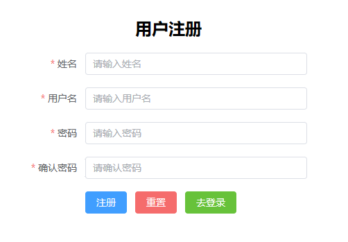

> 权限控制功能


> 发布头条功能


> 修改头条功能

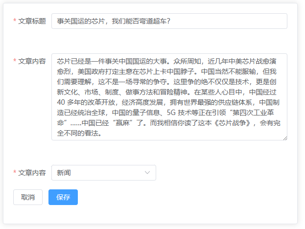

> 删除头条功能


# 二 前端项目环境搭建

+ 解压前端项目代码并存放到磁盘的合适位置


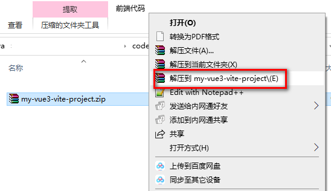

+ 使用vscode打开工程

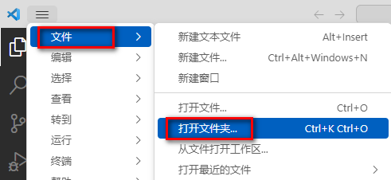


+ 进入项目后打开集成终端或者在src上右击选择在集成终端中打开


+ 通过 npm run dev启动前端项目


# 三 后端项目环境搭建

## 3.1  数据库准备

> `news_users` 用户表


> `news_type` 新闻类型表


> `news_headline` 新闻信息表


> 数据库创建SQL

+ 导入资料中的top_news.sql文件即可

## 3.2 MVC项目架构模式

>  MVC（Model View Controller）是软件工程中的一种**`软件架构模式`**，它把软件系统分为**`模型`**、**`视图`**和**`控制器`**三个基本部分。用一种业务逻辑、数据、界面显示分离的方法组织代码，将业务逻辑聚集到一个部件里面，在改进和个性化定制界面及用户交互的同时，不需要重新编写业务逻辑。

+ **M**：Model 模型层,具体功能如下
    1. 存放和数据库对象的实体类以及一些用于存储非数据库表完整相关的VO对象
    2. 存放一些对数据进行逻辑运算操作的的一些业务处理代码

+ **V**：View 视图层,具体功能如下
    1. 存放一些视图文件相关的代码 html css js等
    2. 在前后端分离的项目中,后端已经没有视图文件,该层次已经衍化成独立的前端项目

+ **C**：Controller 控制层,具体功能如下
    	1. 接收客户端请求,获得请求数据
      2. 将准备好的数据响应给客户端

> MVC模式下,项目中的常见包

+ M:
    1. 实体类包(pojo /entity /bean) 专门存放和数据库对应的实体类和一些VO对象
    2. 数据库访问包(dao/mapper)  专门存放对数据库不同表格CURD方法封装的一些类
    3. 服务包(service)                       专门存放对数据进行业务逻辑预算的一些类

+ C:
    1. 控制层包(controller)

+ V:
    1. web目录下的视图资源 html css js img 等
    2. 前端工程化后,在后端项目中已经不存在了

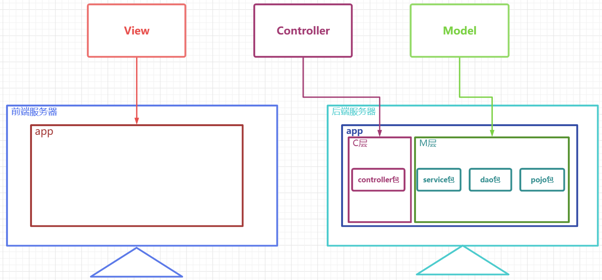

## 3.3 搭建项目

### 3.3.1 创建WEB项目


### 3.3.2 导入依赖

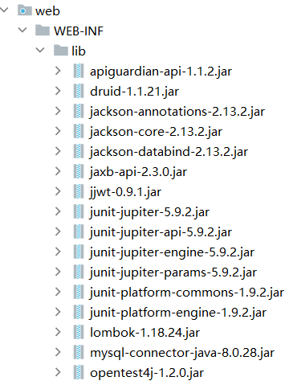

### 3.3.3 准备包结构

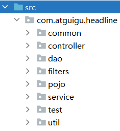

+ controller 控制层代码,主要由Servlet组成
+ service     服务层代码,主要用于处理业务逻辑
+ dao          数据访问层,主要用户定义对于各个表格的CURD的方法
+ pojo         实体类层,主要用于存放和数据库对应的实体类以及一些VO对象
+ util           工具类包,主要用存放一些工具类
+ common  公共包,主要用户存放一些其他公共代码
+ filters       过滤器包,专门用于存放一些过滤器
+ test          测试代码包,专门用于定义一些测试的功能代码,上线前应该删掉,后期用maven可以自动处理掉

## 3.5 准备工具类

### 3.5.1 异步响应规范格式类

+ Result类

```java
package com.atguigu.headline.common;

/**
 * 全局统一返回结果类
 *
 */
public class Result<T> {
    // 返回码
    private Integer code;
    // 返回消息
    private String message;
    // 返回数据
    private T data;
    public Result(){}
    // 返回数据
    protected static <T> Result<T> build(T data) {
        Result<T> result = new Result<T>();
        if (data != null)
            result.setData(data);
        return result;
    }
    public static <T> Result<T> build(T body, Integer code, String message) {
        Result<T> result = build(body);
        result.setCode(code);
        result.setMessage(message);
        return result;
    }
    public static <T> Result<T> build(T body, ResultCodeEnum resultCodeEnum) {
        Result<T> result = build(body);
        result.setCode(resultCodeEnum.getCode());
        result.setMessage(resultCodeEnum.getMessage());
        return result;
    }
    /**
     * 操作成功
     * @param data  baseCategory1List
     * @param <T>
     * @return
     */
    public static<T> Result<T> ok(T data){
        Result<T> result = build(data);
        return build(data, ResultCodeEnum.SUCCESS);
    }
    public Result<T> message(String msg){
        this.setMessage(msg);
        return this;
    }
    public Result<T> code(Integer code){
        this.setCode(code);
        return this;
    }
    public Integer getCode() {
        return code;
    }
    public void setCode(Integer code) {
        this.code = code;
    }
    public String getMessage() {
        return message;
    }
    public void setMessage(String message) {
        this.message = message;
    }
    public T getData() {
        return data;
    }
    public void setData(T data) {
        this.data = data;
    }
}
```

+ ResultCodeEnum 枚举类

``` java
package com.atguigu.headline.common;
/**
 * 统一返回结果状态信息类
 *
 */
public enum ResultCodeEnum {

    SUCCESS(200,"success"),
    USERNAME_ERROR(501,"usernameError"),
    PASSWORD_ERROR(503,"passwordError"),
    NOTLOGIN(504,"notLogin"),
    USERNAME_USED(505,"userNameUsed")
    ;

    private Integer code;
    private String message;
    private ResultCodeEnum(Integer code, String message) {
        this.code = code;
        this.message = message;
    }
    public Integer getCode() {
        return code;
    }
    public String getMessage() {
        return message;
    }
}

```


### 3.5.2 MD5加密工具类


``` java
package com.atguigu.headline.util;

import java.security.MessageDigest;
import java.security.NoSuchAlgorithmException;

public final class MD5Util {
    public static String encrypt(String strSrc) {
        try {
            char hexChars[] = { '0', '1', '2', '3', '4', '5', '6', '7', '8',
                    '9', 'a', 'b', 'c', 'd', 'e', 'f' };
            byte[] bytes = strSrc.getBytes();
            MessageDigest md = MessageDigest.getInstance("MD5");
            md.update(bytes);
            bytes = md.digest();
            int j = bytes.length;
            char[] chars = new char[j * 2];
            int k = 0;
            for (int i = 0; i < bytes.length; i++) {
                byte b = bytes[i];
                chars[k++] = hexChars[b >>> 4 & 0xf];
                chars[k++] = hexChars[b & 0xf];
            }
            return new String(chars);
        } catch (NoSuchAlgorithmException e) {
            e.printStackTrace();
            throw new RuntimeException("MD5加密出错！！+" + e);
        }
    }
}

```

### 3.5.3 JDBCUtil连接池工具类


``` java
package com.atguigu.headline.util;

import com.alibaba.druid.pool.DruidDataSourceFactory;

import javax.sql.DataSource;
import java.io.IOException;
import java.io.InputStream;
import java.sql.Connection;
import java.sql.SQLException;
import java.util.Properties;

public class JDBCUtil {
    private static ThreadLocal<Connection> threadLocal =new ThreadLocal<>();

    private static DataSource dataSource;
    // 初始化连接池
    static{
        // 可以帮助我们读取.properties配置文件
        Properties properties =new Properties();
        InputStream resourceAsStream = JDBCUtil.class.getClassLoader().getResourceAsStream("jdbc.properties");
        try {
            properties.load(resourceAsStream);
        } catch (IOException e) {
            throw new RuntimeException(e);
        }

        try {
            dataSource = DruidDataSourceFactory.createDataSource(properties);
        } catch (Exception e) {
            throw new RuntimeException(e);
        }


    }
    /*1 向外提供连接池的方法*/
    public static DataSource getDataSource(){
        return dataSource;
    }

    /*2 向外提供连接的方法*/
    public static Connection getConnection(){
        Connection connection = threadLocal.get();
        if (null == connection) {
            try {
                connection = dataSource.getConnection();
            } catch (SQLException e) {
                throw new RuntimeException(e);
            }
            threadLocal.set(connection);
        }

        return connection;
    }


    /*定义一个归还连接的方法 (解除和ThreadLocal之间的关联关系) */
    public static void releaseConnection(){
        Connection connection = threadLocal.get();
        if (null != connection) {
            threadLocal.remove();
            // 把连接设置回自动提交的连接
            try {
                connection.setAutoCommit(true);
                // 自动归还到连接池
                connection.close();
            } catch (SQLException e) {
                throw new RuntimeException(e);
            }
        }
    }
}

```

+ 添加jdbc.properties配置文件

``` properties
driverClassName=com.mysql.cj.jdbc.Driver
url=jdbc:mysql://localhost:3306/top_news
username=root
password=root
initialSize=5
maxActive=10
maxWait=1000
```

###  3.5.4  JwtHelper工具类

``` java
package com.atguigu.headline.util;

import com.alibaba.druid.util.StringUtils;
import io.jsonwebtoken.*;

import java.util.Date;

public class JwtHelper {
    private static long tokenExpiration = 24*60*60*1000;
    private static String tokenSignKey = "123456";

    //生成token字符串
    public static String createToken(Long userId) {
        String token = Jwts.builder()

                .setSubject("YYGH-USER")
                .setExpiration(new Date(System.currentTimeMillis() + tokenExpiration))
                .claim("userId", userId)
                .signWith(SignatureAlgorithm.HS512, tokenSignKey)
                .compressWith(CompressionCodecs.GZIP)
                .compact();
        return token;
    }

    //从token字符串获取userid
    public static Long getUserId(String token) {
        if(StringUtils.isEmpty(token)) return null;
        Jws<Claims> claimsJws = Jwts.parser().setSigningKey(tokenSignKey).parseClaimsJws(token);
        Claims claims = claimsJws.getBody();
        Integer userId = (Integer)claims.get("userId");
        return userId.longValue();
    }


    //判断token是否有效
    public static boolean isExpiration(String token){
        try {
            boolean isExpire = Jwts.parser()
                    .setSigningKey(tokenSignKey)
                    .parseClaimsJws(token)
                    .getBody()
                    .getExpiration().before(new Date());
            //没有过期，有效，返回false
            return isExpire;
        }catch(Exception e) {
            //过期出现异常，返回true
            return true;
        }
    }
}

```

### 3.5.5 JSON转换的WEBUtil工具类

``` java
package com.atguigu.headline.util;

import com.atguigu.headline.common.Result;
import com.fasterxml.jackson.databind.ObjectMapper;
import jakarta.servlet.http.HttpServletRequest;
import jakarta.servlet.http.HttpServletResponse;

import java.io.BufferedReader;
import java.io.IOException;
import java.text.SimpleDateFormat;

public class WebUtil {
    private static ObjectMapper objectMapper;
    // 初始化objectMapper
    static{
        objectMapper=new ObjectMapper();
        // 设置JSON和Object转换时的时间日期格式
        objectMapper.setDateFormat(new SimpleDateFormat("yyyy-MM-dd HH:mm:ss"));
    }
	// 从请求中获取JSON串并转换为Object
    public static <T> T readJson(HttpServletRequest request,Class<T> clazz){
        T t =null;
        BufferedReader reader = null;
        try {
            reader = request.getReader();
            StringBuffer buffer =new StringBuffer();
            String line =null;
            while((line = reader.readLine())!= null){
                buffer.append(line);
            }

            t= objectMapper.readValue(buffer.toString(),clazz);
        } catch (IOException e) {
            throw new RuntimeException(e);
        }
        return t;
    }
	// 将Result对象转换成JSON串并放入响应对象
    public static void writeJson(HttpServletResponse response, Result result){
        response.setContentType("application/json;charset=UTF-8");
        try {
            String json = objectMapper.writeValueAsString(result);
            response.getWriter().write(json);
        } catch (IOException e) {
            throw new RuntimeException(e);
        }
    }
}
```

## 3.6 准备各层的接口和实现类

### 3.6.1 准备实体类和VO对象

> NewsUser

``` java
package com.atguigu.headline.pojo;

import lombok.AllArgsConstructor;
import lombok.Data;
import lombok.NoArgsConstructor;
import java.io.Serializable;

@AllArgsConstructor
@NoArgsConstructor
@Data
public class NewsUser implements Serializable {
    private Integer uid;
    private String username;
    private String userPwd;
    private String nickName;
}
```

> NewsType

``` java
package com.atguigu.headline.pojo;

import lombok.AllArgsConstructor;
import lombok.Data;
import lombok.NoArgsConstructor;
import java.io.Serializable;

@AllArgsConstructor
@NoArgsConstructor
@Data
public class NewsType implements Serializable {
    private Integer tid;
    private String tname;
}
```

> NewsHeadline

``` java
package com.atguigu.headline.pojo;

import lombok.AllArgsConstructor;
import lombok.Data;
import lombok.NoArgsConstructor;
import java.io.Serializable;
import java.util.Date;

@AllArgsConstructor
@NoArgsConstructor
@Data
public class NewsHeadline implements Serializable {
    private Integer hid;
    private String title;
    private String article;
    private Integer type;
    private Integer publisher;
    private Integer pageViews;
    private Date createTime;
    private Date updateTime;
    private Integer isDeleted;

}
```

> HeadlineQueryVo

``` java
package com.atguigu.headline.pojo.vo;

import lombok.AllArgsConstructor;
import lombok.Data;
import lombok.NoArgsConstructor;
import java.io.Serializable;

@AllArgsConstructor
@NoArgsConstructor
@Data
public class HeadlineQueryVo implements Serializable {
    private String keyWords;
    private Integer type ;
    private Integer pageNum;
    private Integer pageSize;
}

```

> HeadlinePageVo

``` java
package com.atguigu.headline.pojo.vo;

import lombok.AllArgsConstructor;
import lombok.Data;
import lombok.NoArgsConstructor;
import java.io.Serializable;

@AllArgsConstructor
@NoArgsConstructor
@Data
public class HeadlinePageVo implements Serializable {
    private Integer hid;
    private String title;
    private Integer type;
    private Integer pageViews;
    private Long pastHours;
    private Integer publisher;
}
```

> HeadlineDetailVo

``` java
package com.atguigu.headline.pojo.vo;


import lombok.AllArgsConstructor;
import lombok.Data;
import lombok.NoArgsConstructor;
import java.io.Serializable;

@AllArgsConstructor
@NoArgsConstructor
@Data
public class HeadlineDetailVo implements Serializable {
    private Integer hid;
    private String title;
    private String article;
    private Integer type;
    private String typeName;
    private Integer pageViews;
    private Long pastHours;
    private Integer publisher;
    private String author;
}

```

### 3.6.2 DAO层接口和实现类


> BaseDao基础类,封装了公共的查询方法和公共的增删改方法

+ `注意,所有的Dao接口的实现类都要继承BaseDao`

``` java
package com.atguigu.headline.dao;


import com.atguigu.headline.util.JDBCUtil;
import java.lang.reflect.Field;
import java.sql.*;
import java.time.LocalDateTime;
import java.util.ArrayList;
import java.util.List;

public class BaseDao {
    // 公共的查询方法  返回的是单个对象
    public <T> T baseQueryObject(Class<T> clazz, String sql, Object ... args) {
        T t = null;
        Connection connection = JDBCUtil.getConnection();
        PreparedStatement preparedStatement = null;
        ResultSet resultSet = null;
        int rows = 0;
        try {
            // 准备语句对象
            preparedStatement = connection.prepareStatement(sql);
            // 设置语句上的参数
            for (int i = 0; i < args.length; i++) {
                preparedStatement.setObject(i + 1, args[i]);
            }

            // 执行 查询
            resultSet = preparedStatement.executeQuery();
            if (resultSet.next()) {
                t = (T) resultSet.getObject(1);
            }
        } catch (Exception e) {
            throw new RuntimeException(e);
        } finally {
            if (null != resultSet) {
                try {
                    resultSet.close();
                } catch (SQLException e) {
                    throw new RuntimeException(e);
                }
            }
            if (null != preparedStatement) {
                try {
                    preparedStatement.close();
                } catch (SQLException e) {
                    throw new RuntimeException(e);
                }

            }
            JDBCUtil.releaseConnection();
        }
        return t;
    }
    // 公共的查询方法  返回的是对象的集合

    public <T> List<T> baseQuery(Class clazz, String sql, Object ... args){
        List<T> list =new ArrayList<>();
        Connection connection = JDBCUtil.getConnection();
        PreparedStatement preparedStatement=null;
        ResultSet resultSet =null;
        int rows = 0;
        try {
            // 准备语句对象
            preparedStatement = connection.prepareStatement(sql);
            // 设置语句上的参数
            for (int i = 0; i < args.length; i++) {
                preparedStatement.setObject(i+1,args[i]);
            }

            // 执行 查询
            resultSet = preparedStatement.executeQuery();

            ResultSetMetaData metaData = resultSet.getMetaData();
            int columnCount = metaData.getColumnCount();

            // 将结果集通过反射封装成实体类对象
            while (resultSet.next()) {
                // 使用反射实例化对象
                Object obj =clazz.getDeclaredConstructor().newInstance();

                for (int i = 1; i <= columnCount; i++) {
                    String columnName = metaData.getColumnLabel(i);
                    Object value = resultSet.getObject(columnName);
                    // 处理datetime类型字段和java.util.Data转换问题
                    if(value.getClass().equals(LocalDateTime.class)){
                        value= Timestamp.valueOf((LocalDateTime) value);
                    }
                    Field field = clazz.getDeclaredField(columnName);
                    field.setAccessible(true);
                    field.set(obj,value);
                }

                list.add((T)obj);
            }

        } catch (Exception e) {
            throw new RuntimeException(e);
        } finally {
            if (null !=resultSet) {
                try {
                    resultSet.close();
                } catch (SQLException e) {
                    throw new RuntimeException(e);
                }
            }
            if (null != preparedStatement) {
                try {
                    preparedStatement.close();
                } catch (SQLException e) {
                    throw new RuntimeException(e);
                }
            }
            JDBCUtil.releaseConnection();
        }
        return list;
    }
    
    // 通用的增删改方法
    public int baseUpdate(String sql,Object ... args) {
        // 获取连接
        Connection connection = JDBCUtil.getConnection();
        PreparedStatement preparedStatement=null;
        int rows = 0;
        try {
            // 准备语句对象
            preparedStatement = connection.prepareStatement(sql);
            // 设置语句上的参数
            for (int i = 0; i < args.length; i++) {
                preparedStatement.setObject(i+1,args[i]);
            }

            // 执行 增删改 executeUpdate
            rows = preparedStatement.executeUpdate();
            // 释放资源(可选)


        } catch (SQLException e) {
            throw new RuntimeException(e);
        } finally {
            if (null != preparedStatement) {
                try {
                    preparedStatement.close();
                } catch (SQLException e) {
                    throw new RuntimeException(e);
                }

            }
            JDBCUtil.releaseConnection();
        }
        // 返回的是影响数据库记录数
        return rows;
    }
}

```

> dao层的所有接口

``` java
package com.atguigu.headline.dao;
public interface NewsHeadLineDao {
    
}

package com.atguigu.headline.dao;
public interface NewsTypeDao {
    
}


package com.atguigu.headline.dao;
public interface NewsUserDao {

}

```

> dao层所有实现类

``` java
package com.atguigu.headline.dao.impl;
import com.atguigu.headline.dao.BaseDao;
import com.atguigu.headline.dao.NewsHeadLineDao;
public class NewsHeadlineDaoImpl extends BaseDao implements NewsHeadLineDao{
    
}

package com.atguigu.headline.dao.impl;
import com.atguigu.headline.dao.BaseDao;
import com.atguigu.headline.dao.NewsTypeDao;
public class NewsTypeDaoImpl extends BaseDao implements NewsTypeDao{
    
}

package com.atguigu.headline.dao.impl;
import com.atguigu.headline.dao.BaseDao;
import com.atguigu.headline.dao.NewsUserDao;
public class NewsUserDaoImpl extends BaseDao implements NewsUserDao{
    
}
```

### 3.6.3 Service层接口和实现类


> service层所有接口

``` java
package com.atguigu.headline.service;
public interface NewsHeadlineService {
    
}

package com.atguigu.headline.service;
public interface NewsTypeService {
    List<NewsType> findAll();
}

package com.atguigu.headline.service;
public interface NewsUserService {
    
}
```

> service层所有实现类

``` java
package com.atguigu.headline.service.impl;
import com.atguigu.headline.service.NewsHeadlineService;
public class NewsHeadlineServiceImpl  implements NewsHeadlineService {
}


package com.atguigu.headline.service.impl;
import com.atguigu.headline.service.NewsTypeService;
public class NewsTypeServiceImpl implements NewsTypeService {
  
}

package com.atguigu.headline.service.impl;
import com.atguigu.headline.service.NewsUserService;
public class NewsUserServiceImpl implements NewsUserService {
   
}

```

### 3.6.4 Controller层接口和实现类

> BaseController 用于将路径关联到处理方法的基础控制器

+ `所有的Controller都要继承该类`

``` java
package com.atguigu.headline.controller;

import jakarta.servlet.ServletException;
import jakarta.servlet.http.HttpServlet;
import jakarta.servlet.http.HttpServletRequest;
import jakarta.servlet.http.HttpServletResponse;

import java.io.IOException;
import java.lang.reflect.Method;

public class BaseController extends HttpServlet {
    @Override
    protected void service(HttpServletRequest req, HttpServletResponse resp) throws ServletException, IOException {
        // 响应的MIME类型和乱码问题
        resp.setContentType("application/json;charset=UTF-8");

        String requestURI = req.getRequestURI();
        String[] split = requestURI.split("/");
        String methodName =split[split.length-1];
        // 通过反射获取要执行的方法
        Class clazz = this.getClass();
        try {
            Method method=clazz.getDeclaredMethod(methodName,HttpServletRequest.class,HttpServletResponse.class);
            // 设置方法可以访问
            method.setAccessible(true);
            // 通过反射执行代码
            method.invoke(this,req,resp);
        } catch (Exception e) {
            e.printStackTrace();
            throw new RuntimeException(e.getMessage());
        }
    }
}

```

> 所有的Controller类

``` java
package com.atguigu.headline.controller;
import jakarta.servlet.annotation.WebServlet;
@WebServlet("/headline/*")
public class NewsHeadlineController extends BaseController {
    
}

package com.atguigu.headline.controller;
import jakarta.servlet.annotation.WebServlet;
@WebServlet("/type/*")
public class NewsTypeController {
    
}

package com.atguigu.headline.controller;
import jakarta.servlet.annotation.WebServlet;
@WebServlet("/user/*")
public class NewsUserController extends BaseController{
    
}

package com.atguigu.headline.controller;
import jakarta.servlet.annotation.WebServlet;
@WebServlet("/portal/*")
public class PortalController extends BaseController{
    
}

```

## 3.7 开发跨域CORS过滤器

### 3.7.1 什么是跨域

> 同源策略（Sameoriginpolicy）是浏览器最核心也最基本的安全功能，如果缺少了同源策略，则浏览器的正常功能可能都会受到影响。可以说Web是构建在同源策略基础之上的，浏览器只是针对同源策略的一种实现。**`同源策略会阻止一个域的javascript脚本和另外一个域的内容进行交互。所谓同源（即指在同一个域）就是两个页面具有相同的协议（protocol），主机（host）和端口号`**

### 3.7.2 为什么会产生跨域

> 前后端分离模式下,客户端请求前端服务器获取视图资源,然后客户端自行向后端服务器获取数据资源,前端服务器的 协议,IP和端口和后端服务器很可能是不一样的,这样就产生了跨域


### 3.7.3 如何解决跨域

> 前端项目代理模式处理


> 后端跨域过滤器方式处理


+ CrosFilter过滤器

``` java
package com.atguigu.headline.filters;

import jakarta.servlet.*;
import jakarta.servlet.annotation.WebFilter;
import jakarta.servlet.http.HttpServletRequest;
import jakarta.servlet.http.HttpServletResponse;

import java.io.IOException;

@WebFilter("/*")
public class CrosFilter implements Filter {
    @Override
    public void doFilter(ServletRequest servletRequest, ServletResponse servletResponse, FilterChain filterChain) throws IOException, ServletException {
        HttpServletResponse response = (HttpServletResponse) servletResponse;
        HttpServletRequest request =(HttpServletRequest) servletRequest;
        response.setHeader("Access-Control-Allow-Origin", "*");
        response.setHeader("Access-Control-Allow-Methods", "POST, GET, OPTIONS, DELETE, HEAD");
        response.setHeader("Access-Control-Max-Age", "3600");
        response.setHeader("Access-Control-Allow-Headers", "access-control-allow-origin, authority, content-type, version-info, X-Requested-With");
        // 非预检请求,放行即可,预检请求,则到此结束,不需要放行
        if(!request.getMethod().equalsIgnoreCase("OPTIONS")){
            filterChain.doFilter(servletRequest, servletResponse);
        }
    }
}
```


+ 未来我们使用框架,直接用一个@CrossOrigin 就可以解决跨域问题了

# 四 PostMan测试工具

## 4.1 什么是PostMan

+  Postman是一个**`接口测试工具`**,在做接口测试的时候,Postman相当于一个客户端,它可以模拟用户发起的各类HTTP请求,将请求数据发送至服务端,获取对应的响应结果, 从而验证响应中的结果数据是否和预期值相匹配;并确保开发人员能够及时处理接口中的bug,进而保证产品上线之后的稳定性和安全性。 它主要是用来模拟各种HTTP请求的(如:get/post/delete/put..等等),Postman与浏览器的区别在于有的浏览器不能输出Json格式,而Postman更直观接口返回的结果。 

## 4.2 怎么安装PostMan

+ 官网下载地址: https://www.getpostman.com ,或者使用资料中提供的安装包
+ 安装过程简单,一路next即可
+  第一次启动postman 会要求输入用户名和密码，如果没有的话，关闭，再次启动就可以直接进入了 

## 4.3 怎么使用PostMan

> 启动PostMan后,创建一个collection,在该collection下专门存放和微头条项目相关的测试


> 创建完毕后,增加新的接口测试


> 填写要测试的接口相关的路径,参数,请求体内容等信息


> 测试完毕后,可以选择将该接口的测试进行保存,方便后续随时再次测试

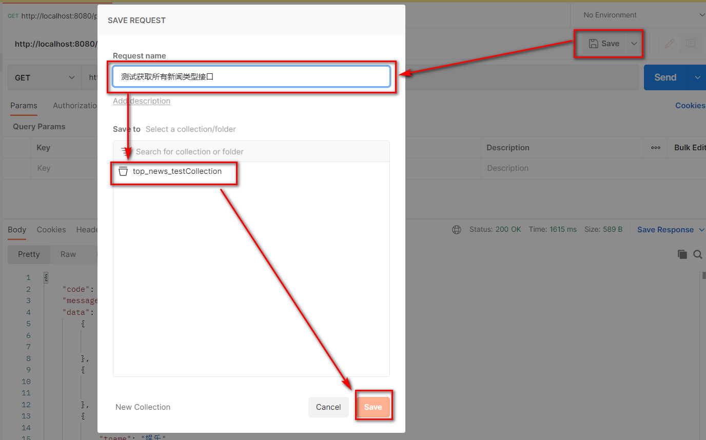


# 五 登录注册功能

## 5.1 登录表单提交

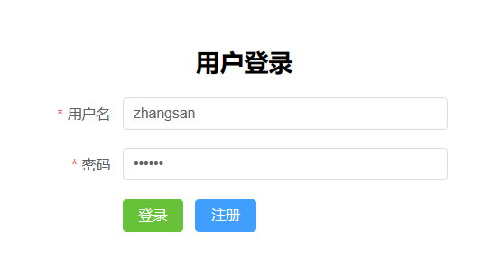

> 需求描述

+ 用户在客户端输入用户名密码并向后端提交,后端根据用户名和密码判断登录是否成功,用户有误或者密码有误响应不同的提示信息

> uri: 

``` http
user/login
```

> 请求方式:

``` http
POST
```

> 请求参数

``` json
{
    "username":"zhangsan", //用户名
    "userPwd":"123456"     //明文密码
}
```

> 响应示例

+ 登录成功

``` json
{
    "code":"200",         // 成功状态码 
 	"message":"success"   // 成功状态描述
 	"data":{
		"token":"... ..." // 用户id的token
	}
}
```

+ 用户名有误

``` json
{
    "code":"501",
 	"message":"用户名有误"
 	"data":{}
}
```

+ 密码有误

``` json
{
    "code":"503",
 	"message":"密码有误"
 	"data":{}
}
```

> 后端代码

+ NewsUserController

``` java
package com.atguigu.headline.controller;

import com.atguigu.headline.common.Result;
import com.atguigu.headline.common.ResultCodeEnum;
import com.atguigu.headline.pojo.NewsHeadline;
import com.atguigu.headline.pojo.NewsUser;
import com.atguigu.headline.service.NewsUserService;
import com.atguigu.headline.service.impl.NewsUserServiceImpl;
import com.atguigu.headline.util.JwtHelper;
import com.atguigu.headline.util.MD5Util;
import com.atguigu.headline.util.WebUtil;
import jakarta.servlet.ServletException;
import jakarta.servlet.annotation.WebServlet;
import jakarta.servlet.http.HttpServletRequest;
import jakarta.servlet.http.HttpServletResponse;

import java.io.IOException;
import java.util.HashMap;
import java.util.Map;


@WebServlet("/user/*")
public class NewsUserController extends BaseController{

    private NewsUserService newsUserService =new NewsUserServiceImpl();
     /**
     * 登录验证
     * @param req
     * @param resp
     * @throws ServletException
     * @throws IOException
     */
    protected void login(HttpServletRequest req, HttpServletResponse resp) throws ServletException, IOException {
        NewsUser newsUser = WebUtil.readJson(req, NewsUser.class);

        Result result =null;
        NewsUser loginNewsUser =newsUserService.findByUserName(newsUser.getUsername());
        // 判断用户名
        if (null != loginNewsUser) {
            // 判断密码
            if(loginNewsUser.getUserPwd().equals(MD5Util.encrypt(newsUser.getUserPwd()))){
                // 密码正确
                Map<String,Object> data =new HashMap<>();
                // 生成token口令
                String token = JwtHelper.createToken(loginNewsUser.getUid().longValue());
                // 封装数据map
                data.put("token",token);
                // 封装结果
                result=Result.ok(data);
            }else{
                // 封装密码错误结果
                result=Result.build(null, ResultCodeEnum.PASSWORD_ERROR);
            }
        }else{
            // 封装用户名错误结果
            result=Result.build(null, ResultCodeEnum.USERNAME_ERROR);
        }
        // 响应结果
        WebUtil.writeJson(resp,result);
    }
}
```

+ NewsUserService

``` java
package com.atguigu.headline.service;

import com.atguigu.headline.pojo.NewsUser;

public interface NewsUserService {
    /**
     * 根据用户名,获得查询用户的方法
     * @param username 要查询的用户名
     * @return 如果找到返回NewsUser对象,找不到返回null
     */
    NewsUser findByUserName(String username);
}
```

+ NewsUserServiceImpl

``` java 
package com.atguigu.headline.service.impl;

import com.atguigu.headline.dao.NewsUserDao;
import com.atguigu.headline.dao.impl.NewsUserDaoImpl;
import com.atguigu.headline.pojo.NewsUser;
import com.atguigu.headline.service.NewsTypeService;
import com.atguigu.headline.service.NewsUserService;
import com.atguigu.headline.util.MD5Util;

public class NewsUserServiceImpl implements NewsUserService {
    private NewsUserDao newsUserDao =new NewsUserDaoImpl();
    @Override
    public NewsUser findByUserName(String username) {
        return newsUserDao.findByUserName(username);
    }
}
```

+ NewUserDao

``` java
package com.atguigu.headline.dao;
import com.atguigu.headline.pojo.NewsUser;

public interface NewsUserDao {
    /**
     * 根据用户名查询用户信息
     * @param username 要查询的用户名
     * @return 找到返回NewsUser对象,找不到返回null
     */
    NewsUser findByUserName(String username);
}
```

+ NewsUserDaoImpl

``` java
package com.atguigu.headline.dao.impl;

import com.atguigu.headline.dao.BaseDao;
import com.atguigu.headline.dao.NewsUserDao;
import com.atguigu.headline.pojo.NewsUser;
import java.util.List;

public class NewsUserDaoImpl extends BaseDao implements NewsUserDao {

    @Override
    public NewsUser findByUserName(String username) {
        // 准备SQL
        String sql ="select uid,username,user_pwd userPwd ,nick_name nickName from news_user where username = ?";
        // 调用BaseDao公共查询方法
        List<NewsUser> newsUserList = baseQuery(NewsUser.class, sql, username);
        // 如果找到,返回集合中的第一个数据(其实就一个)
        if (null != newsUserList && newsUserList.size()>0){
            return  newsUserList.get(0);
        }
        return null;
    }
}
```

## 5.2 根据token获取完整用户信息

> 需求描述

+ 客户端发送请求,提交token请求头,后端根据token请求头获取登录用户的详细信息并响应给客户端进行存储

> uri

``` http
user/getUserInfo
```

> 请求方式

``` http
GET
```

> 请求头

``` json
token: ... ...
```

> 响应示例

+ 成功获取

``` JSON
{
    "code": 200,
    "message": "success",
    "data": {
        "loginUser": {
            "uid": 1,
            "username": "zhangsan",
            "userPwd": "",
            "nickName": "张三"
        }
    }
}
```

+ 获取失败

``` json
{
    "code": 504,
    "message": "notLogin",
    "data": null
}
```

> 后端代码

+ NewsUserController

``` java 
package com.atguigu.headline.controller;

import com.atguigu.headline.common.Result;
import com.atguigu.headline.common.ResultCodeEnum;
import com.atguigu.headline.pojo.NewsHeadline;
import com.atguigu.headline.pojo.NewsUser;
import com.atguigu.headline.service.NewsUserService;
import com.atguigu.headline.service.impl.NewsUserServiceImpl;
import com.atguigu.headline.util.JwtHelper;
import com.atguigu.headline.util.MD5Util;
import com.atguigu.headline.util.WebUtil;
import jakarta.servlet.ServletException;
import jakarta.servlet.annotation.WebServlet;
import jakarta.servlet.http.HttpServletRequest;
import jakarta.servlet.http.HttpServletResponse;

import java.io.IOException;
import java.util.HashMap;
import java.util.Map;


@WebServlet("/user/*")
public class NewsUserController extends BaseController{

    private NewsUserService newsUserService =new NewsUserServiceImpl();

    /**
     * 接收token,根据token查询完整用户信息
     * @param req
     * @param resp
     * @throws ServletException
     * @throws IOException
     */
    protected void getUserInfo(HttpServletRequest req, HttpServletResponse resp) throws ServletException, IOException {
        String token = req.getHeader("token");
        Result  result =Result.build(null,ResultCodeEnum.NOTLOGIN);
        if(null!= token){
            if (!JwtHelper.isExpiration(token)) {
                Integer uid = JwtHelper.getUserId(token).intValue();
                NewsUser newsUser =newsUserService.findByUid(uid);
                newsUser.setUserPwd("");
                Map<String,Object> data =new HashMap<>();
                data.put("loginUser",newsUser);
                result=Result.ok(data);

            }
        }
        WebUtil.writeJson(resp,result);
    }
}
```

+ NewsUserService

``` java 
package com.atguigu.headline.service;

import com.atguigu.headline.pojo.NewsUser;

public interface NewsUserService {
    /**
     * 根据用户id查询用户信息
     * @param uid 要查询的用户id
     * @return 找到返回NewsUser对象,找不到返回null
     */
    NewsUser findByUid(Integer uid);
}
```

+ NewsUserServiceImpl

``` java
package com.atguigu.headline.service.impl;

import com.atguigu.headline.dao.NewsUserDao;
import com.atguigu.headline.dao.impl.NewsUserDaoImpl;
import com.atguigu.headline.pojo.NewsUser;
import com.atguigu.headline.service.NewsTypeService;
import com.atguigu.headline.service.NewsUserService;
import com.atguigu.headline.util.MD5Util;

public class NewsUserServiceImpl implements NewsUserService {
    private NewsUserDao newsUserDao =new NewsUserDaoImpl();

    @Override
    public NewsUser findByUid(Integer uid) {
        return newsUserDao.findByUid(uid);
    }
}
```

+ NewUserDao

``` java
package com.atguigu.headline.dao;

import com.atguigu.headline.pojo.NewsUser;


public interface NewsUserDao {
    /**
     * 根据用户id连接数据库查询用户信息
     * @param uid  要查询的用户id
     * @return 找到返回NewsUser对象,找不到返回null
     */
    NewsUser findByUid(Integer uid);
}
```

+ NewUserDaoImpl

``` java
package com.atguigu.headline.dao.impl;

import com.atguigu.headline.dao.BaseDao;
import com.atguigu.headline.dao.NewsUserDao;
import com.atguigu.headline.pojo.NewsUser;
import java.util.List;

public class NewsUserDaoImpl extends BaseDao implements NewsUserDao {
    @Override
    public NewsUser findByUid(Integer uid) {
        String sql ="select uid,username,user_pwd userPwd ,nick_name nickName from news_user where uid = ?";
        List<NewsUser> newsUserList = baseQuery(NewsUser.class, sql, uid);
        if (null != newsUserList && newsUserList.size()>0){
            return  newsUserList.get(0);
        }
        return null;
    }
}
```

## 5.3 注册时用户名占用校验

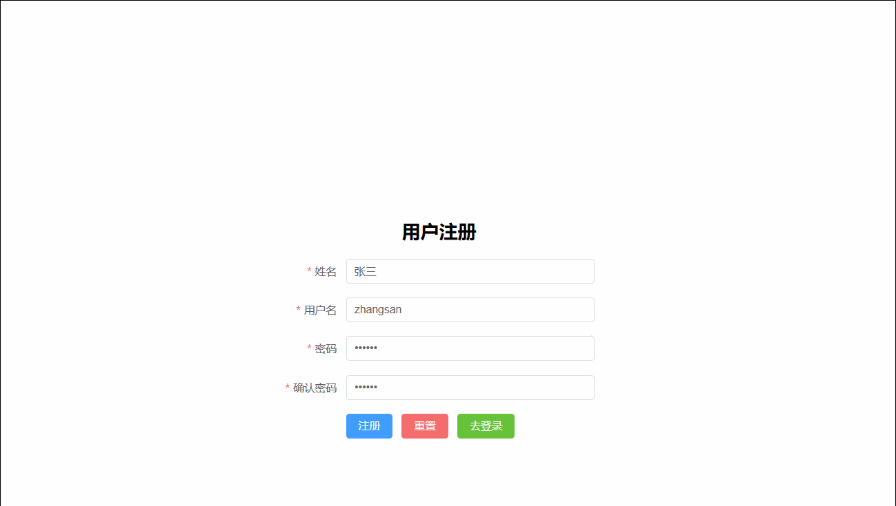

> 需求说明

+ 用户在注册时输入用户名时,立刻将用户名发送给后端,后端根据用户名查询用户名是否可用并做出响应

> uri:

``` http
user/checkUserName
```

> 请求方式:

``` http
POST
```

> 请求参数

``` json
username=zhangsan
```

> 响应示例

+ 用户名校验通过

``` json
{
    "code":"200",
 	"message":"success"
 	"data":{}
}
```

+ 用户名占用

``` json
{
    "code":"505",
 	"message":"用户名占用"
 	"data":{}
}
```

> 后端代码

+ NewsUserController

``` java 
package com.atguigu.headline.controller;

import com.atguigu.headline.common.Result;
import com.atguigu.headline.common.ResultCodeEnum;
import com.atguigu.headline.pojo.NewsHeadline;
import com.atguigu.headline.pojo.NewsUser;
import com.atguigu.headline.service.NewsUserService;
import com.atguigu.headline.service.impl.NewsUserServiceImpl;
import com.atguigu.headline.util.JwtHelper;
import com.atguigu.headline.util.MD5Util;
import com.atguigu.headline.util.WebUtil;
import jakarta.servlet.ServletException;
import jakarta.servlet.annotation.WebServlet;
import jakarta.servlet.http.HttpServletRequest;
import jakarta.servlet.http.HttpServletResponse;

import java.io.IOException;
import java.util.HashMap;
import java.util.Map;


@WebServlet("/user/*")
public class NewsUserController extends BaseController{

    private NewsUserService newsUserService =new NewsUserServiceImpl();
    /**
     * 注册时校验用户名是否被占用
     * @param req
     * @param resp
     * @throws ServletException
     * @throws IOException
     */
    protected void checkUserName(HttpServletRequest req, HttpServletResponse resp) throws ServletException, IOException {
        String username = req.getParameter("username");
        NewsUser newsUser = newsUserService.findByUserName(username);
        Result result=null;
        if (null == newsUser){
            result=Result.ok(null);
        }else{
            result=Result.build(null,ResultCodeEnum.USERNAME_USED);
        }
        WebUtil.writeJson(resp,result);
    }
}
```

## 5.4 注册表单提交


> 需求说明

+ 客户端将新用户信息发送给服务端,服务端将新用户存入数据库,存入之前做用户名是否被占用校验,校验通过响应成功提示,否则响应失败提示


> uri:

``` http
user/regist
```

> 请求方式:

``` http
POST
```

> 请求参数

``` json
{
    "username":"zhangsan",
    "userPwd":"123456",
    "nickName":"张三"
}
```

> 响应示例

+ 注册成功

``` json
{
    "code":"200",
 	"message":"success"
 	"data":{}
}
```

+ 用户名占用

``` json
{
    "code":"505",
 	"message":"用户名占用"
 	"data":{}
}
```

> 后端代码

+ NewsUserController

``` java 
package com.atguigu.headline.controller;

import com.atguigu.headline.common.Result;
import com.atguigu.headline.common.ResultCodeEnum;
import com.atguigu.headline.pojo.NewsHeadline;
import com.atguigu.headline.pojo.NewsUser;
import com.atguigu.headline.service.NewsUserService;
import com.atguigu.headline.service.impl.NewsUserServiceImpl;
import com.atguigu.headline.util.JwtHelper;
import com.atguigu.headline.util.MD5Util;
import com.atguigu.headline.util.WebUtil;
import jakarta.servlet.ServletException;
import jakarta.servlet.annotation.WebServlet;
import jakarta.servlet.http.HttpServletRequest;
import jakarta.servlet.http.HttpServletResponse;
import java.io.IOException;
import java.util.HashMap;
import java.util.Map;


@WebServlet("/user/*")
public class NewsUserController extends BaseController{

    private NewsUserService newsUserService =new NewsUserServiceImpl();

    /**
     * 注册功能接口
     * @param req
     * @param resp
     * @throws ServletException
     * @throws IOException
     */
    protected void regist(HttpServletRequest req, HttpServletResponse resp) throws ServletException, IOException {
        NewsUser newsUser = WebUtil.readJson(req, NewsUser.class);
        NewsUser usedUser = newsUserService.findByUserName(newsUser.getUsername());
        Result result=null;
        if (null == usedUser){
            newsUserService.registUser(newsUser);
            result=Result.ok(null);
        }else{
            result=Result.build(null,ResultCodeEnum.USERNAME_USED);
        }
        WebUtil.writeJson(resp,result);
    }
}
```

+ NewsUserService

``` java 
package com.atguigu.headline.service;

import com.atguigu.headline.pojo.NewsUser;

public interface NewsUserService {

    /**
     * 注册用户信息,注册成功返回大于0的整数,失败返回0
     * @param newsUser
     * @return
     */
    int registUser(NewsUser newsUser);
}
```

+ NewsUserServiceImpl

``` java
package com.atguigu.headline.service.impl;

import com.atguigu.headline.dao.NewsUserDao;
import com.atguigu.headline.dao.impl.NewsUserDaoImpl;
import com.atguigu.headline.pojo.NewsUser;
import com.atguigu.headline.service.NewsTypeService;
import com.atguigu.headline.service.NewsUserService;
import com.atguigu.headline.util.MD5Util;

public class NewsUserServiceImpl implements NewsUserService {
    @Override
    public int registUser(NewsUser newsUser) {
        // 密码明文转密文
        newsUser.setUserPwd(MD5Util.encrypt(newsUser.getUserPwd()));
        // 存入数据库
        return newsUserDao.insertNewsUser(newsUser);
    }
}
```

+ NewUserDao

``` java
package com.atguigu.headline.dao;

import com.atguigu.headline.pojo.NewsUser;


public interface NewsUserDao {
    /**
     * 将用户信息存入数据库
     * @param newsUser 
     * @return
     */
    int insertNewsUser(NewsUser newsUser);
}
```

+ NewUserDaoImpl

``` java
package com.atguigu.headline.dao.impl;

import com.atguigu.headline.dao.BaseDao;
import com.atguigu.headline.dao.NewsUserDao;
import com.atguigu.headline.pojo.NewsUser;
import java.util.List;

public class NewsUserDaoImpl extends BaseDao implements NewsUserDao {
    @Override
    public int insertNewsUser(NewsUser newsUser) {
        String sql ="insert into news_user values(DEFAULT,?,?,?)";
        return baseUpdate(sql,newsUser.getUsername(),newsUser.getUserPwd(),newsUser.getNickName());
    }
}
```

# 六 头条首页功能

## 6.1 查询所有头条分类


> 需求说明

+ 进入新闻首页,查询所有分类并动态展示新闻类别栏位

> uri:

``` http
portal/findAllTypes
```

> 请求方式

``` http
GET
```

> 请求参数

``` JSON
无
```

> 响应示例

``` JSON
{
    "code":"200",
 	"message":"OK"
 	"data":
            [
                {
                    "tid":"1",
                    "tname":"新闻"
                },
                {
                    "tid":"2",
                    "tname":"体育"
                },
                {
                    "tid":"3",
                    "tname":"娱乐"
                },
                {
                    "tid":"4",
                    "tname":"科技"
                },
                {
                    "tid":"5",
                    "tname":"其他"
                }
            ]
    
}

```

> 后端代码

+ PortalController

``` java 
package com.atguigu.headline.controller;

import com.atguigu.headline.common.Result;
import com.atguigu.headline.pojo.NewsType;
import com.atguigu.headline.pojo.vo.HeadlineDetailVo;
import com.atguigu.headline.pojo.vo.HeadlineQueryVo;
import com.atguigu.headline.service.NewsHeadlineService;
import com.atguigu.headline.service.NewsTypeService;
import com.atguigu.headline.service.impl.NewsHeadlineServiceImpl;
import com.atguigu.headline.service.impl.NewsTypeServiceImpl;
import com.atguigu.headline.util.WebUtil;
import jakarta.servlet.ServletException;
import jakarta.servlet.annotation.WebServlet;
import jakarta.servlet.http.HttpServletRequest;
import jakarta.servlet.http.HttpServletResponse;

import java.io.IOException;
import java.util.HashMap;
import java.util.List;
import java.util.Map;

@WebServlet("/portal/*")
public class PortalController extends BaseController{

    private NewsHeadlineService headlineService=new NewsHeadlineServiceImpl();
    private NewsTypeService newsTypeService=new NewsTypeServiceImpl();
    /**
     * 查询所有新闻类型
     * @param req
     * @param resp
     * @throws ServletException
     * @throws IOException
     */
    protected void findAllTypes(HttpServletRequest req, HttpServletResponse resp) throws ServletException, IOException {
        List<NewsType> newsTypeList =newsTypeService.findAll();
        WebUtil.writeJson(resp,Result.ok(newsTypeList));
    }
}
```

+ NewsTypeService

``` java 
package com.atguigu.headline.service;

import com.atguigu.headline.pojo.NewsType;

import java.util.List;

public interface NewsTypeService {
    /**
     * 查询全部新闻类型
     * @return
     */
    List<NewsType> findAll();
}

```

+ NewsTypeServiceImpl

``` java
package com.atguigu.headline.service.impl;

import com.atguigu.headline.dao.NewsTypeDao;
import com.atguigu.headline.dao.impl.NewsTypeDaoImpl;
import com.atguigu.headline.pojo.NewsType;
import com.atguigu.headline.service.NewsTypeService;

import java.util.List;

public class NewsTypeServiceImpl implements NewsTypeService {
    private NewsTypeDao  newsTypeDao =new NewsTypeDaoImpl();
    @Override
    public List<NewsType> findAll() {
        return newsTypeDao.findAll();
    }
}
```

+ NewUserDao

``` java
package com.atguigu.headline.dao;

import com.atguigu.headline.pojo.NewsType;

import java.util.List;

public interface NewsTypeDao {
    /**
     * 从数据库中查询全部新闻类型
     * @return
     */
    List<NewsType> findAll();
}

```

+ NewsTypeDaoImpl

``` java
package com.atguigu.headline.dao.impl;

import com.atguigu.headline.dao.BaseDao;
import com.atguigu.headline.dao.NewsTypeDao;
import com.atguigu.headline.pojo.NewsType;

import java.util.List;

public class NewsTypeDaoImpl extends BaseDao implements NewsTypeDao {
    @Override
    public List<NewsType> findAll() {
        String sql ="select tid,tname from news_type";
        return  baseQuery(NewsType.class, sql);
    }
}
```

## 6.2 分页带条件查询所有头条

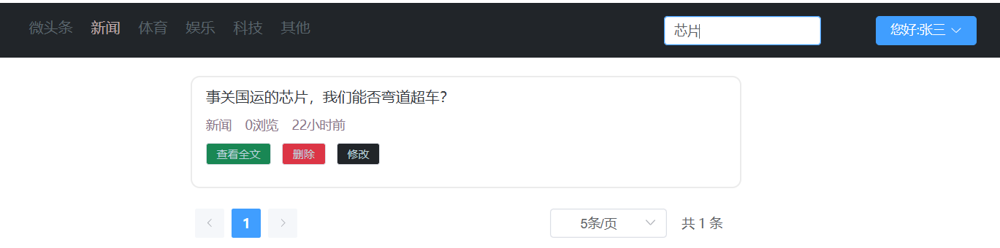

> 需求说明

+ 客户端向服务端发送查询关键字,新闻类别,页码数,页大小
+ 服务端根据条件搜索分页信息,返回含页码数,页大小,总页数,总记录数,当前页数据等信息,并根据时间降序,浏览量降序排序

> uri:

``` http
portal/findNewsPage
```

> 请求方式:

``` http
POST
```

> 请求参数:

``` json
{
    "keyWords":"马斯克", // 搜索标题关键字
    "type":0,           // 新闻类型
    "pageNum":1,        // 页码数
    "pageSize":"10"     // 页大小
}
```

> 响应示例:

``` json
{
    "code":"200",
 	"message":"success"
 	"data":{
    	"pageInfo":{
    		"pageData":[                           // 本页的数据
    			{
    				"hid":"1",                     // 新闻id 
    				"title":"尚硅谷宣布 ... ...",   // 新闻标题
    				"type":"1",                    // 新闻所属类别编号
    				"pageViews":"40",              // 新闻浏览量
    				"pastHours":"3" ,              // 发布时间已过小时数
    				"publisher":"1"                // 发布用户ID
				},
				{
    				"hid":"1",                     // 新闻id 
    				"title":"尚硅谷宣布 ... ...",   // 新闻标题
    				"type":"1",                    // 新闻所属类别编号
    				"pageViews":"40",              // 新闻浏览量
    				"pastHours":"3",              // 发布时间已过小时数
    				"publisher":"1"                // 发布用户ID
				},
				{
    				"hid":"1",                     // 新闻id 
    				"title":"尚硅谷宣布 ... ...",   // 新闻标题
    				"type":"1",                    // 新闻所属类别编号
    				"pageViews":"40",              // 新闻浏览量
    				"pastHours":"3",               // 发布时间已过小时数
    				"publisher":"1"                // 发布用户ID
				}
    		],
			"pageNum":1,    //页码数
			"pageSize":10,  // 页大小
			"totalPage":20, // 总页数
			"totalSize":200 // 总记录数
		}
	}
}
```

>  后端代码

+ PortalController

``` java 
package com.atguigu.headline.controller;

import com.atguigu.headline.common.Result;
import com.atguigu.headline.pojo.NewsType;
import com.atguigu.headline.pojo.vo.HeadlineDetailVo;
import com.atguigu.headline.pojo.vo.HeadlineQueryVo;
import com.atguigu.headline.service.NewsHeadlineService;
import com.atguigu.headline.service.NewsTypeService;
import com.atguigu.headline.service.impl.NewsHeadlineServiceImpl;
import com.atguigu.headline.service.impl.NewsTypeServiceImpl;
import com.atguigu.headline.util.WebUtil;
import jakarta.servlet.ServletException;
import jakarta.servlet.annotation.WebServlet;
import jakarta.servlet.http.HttpServletRequest;
import jakarta.servlet.http.HttpServletResponse;

import java.io.IOException;
import java.util.HashMap;
import java.util.List;
import java.util.Map;

@WebServlet("/portal/*")
public class PortalController extends BaseController{

    private NewsHeadlineService headlineService=new NewsHeadlineServiceImpl();
    private NewsTypeService newsTypeService=new NewsTypeServiceImpl();
    /**
     * 分页带条件查询新闻
     * @param req
     * @param resp
     * @throws ServletException
     * @throws IOException
     */
    protected void findNewsPage(HttpServletRequest req, HttpServletResponse resp) throws ServletException, IOException {
        HeadlineQueryVo headLineQueryVo = WebUtil.readJson(req, HeadlineQueryVo.class);
        // 查询分页五项数据
        Map<String,Object> pageInfo =headlineService.findPage(headLineQueryVo);
        // 将分页五项数据放入PageInfoMap
        Map<String,Object> pageInfoMap=new HashMap<>();
        pageInfoMap.put("pageInfo",pageInfo);
        // 响应JSON
        WebUtil.writeJson(resp, Result.ok(pageInfoMap));
    }
}
```

+ NewsHeadlineService

``` java 
package com.atguigu.headline.service;

import com.atguigu.headline.pojo.NewsHeadline;
import com.atguigu.headline.pojo.vo.HeadlineDetailVo;
import com.atguigu.headline.pojo.vo.HeadlineQueryVo;

import java.util.List;
import java.util.Map;

public interface NewsHeadlineService {
    /**
     * 分页查询头条新闻方法
     * @param headLineQueryVo
     * @return
     */
    Map<String, Object> findPage(HeadlineQueryVo headLineQueryVo);
}
```

+ NewsHeadlineServiceImpl

``` java
package com.atguigu.headline.service.impl;

import com.atguigu.headline.dao.NewsHeadLineDao;
import com.atguigu.headline.dao.impl.NewsHeadlineDaoImpl;
import com.atguigu.headline.pojo.NewsHeadline;
import com.atguigu.headline.pojo.vo.HeadlineDetailVo;
import com.atguigu.headline.pojo.vo.HeadlinePageVo;
import com.atguigu.headline.pojo.vo.HeadlineQueryVo;
import com.atguigu.headline.service.NewsHeadlineService;

import java.util.HashMap;
import java.util.List;
import java.util.Map;

public class NewsHeadlineServiceImpl  implements NewsHeadlineService {
    private NewsHeadLineDao newsHeadLineDao =new NewsHeadlineDaoImpl();

    @Override
    public Map<String, Object> findPage(HeadlineQueryVo headLineQueryVo) {
        // 准备一个map,用于装分页的五项数据
        Map<String,Object> pageInfo =new HashMap<>();
        // 分页查询本页数据
        List<HeadlinePageVo>  pageData =newsHeadLineDao.findPageList(headLineQueryVo);
        // 分页查询满足记录的总数据量
        int totalSize = newsHeadLineDao.findPageCount(headLineQueryVo);
        // 页大小
        int pageSize =headLineQueryVo.getPageSize();
        // 总页码数
        int totalPage=totalSize%pageSize == 0 ?  totalSize/pageSize  : totalSize/pageSize+1;
        // 当前页码数
        int pageNum= headLineQueryVo.getPageNum();
        pageInfo.put("pageData",pageData);
        pageInfo.put("pageNum",pageNum);
        pageInfo.put("pageSize",pageSize);
        pageInfo.put("totalPage",totalPage);
        pageInfo.put("totalSize",totalSize);


        return pageInfo;
    }
}
```

+ NewsHeadLineDao

``` java
package com.atguigu.headline.dao;

import com.atguigu.headline.pojo.NewsHeadline;
import com.atguigu.headline.pojo.vo.HeadlineDetailVo;
import com.atguigu.headline.pojo.vo.HeadlinePageVo;
import com.atguigu.headline.pojo.vo.HeadlineQueryVo;

import java.util.List;

public interface NewsHeadLineDao {
    /**
     * 根据查询条件,查询满足条件的记录数
     * @param headLineQueryVo
     * @return
     */
    int findPageCount(HeadlineQueryVo headLineQueryVo);

    /**
     * 根据查询条件,查询当前页数据
     * @param headLineQueryVo
     * @return
     */
    List<HeadlinePageVo> findPageList(HeadlineQueryVo headLineQueryVo);
}
```

+ NewsHeadlineDaoImpl

``` java
package com.atguigu.headline.dao.impl;

import com.atguigu.headline.dao.BaseDao;
import com.atguigu.headline.dao.NewsHeadLineDao;
import com.atguigu.headline.pojo.NewsHeadline;
import com.atguigu.headline.pojo.vo.HeadlineDetailVo;
import com.atguigu.headline.pojo.vo.HeadlinePageVo;
import com.atguigu.headline.pojo.vo.HeadlineQueryVo;

import java.util.LinkedList;
import java.util.List;

public class NewsHeadlineDaoImpl extends BaseDao implements NewsHeadLineDao{

    @Override
    public int findPageCount(HeadlineQueryVo headLineQueryVo) {
        //  拼接动态 SQL,拼接参数
        List<Object> args =new LinkedList<>();
        String  sql="select count(1) from news_headline where is_deleted=0 ";
        StringBuilder sqlBuffer =new StringBuilder(sql) ;
        String keyWords = headLineQueryVo.getKeyWords();
        //判断并动态拼接条件
        if (null != keyWords && keyWords.length()>0){
            sqlBuffer.append("and title like ? ");
            args.add("%"+keyWords+"%");
        }
        //  判断并动态拼接条件
        Integer type = headLineQueryVo.getType();
        if(null != type  && type != 0){
            sqlBuffer.append("and type  =  ? ");
            args.add(type);
        }

        // 参数转数组
        Object[] argsArr = args.toArray();
        System.out.println(sqlBuffer.toString());
        Long totalSize = baseQueryObject(Long.class, sqlBuffer.toString(), argsArr);
        // 返回数据
        return totalSize.intValue();
    }

    @Override
    public List<HeadlinePageVo> findPageList(HeadlineQueryVo headLineQueryVo) {
        //  拼接动态 SQL,拼接参数
        List<Object> args =new LinkedList<>();
        String  sql="select hid,title,type,page_views pageViews,TIMESTAMPDIFF(HOUR,create_time,NOW()) pastHours,publisher from news_headline where is_deleted=0 ";
        StringBuilder sqlBuffer =new StringBuilder(sql) ;
        String keyWords = headLineQueryVo.getKeyWords();
        if (null != keyWords && keyWords.length()>0){
            sqlBuffer.append("and title like ? ");
            args.add("%"+keyWords+"%");
        }
        Integer type = headLineQueryVo.getType();
        if(null != type  && type != 0){
            sqlBuffer.append("and type  =  ? ");
            args.add(type);
        }

        sqlBuffer.append("order by pastHours , page_views desc ");
        sqlBuffer.append("limit ? , ?");
        args.add((headLineQueryVo.getPageNum()-1)*headLineQueryVo.getPageSize());
        args.add(headLineQueryVo.getPageSize());

        // 参数转数组
        Object[] argsArr = args.toArray();
        System.out.println(sqlBuffer.toString());
        List<HeadlinePageVo> pageData = baseQuery(HeadlinePageVo.class, sqlBuffer.toString(), argsArr);

        return pageData;
    }
}
```

##  6.3 查看头条详情


> 需求说明

+ 用户点击"查看全文"时,向服务端发送新闻id
+ 后端根据新闻id查询完整新闻文章信息并返回
+ 后端要同时让新闻的浏览量+1

> uri

``` http
portal/showHeadlineDetail
```

> 请求方式

``` http
POST
```

> 请求参数

``` json
hid=1
```

> 响应示例

``` json
{
    "code":"200",
    "message":"success",
    "data":{
        "headline":{
            "hid":"1",                     // 新闻id 
            "title":"马斯克宣布 ... ...",   // 新闻标题
            "article":"... ..."            // 新闻正文
            "type":"1",                    // 新闻所属类别编号
            "typeName":"科技",             // 新闻所属类别
            "pageViews":"40",              // 新闻浏览量
            "pastHours":"3" ,              // 发布时间已过小时数
            "publisher":"1" ,               // 发布用户ID
            "author":"张三"                 // 新闻作者
        }
    }
}
```

> 后端代码

+ PortalController

``` java 
package com.atguigu.headline.controller;

import com.atguigu.headline.common.Result;
import com.atguigu.headline.pojo.NewsType;
import com.atguigu.headline.pojo.vo.HeadlineDetailVo;
import com.atguigu.headline.pojo.vo.HeadlineQueryVo;
import com.atguigu.headline.service.NewsHeadlineService;
import com.atguigu.headline.service.NewsTypeService;
import com.atguigu.headline.service.impl.NewsHeadlineServiceImpl;
import com.atguigu.headline.service.impl.NewsTypeServiceImpl;
import com.atguigu.headline.util.WebUtil;
import jakarta.servlet.ServletException;
import jakarta.servlet.annotation.WebServlet;
import jakarta.servlet.http.HttpServletRequest;
import jakarta.servlet.http.HttpServletResponse;

import java.io.IOException;
import java.util.HashMap;
import java.util.List;
import java.util.Map;

@WebServlet("/portal/*")
public class PortalController extends BaseController{

    private NewsHeadlineService headlineService=new NewsHeadlineServiceImpl();
    private NewsTypeService newsTypeService=new NewsTypeServiceImpl();
    /**
     * 查询单个新闻详情
     * @param req
     * @param resp
     * @throws ServletException
     * @throws IOException
     */
    protected void showHeadlineDetail(HttpServletRequest req, HttpServletResponse resp) throws ServletException, IOException {
        // 获取要查询的详情新闻id
        Integer hid =Integer.parseInt(req.getParameter("hid"));
        
        // 查询新闻详情vo
        HeadlineDetailVo headlineDetailVo =headlineService.findHeadlineDetail(hid);
        // 封装data内容
        Map<String ,Object> data =new HashMap<>();
        data.put("headline",headlineDetailVo);
        // 响应JSON
        WebUtil.writeJson(resp,Result.ok(data));
    }
}
```

+ NewsHeadlineService

``` java 
package com.atguigu.headline.service;

import com.atguigu.headline.pojo.NewsHeadline;
import com.atguigu.headline.pojo.vo.HeadlineDetailVo;
import com.atguigu.headline.pojo.vo.HeadlineQueryVo;

import java.util.List;
import java.util.Map;

public interface NewsHeadlineService {
    /**
     * 根据头条id,显示头条详情
     * @param hid
     * @return
     */
    HeadlineDetailVo findHeadlineDetail(Integer hid);
}
```

+ NewsHeadlineServiceImpl

``` java
package com.atguigu.headline.service.impl;

import com.atguigu.headline.dao.NewsHeadLineDao;
import com.atguigu.headline.dao.impl.NewsHeadlineDaoImpl;
import com.atguigu.headline.pojo.NewsHeadline;
import com.atguigu.headline.pojo.vo.HeadlineDetailVo;
import com.atguigu.headline.pojo.vo.HeadlinePageVo;
import com.atguigu.headline.pojo.vo.HeadlineQueryVo;
import com.atguigu.headline.service.NewsHeadlineService;

import java.util.HashMap;
import java.util.List;
import java.util.Map;

public class NewsHeadlineServiceImpl  implements NewsHeadlineService {
    private NewsHeadLineDao newsHeadLineDao =new NewsHeadlineDaoImpl();
    @Override
    public HeadlineDetailVo findHeadlineDetail(Integer hid) {
        // 修改新闻信息浏览量+1
        newsHeadLineDao.increasePageViews(hid);
        // 查询新闻详情
        return newsHeadLineDao.findHeadlineDetail(hid);
    }
}
```

+ NewsHeadLineDao

``` java
package com.atguigu.headline.dao;

import com.atguigu.headline.pojo.NewsHeadline;
import com.atguigu.headline.pojo.vo.HeadlineDetailVo;
import com.atguigu.headline.pojo.vo.HeadlinePageVo;
import com.atguigu.headline.pojo.vo.HeadlineQueryVo;

import java.util.List;

public interface NewsHeadLineDao {
    /**
     * 多表查询新闻详情
     * @param hid
     * @return
     */
    HeadlineDetailVo findHeadlineDetail(Integer hid);
    
    int increasePageViews(Integer hid);
}
```

+ NewsHeadlineDaoImpl

``` java
package com.atguigu.headline.dao.impl;

import com.atguigu.headline.dao.BaseDao;
import com.atguigu.headline.dao.NewsHeadLineDao;
import com.atguigu.headline.pojo.NewsHeadline;
import com.atguigu.headline.pojo.vo.HeadlineDetailVo;
import com.atguigu.headline.pojo.vo.HeadlinePageVo;
import com.atguigu.headline.pojo.vo.HeadlineQueryVo;

import java.util.LinkedList;
import java.util.List;

public class NewsHeadlineDaoImpl extends BaseDao implements NewsHeadLineDao{
    @Override
    public HeadlineDetailVo findHeadlineDetail(Integer hid) {
        String sql ="select hid,title,article,type, tname typeName ,page_views pageViews,TIMESTAMPDIFF(HOUR,create_time,NOW()) pastHours,publisher,nick_name author from news_headline h left join  news_type t on h.type = t.tid left join news_user u  on h.publisher = u.uid where hid = ?";
        List<HeadlineDetailVo> headlineDetailVoList = baseQuery(HeadlineDetailVo.class, sql, hid);
        if(null != headlineDetailVoList && headlineDetailVoList.size()>0)
            return headlineDetailVoList.get(0);
        return null;
    }
    
    @Override
    public int increasePageViews(Integer hid) {
        String sql ="update news_headline set page_views = page_views +1 where hid =?";
        return baseUpdate(sql,hid);
    }
}
```


# 七 头条发布修改和删除

## 7.1 登录校验

> 需求说明

+ 客户端在进入发布页前、发布新闻前、进入修改页前、修改前、删除新闻前先向服务端发送请求携带token请求头
+ 后端接收token请求头后,校验用户登录是否过期并做响应
+ 前端根据响应信息提示用户进入登录页还是进入正常业务页面

> uri

``` http
user/checkLogin
```

> 请求方式

``` http
GET
```

> 请求参数

``` json
无
```

> 请求头

``` JSON
token: ... ...
```

> 响应示例

+ 登录未过期

``` json
{
    "code":"200",
    "message":"success",
    "data":{}
}
```

+ 登录已过期

``` json
{
    "code":"504",
    "message":"loginExpired",
    "data":{}
}
```

> 后端代码

+ NewsUserController

``` java 
package com.atguigu.headline.controller;

import com.atguigu.headline.common.Result;
import com.atguigu.headline.common.ResultCodeEnum;
import com.atguigu.headline.pojo.NewsHeadline;
import com.atguigu.headline.pojo.NewsUser;
import com.atguigu.headline.service.NewsUserService;
import com.atguigu.headline.service.impl.NewsUserServiceImpl;
import com.atguigu.headline.util.JwtHelper;
import com.atguigu.headline.util.MD5Util;
import com.atguigu.headline.util.WebUtil;
import jakarta.servlet.ServletException;
import jakarta.servlet.annotation.WebServlet;
import jakarta.servlet.http.HttpServletRequest;
import jakarta.servlet.http.HttpServletResponse;

import java.io.IOException;
import java.util.HashMap;
import java.util.Map;


@WebServlet("/user/*")
public class NewsUserController extends BaseController{

    private NewsUserService newsUserService =new NewsUserServiceImpl();
    /**
     * 通过token检验用户登录是否过期
     * @param req
     * @param resp
     * @throws ServletException
     * @throws IOException
     */
    protected void checkLogin(HttpServletRequest req, HttpServletResponse resp) throws ServletException, IOException {
        String token = req.getHeader("token");
        Result  result =Result.build(null,ResultCodeEnum.NOTLOGIN);
        if(null!= token){
            if (!JwtHelper.isExpiration(token)) {
                result=Result.ok(null);
            }
        }
        WebUtil.writeJson(resp,result);
    }
}
```

+ 登录校验过滤器

``` java
package com.atguigu.headline.filters;

import com.atguigu.headline.common.Result;
import com.atguigu.headline.common.ResultCodeEnum;
import com.atguigu.headline.util.JwtHelper;
import com.atguigu.headline.util.WebUtil;
import jakarta.servlet.*;
import jakarta.servlet.http.HttpServletRequest;
import jakarta.servlet.http.HttpServletResponse;

import java.io.IOException;

public class LoginFilter implements Filter {
    @Override
    public void doFilter(ServletRequest servletRequest, ServletResponse servletResponse, FilterChain filterChain) throws IOException, ServletException {
        HttpServletRequest request =(HttpServletRequest)  servletRequest;
        String token = request.getHeader("token");
        boolean flag =false;
        // token不为空并且没过期
        if (null  != token ){
            boolean expiration = JwtHelper.isExpiration(token);
            if (!expiration ){
               flag=true;
            }
        }
        if (flag){
            filterChain.doFilter(servletRequest,servletResponse);
        }else{
            WebUtil.writeJson((HttpServletResponse) servletResponse, Result.build(null, ResultCodeEnum.NOTLOGIN));
        }
    }
}
```

+ web.xml中配置登录校验过滤器

``` xml
    <!--登录校验过滤器-->
    <filter>
        <filter-name>loginFilter</filter-name>
        <filter-class>com.atguigu.headline.filters.LoginFilter</filter-class>
    </filter>
    <filter-mapping>
        <filter-name>loginFilter</filter-name>
        <url-pattern>/headline/*</url-pattern>
    </filter-mapping>
```

## 7.2 提交发布头条


> 需求说明

+ 用户在客户端输入发布的新闻信息完毕后
+ 发布前先请求后端的登录校验接口验证登录
+ 登录通过则提交新闻信息
+ 后端将新闻信息存入数据库

> uri

``` http
headline/publish
```

> 请求方式

``` http
POST
```

> 请求头

``` json
token: ... ...
```

> 请求参数

``` json
{
    "title":"尚硅谷宣布 ... ...",   // 文章标题
    "article":"... ...",          // 文章内容
    "type":"1"                    // 文章类别
}
```

> 响应示例

+ 发布成功

``` json
{
    "code":"200",
    "message":"success",
    "data":{}
}
```

+ 失去登录状态发布失败

```  json
{
    "code":"504",
    "message":"loginExpired",
    "data":{}
}
```

> 后端代码


+ NewsHeadlineController

``` java 
package com.atguigu.headline.controller;


import com.atguigu.headline.common.Result;
import com.atguigu.headline.pojo.NewsHeadline;
import com.atguigu.headline.service.NewsHeadlineService;
import com.atguigu.headline.service.impl.NewsHeadlineServiceImpl;
import com.atguigu.headline.util.JwtHelper;
import com.atguigu.headline.util.WebUtil;
import jakarta.servlet.ServletException;
import jakarta.servlet.annotation.WebServlet;
import jakarta.servlet.http.HttpServletRequest;
import jakarta.servlet.http.HttpServletResponse;

import java.io.IOException;
import java.util.HashMap;
import java.util.Map;

@WebServlet("/headline/*")
public class NewsHeadlineController extends BaseController {

    private NewsHeadlineService newsHeadlineService =new NewsHeadlineServiceImpl();
    /**
     * 发布新闻
     * @param req
     * @param resp
     * @throws ServletException
     * @throws IOException
     */
    protected void publish(HttpServletRequest req, HttpServletResponse resp) throws ServletException, IOException {
        // 读取新闻信息
        NewsHeadline newsHeadline = WebUtil.readJson(req, NewsHeadline.class);
        // 通过token获取发布者ID
        String token = req.getHeader("token");
        Long userId = JwtHelper.getUserId(token);
        newsHeadline.setPublisher(userId.intValue());
        // 将新闻存入数据库
        newsHeadlineService.addNewsHeadline(newsHeadline);
        WebUtil.writeJson(resp,Result.ok(null));
    }
}
```

+ NewsHeadlineService

``` java 
package com.atguigu.headline.service;

import com.atguigu.headline.pojo.NewsHeadline;
import com.atguigu.headline.pojo.vo.HeadlineDetailVo;
import com.atguigu.headline.pojo.vo.HeadlineQueryVo;

import java.util.List;
import java.util.Map;

public interface NewsHeadlineService {
    /**
     * 新增头条
     * @param newsHeadline
     * @return
     */
    int addNewsHeadline(NewsHeadline newsHeadline);
}
```

+ NewsHeadlineServiceImpl

``` java
package com.atguigu.headline.service.impl;

import com.atguigu.headline.dao.NewsHeadLineDao;
import com.atguigu.headline.dao.impl.NewsHeadlineDaoImpl;
import com.atguigu.headline.pojo.NewsHeadline;
import com.atguigu.headline.pojo.vo.HeadlineDetailVo;
import com.atguigu.headline.pojo.vo.HeadlinePageVo;
import com.atguigu.headline.pojo.vo.HeadlineQueryVo;
import com.atguigu.headline.service.NewsHeadlineService;

import java.util.HashMap;
import java.util.List;
import java.util.Map;

public class NewsHeadlineServiceImpl  implements NewsHeadlineService {
    private NewsHeadLineDao newsHeadLineDao =new NewsHeadlineDaoImpl();
    public int addNewsHeadline(NewsHeadline newsHeadline) {
        return newsHeadLineDao.addNewsHeadline(newsHeadline);
    }
}
```

+ NewsHeadLineDao

``` java
package com.atguigu.headline.dao;

import com.atguigu.headline.pojo.NewsHeadline;
import com.atguigu.headline.pojo.vo.HeadlineDetailVo;
import com.atguigu.headline.pojo.vo.HeadlinePageVo;
import com.atguigu.headline.pojo.vo.HeadlineQueryVo;

import java.util.List;

public interface NewsHeadLineDao {
    /**
     * 头条存入数据库
     * @param newsHeadline
     * @return
     */
    int addNewsHeadline(NewsHeadline newsHeadline);
}
```

+ NewsHeadlineDaoImpl

``` java
package com.atguigu.headline.dao.impl;

import com.atguigu.headline.dao.BaseDao;
import com.atguigu.headline.dao.NewsHeadLineDao;
import com.atguigu.headline.pojo.NewsHeadline;
import com.atguigu.headline.pojo.vo.HeadlineDetailVo;
import com.atguigu.headline.pojo.vo.HeadlinePageVo;
import com.atguigu.headline.pojo.vo.HeadlineQueryVo;

import java.util.LinkedList;
import java.util.List;

public class NewsHeadlineDaoImpl extends BaseDao implements NewsHeadLineDao{
    @Override
    public int addNewsHeadline(NewsHeadline newsHeadline) {
        String sql = "insert into news_headline values(DEFAULT,?,?,?,?,0,NOW(),NOW(),0)";

        return baseUpdate(
                sql,
                newsHeadline.getTitle(),
                newsHeadline.getArticle(),
                newsHeadline.getType(),
                newsHeadline.getPublisher()
        );
    }
}
```

## 7.3 修改头条回显


> 需求说明

+ 前端先调用登录校验接口,校验登录是否过期
+ 登录校验通过后 ,则根据新闻id查询新闻的完整信息并响应给前端

> uri

``` http
headline/findHeadlineByHid
```

> 请求方式

``` http
POST
```

> 请求参数

``` json
hid=1
```

> 响应示例

+ 查询成功

``` json
{
    "code":"200",
    "message":"success",
    "data":{
        "headline":{
            "hid":"1",
            "title":"马斯克宣布",
            "article":"... ... ",
            "type":"2"
        }
    }
}
```

> 后端代码

+ NewsHeadlineController

``` java 
package com.atguigu.headline.controller;


import com.atguigu.headline.common.Result;
import com.atguigu.headline.pojo.NewsHeadline;
import com.atguigu.headline.service.NewsHeadlineService;
import com.atguigu.headline.service.impl.NewsHeadlineServiceImpl;
import com.atguigu.headline.util.JwtHelper;
import com.atguigu.headline.util.WebUtil;
import jakarta.servlet.ServletException;
import jakarta.servlet.annotation.WebServlet;
import jakarta.servlet.http.HttpServletRequest;
import jakarta.servlet.http.HttpServletResponse;

import java.io.IOException;
import java.util.HashMap;
import java.util.Map;

@WebServlet("/headline/*")
public class NewsHeadlineController extends BaseController {
    private NewsHeadlineService newsHeadlineService =new NewsHeadlineServiceImpl();
    /**
     * 修改新闻回显
     * @param req
     * @param resp
     * @throws ServletException
     * @throws IOException
     */
    protected void findHeadlineByHid(HttpServletRequest req, HttpServletResponse resp) throws ServletException, IOException {
        Integer hid = Integer.parseInt(req.getParameter("hid"));
        NewsHeadline newsHeadline =newsHeadlineService.findHeadlineByHid(hid);
        Map<String ,Object> data =new HashMap<>();
        data.put("headline",newsHeadline);
        WebUtil.writeJson(resp,Result.ok(data));

    }
}
```

+ NewsHeadlineService

``` java 
package com.atguigu.headline.service;

import com.atguigu.headline.pojo.NewsHeadline;
import com.atguigu.headline.pojo.vo.HeadlineDetailVo;
import com.atguigu.headline.pojo.vo.HeadlineQueryVo;

import java.util.List;
import java.util.Map;

public interface NewsHeadlineService {
    /**
     * 根据新闻id查询单个新闻
     * @param hid
     * @return
     */
    NewsHeadline findHeadlineByHid(Integer hid);
}
```

+ NewsHeadlineServiceImpl

``` java
package com.atguigu.headline.service.impl;

import com.atguigu.headline.dao.NewsHeadLineDao;
import com.atguigu.headline.dao.impl.NewsHeadlineDaoImpl;
import com.atguigu.headline.pojo.NewsHeadline;
import com.atguigu.headline.pojo.vo.HeadlineDetailVo;
import com.atguigu.headline.pojo.vo.HeadlinePageVo;
import com.atguigu.headline.pojo.vo.HeadlineQueryVo;
import com.atguigu.headline.service.NewsHeadlineService;

import java.util.HashMap;
import java.util.List;
import java.util.Map;

public class NewsHeadlineServiceImpl  implements NewsHeadlineService {
    private NewsHeadLineDao newsHeadLineDao =new NewsHeadlineDaoImpl();
    @Override
    public NewsHeadline findHeadlineByHid(Integer hid) {
        return newsHeadLineDao.findHeadlineByHid(hid);
    }
}
```

+ NewsHeadLineDao

``` java
package com.atguigu.headline.dao;

import com.atguigu.headline.pojo.NewsHeadline;
import com.atguigu.headline.pojo.vo.HeadlineDetailVo;
import com.atguigu.headline.pojo.vo.HeadlinePageVo;
import com.atguigu.headline.pojo.vo.HeadlineQueryVo;

import java.util.List;

public interface NewsHeadLineDao {
    NewsHeadline findHeadlineByHid(Integer hid);
}
```

+ NewUserDaoImpl

``` java
package com.atguigu.headline.dao.impl;

import com.atguigu.headline.dao.BaseDao;
import com.atguigu.headline.dao.NewsHeadLineDao;
import com.atguigu.headline.pojo.NewsHeadline;
import com.atguigu.headline.pojo.vo.HeadlineDetailVo;
import com.atguigu.headline.pojo.vo.HeadlinePageVo;
import com.atguigu.headline.pojo.vo.HeadlineQueryVo;

import java.util.LinkedList;
import java.util.List;

public class NewsHeadlineDaoImpl extends BaseDao implements NewsHeadLineDao{
    
    @Override
    public NewsHeadline findHeadlineByHid(Integer hid) {
        String sql ="select hid,title,article,type,publisher,page_views pageViews from news_headline where hid =?";
        List<NewsHeadline> newsHeadlineList = baseQuery(NewsHeadline.class, sql, hid);
        if(null != newsHeadlineList && newsHeadlineList.size()>0)
            return newsHeadlineList.get(0);
        return null;
    }
}
```

## 7.4 保存修改

> 需求描述

+ 客户端将新闻信息修改后,提交前先请求登录校验接口校验登录状态
+ 登录校验通过则提交修改后的新闻信息,后端接收并更新进入数据库

> uri

``` http
headline/update
```

> 请求方式 

``` http
POST
```

> 请求参数

``` JSON
{
    "hid":"1",
    "title":"尚硅谷宣布 ... ...",
    "article":"... ...",
    "type":"2"
}
```

> 响应示例

+ 修改成功

``` json
{
    "code":"200",
    "message":"success",
    "data":{}
}
```

+ 修改失败

```  json
{
    "code":"504",
    "message":"loginExpired",
    "data":{}
}
```

> 后端代码

+ NewsHeadlineController

``` java 
package com.atguigu.headline.controller;


import com.atguigu.headline.common.Result;
import com.atguigu.headline.pojo.NewsHeadline;
import com.atguigu.headline.service.NewsHeadlineService;
import com.atguigu.headline.service.impl.NewsHeadlineServiceImpl;
import com.atguigu.headline.util.JwtHelper;
import com.atguigu.headline.util.WebUtil;
import jakarta.servlet.ServletException;
import jakarta.servlet.annotation.WebServlet;
import jakarta.servlet.http.HttpServletRequest;
import jakarta.servlet.http.HttpServletResponse;

import java.io.IOException;
import java.util.HashMap;
import java.util.Map;

@WebServlet("/headline/*")
public class NewsHeadlineController extends BaseController {
    private NewsHeadlineService newsHeadlineService =new NewsHeadlineServiceImpl();
    /**
     * 更新新闻信息
     * @param req
     * @param resp
     * @throws ServletException
     * @throws IOException
     */
    protected void update(HttpServletRequest req, HttpServletResponse resp) throws ServletException, IOException {
        NewsHeadline newsHeadline = WebUtil.readJson(req, NewsHeadline.class);
        newsHeadlineService.updateNewsHeadline(newsHeadline);
        WebUtil.writeJson(resp,Result.ok(null));
    }
}
```

+ NewsHeadlineService

``` java 
package com.atguigu.headline.service;

import com.atguigu.headline.pojo.NewsHeadline;
import com.atguigu.headline.pojo.vo.HeadlineDetailVo;
import com.atguigu.headline.pojo.vo.HeadlineQueryVo;

import java.util.List;
import java.util.Map;

public interface NewsHeadlineService {
    int updateNewsHeadline(NewsHeadline newsHeadline);
}
```

+ NewsHeadlineServiceImpl

``` java
package com.atguigu.headline.service.impl;

import com.atguigu.headline.dao.NewsHeadLineDao;
import com.atguigu.headline.dao.impl.NewsHeadlineDaoImpl;
import com.atguigu.headline.pojo.NewsHeadline;
import com.atguigu.headline.pojo.vo.HeadlineDetailVo;
import com.atguigu.headline.pojo.vo.HeadlinePageVo;
import com.atguigu.headline.pojo.vo.HeadlineQueryVo;
import com.atguigu.headline.service.NewsHeadlineService;

import java.util.HashMap;
import java.util.List;
import java.util.Map;

public class NewsHeadlineServiceImpl  implements NewsHeadlineService {
    private NewsHeadLineDao newsHeadLineDao =new NewsHeadlineDaoImpl();
    @Override
    public int updateNewsHeadline(NewsHeadline newsHeadline) {
        return newsHeadLineDao.updateNewsHeadline(newsHeadline);
    }
}
```

+ NewsHeadLineDao

``` java
package com.atguigu.headline.dao;

import com.atguigu.headline.pojo.NewsHeadline;
import com.atguigu.headline.pojo.vo.HeadlineDetailVo;
import com.atguigu.headline.pojo.vo.HeadlinePageVo;
import com.atguigu.headline.pojo.vo.HeadlineQueryVo;

import java.util.List;

public interface NewsHeadLineDao {
    int updateNewsHeadline(NewsHeadline newsHeadline);
}
```

+ NewUserDaoImpl

``` java
package com.atguigu.headline.dao.impl;

import com.atguigu.headline.dao.BaseDao;
import com.atguigu.headline.dao.NewsHeadLineDao;
import com.atguigu.headline.pojo.NewsHeadline;
import com.atguigu.headline.pojo.vo.HeadlineDetailVo;
import com.atguigu.headline.pojo.vo.HeadlinePageVo;
import com.atguigu.headline.pojo.vo.HeadlineQueryVo;

import java.util.LinkedList;
import java.util.List;

public class NewsHeadlineDaoImpl extends BaseDao implements NewsHeadLineDao{
    @Override
    public int updateNewsHeadline(NewsHeadline newsHeadline) {
        String sql ="update news_headline set title = ?, article= ? , type =? , update_time = NOW() where hid = ? ";
        return baseUpdate(
                sql,
                newsHeadline.getTitle(),
                newsHeadline.getArticle(),
                newsHeadline.getType(),
                newsHeadline.getHid()
        );
    }
}
```

## 7.5 删除头条


> 需求说明

+ 将要删除的新闻id发送给服务端
+ 服务端校验登录是否过期,未过期则直接删除,过期则响应登录过期信息

> uri

``` http
headline/removeByHid
```

> 请求方式

``` http
POST
```

> 请求参数

```  json
hid=1
```

> 响应示例

+ 删除成功

``` json
{
    "code":"200",
    "message":"success",
    "data":{}
}
```

+ 删除失败

``` json
{
    "code":"504",
    "message":"loginExpired",
    "data":{}
    
}
```

> 后端代码

+ NewsHeadlineController

``` java 
package com.atguigu.headline.controller;


import com.atguigu.headline.common.Result;
import com.atguigu.headline.pojo.NewsHeadline;
import com.atguigu.headline.service.NewsHeadlineService;
import com.atguigu.headline.service.impl.NewsHeadlineServiceImpl;
import com.atguigu.headline.util.JwtHelper;
import com.atguigu.headline.util.WebUtil;
import jakarta.servlet.ServletException;
import jakarta.servlet.annotation.WebServlet;
import jakarta.servlet.http.HttpServletRequest;
import jakarta.servlet.http.HttpServletResponse;

import java.io.IOException;
import java.util.HashMap;
import java.util.Map;

@WebServlet("/headline/*")
public class NewsHeadlineController extends BaseController {
    private NewsHeadlineService newsHeadlineService =new NewsHeadlineServiceImpl();
    /**
     * 删除新闻
     * @param req
     * @param resp
     * @throws ServletException
     * @throws IOException
     */
    protected void removeByHid(HttpServletRequest req, HttpServletResponse resp) throws ServletException, IOException {
        Integer hid = Integer.parseInt(req.getParameter("hid"));
        newsHeadlineService.removeByHid(hid);
        WebUtil.writeJson(resp,Result.ok(null));
    }
}
```

+ NewsHeadlineService

``` java 
package com.atguigu.headline.service;

import com.atguigu.headline.pojo.NewsHeadline;
import com.atguigu.headline.pojo.vo.HeadlineDetailVo;
import com.atguigu.headline.pojo.vo.HeadlineQueryVo;

import java.util.List;
import java.util.Map;

public interface NewsHeadlineService {
    int removeByHid(Integer hid);
}
```

+ NewsHeadlineServiceImpl

``` java
package com.atguigu.headline.service.impl;

import com.atguigu.headline.dao.NewsHeadLineDao;
import com.atguigu.headline.dao.impl.NewsHeadlineDaoImpl;
import com.atguigu.headline.pojo.NewsHeadline;
import com.atguigu.headline.pojo.vo.HeadlineDetailVo;
import com.atguigu.headline.pojo.vo.HeadlinePageVo;
import com.atguigu.headline.pojo.vo.HeadlineQueryVo;
import com.atguigu.headline.service.NewsHeadlineService;

import java.util.HashMap;
import java.util.List;
import java.util.Map;

public class NewsHeadlineServiceImpl  implements NewsHeadlineService {
    private NewsHeadLineDao newsHeadLineDao =new NewsHeadlineDaoImpl();
    @Override
    public int removeByHid(Integer hid) {
        return newsHeadLineDao.removeByHid(hid);
    }
}
```

+ NewsHeadLineDao

``` java
package com.atguigu.headline.dao;

import com.atguigu.headline.pojo.NewsHeadline;
import com.atguigu.headline.pojo.vo.HeadlineDetailVo;
import com.atguigu.headline.pojo.vo.HeadlinePageVo;
import com.atguigu.headline.pojo.vo.HeadlineQueryVo;

import java.util.List;

public interface NewsHeadLineDao {
    int removeByHid(Integer hid);
}
```

+ NewsHeadlineDaoImpl

``` java
package com.atguigu.headline.dao.impl;

import com.atguigu.headline.dao.BaseDao;
import com.atguigu.headline.dao.NewsHeadLineDao;
import com.atguigu.headline.pojo.NewsHeadline;
import com.atguigu.headline.pojo.vo.HeadlineDetailVo;
import com.atguigu.headline.pojo.vo.HeadlinePageVo;
import com.atguigu.headline.pojo.vo.HeadlineQueryVo;

import java.util.LinkedList;
import java.util.List;

public class NewsHeadlineDaoImpl extends BaseDao implements NewsHeadLineDao{
    @Override
    public int removeByHid(Integer hid) {
        String sql ="update news_headline set is_deleted =1 ,  update_time =NOW() where hid = ? ";
        return baseUpdate(sql,hid);
    }
```


---


----

© 版权声明

<escape>

<div>
    <h3 align="center"  style="color: brown;" >版权声明</h3>
    <table>
   		<tr>
    		<ol>
				<li>本网站名称：𝚲𝚳𝚲</li>
				<li>𝚲𝚳𝚲提供的资源仅供您个人用于非商业性目的。</li>
				<li>本站文章部分内容可能来源于网络，仅供大家学习与参考，如有侵权，请联系我进行删除处理。</li>
				<li>本站一切资源不代表本站立场，并不代表本站赞同其观点和对其真实性负责。</li>
        		<li>本站一律禁止以任何方式发布或转载任何违法的相关信息，访客发现请举报</li> 
        		<li>本站资源大多存储在云盘，如发现链接失效，请联系我，我会第一时间更新。</li>
        		<li>本站强烈打击盗版/破解等有损他人权益和违法作为，请支持正版！</li>  
			</ol>
		</tr>
	</table>
</div>


</escape>

----


