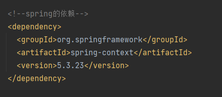

<h1>
spring
</h1>

## 1、spring理解

​		spring是一系列的框架合集，这里的spring指的是狭义上的spring,指的是SpringFramework，他是spring的核心

## 2 、使用spring框架

IOC 容器，控制反转的意思就是，将创建对象new 的动作，交给了spring ，创建了对象，全部都放在IOC容器中 ，是一个map<Clsss,name>

使用spring就是将new 对象这个代码 ，不写死在代码中了， 创建对象，全部都交给spring 来管理

- ### 2.1 使用spring框架的步骤

  1.引入依赖

  

  2.创建配置文件

  

2.1 使用xml配置文件方式，管理对象

## 3.、启用Log4j2日志框架

为什么要启用log4J2的日志框架？

因为，spring启动或者运行在控制台显示的日志几乎没有，加入这个框架，在spring启动或者程序运行时，能更好的对spring进行监控，在控制台上面查看spring运行情况！

- 3.1 引入log4j2的依赖

~~~ xml
<!--log4j2的依赖-->
<dependency>
	<groupId>org.apache.logging.log4j</groupId>
	<artifactId>log4j-core</artifactId>
	<version>2.19.0</version>
</dependency>
<dependency>
	<groupId>org.apache.logging.log4j</groupId>
	<artifactId>log4j-slf4j2-impl</artifactId>
	<version>2.19.0</version>
</dependency>
~~~

- 3.2 、加入日志配置文件

~~~xml
<?xml version="1.0" encoding="UTF-8"?>
<configuration>
    <loggers>
        <!--
        level指定日志级别,从低到高的优先级:
        TRACE < DEBUG < INFO < WARN < ERROR < FATAL
        trace:追踪,是最低的日志级别,相当于追踪程序的执行
        debug:调试,一般在开发中,都将其设置为最低的日志级别
        info:信息,输出重要的信息,使用较多
        warn:警告,输出警告的信息
        error:错误,输出错误信息
        fatal:严重错误
        -->
        <root level="DEBUG">
            <appender-ref ref="spring6log"/>
            <appender-ref ref="RollingFile"/>
            <appender-ref ref="log"/>
        </root>
    </loggers>
    <appenders>
        <!--输出日志信息到控制台-->
        <console name="spring6log" target="SYSTEM_OUT">
            <!--控制日志输出的格式-->
            <PatternLayout pattern="%d{yyyy-MM-dd HH:mm:ss SSS} [%t]%-3level %logger{1024} - %msg%n"/>
        </console>
        <!--文件会打印出所有信息,这个log每次运行程序会自动清空,由append属性决定,
        适合临时测试用-->
        <File name="log" fileName="d:/spring6_log/test.log"
              append="false">
            <PatternLayout pattern="%d{HH:mm:ss.SSS} %-5level %class{36}%L %M - %msg%xEx%n"/>
        </File>
        <!-- 这个会打印出所有的信息,
        每次大小超过size,
        则这size大小的日志会自动存入按年份-月份建立的文件夹下面并进行压缩,
        作为存档-->
        <RollingFile name="RollingFile"
                     fileName="d:/spring6_log/app.log"
                     filePattern="log/$${date:yyyy-MM}/app-%d{MM-dd-yyyy}-%i.log.gz">
            <PatternLayout pattern="%d{yyyy-MM-dd 'at' HH:mm:ss z}%-5level %class{36} %L %M - %msg%xEx%n"/>
            <SizeBasedTriggeringPolicy size="50MB"/>
            <!-- DefaultRolloverStrategy属性如不设置,
            则默认为最多同一文件夹下7个文件,这里设置了20 -->
            <DefaultRolloverStrategy max="20"/>
        </RollingFile>
    </appenders>
</configuration>
~~~

- 3.3正常启动项目，执行程序，在控制台就可以看见spring的日志了

---

----

© 版权声明

<escape>

    <h3 align="center"  style="color: brown;" >版权声明</h3>
    <table>
   		<tr>
    		<ol>
				<li>本网站名称：𝚲𝚳𝚲</li>
				<li>𝚲𝚳𝚲提供的资源仅供您个人用于非商业性目的。</li>
				<li>本站文章部分内容可能来源于网络，仅供大家学习与参考，如有侵权，请联系我进行删除处理。</li>
				<li>本站一切资源不代表本站立场，并不代表本站赞同其观点和对其真实性负责。</li>
        		<li>本站一律禁止以任何方式发布或转载任何违法的相关信息，访客发现请举报</li> 
        		<li>本站资源大多存储在云盘，如发现链接失效，请联系我，我会第一时间更新。</li>
        		<li>本站强烈打击盗版/破解等有损他人权益和违法作为，请支持正版！</li>  
			</ol>
		</tr>
	</table>

</escape>

----

